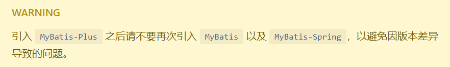
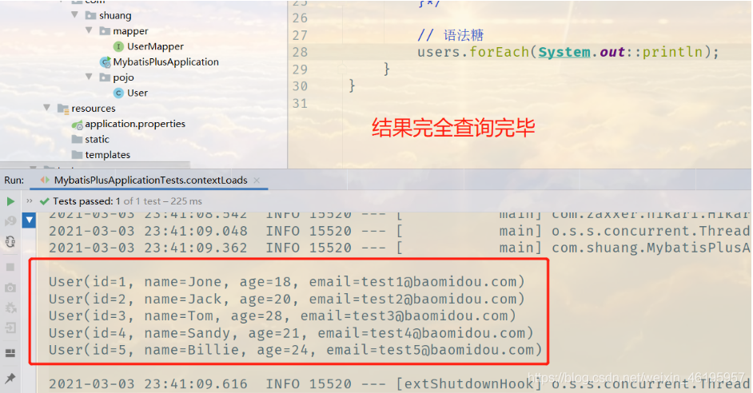
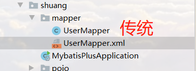

地址：[简介 | MyBatis-Plus (baomidou.com)](https://baomidou.com/pages/24112f/)

## 使用第三方组件：

1. 导入对应的依赖
2. 研究依赖如何配置
3. 代码如何编写
4. 提高拓展技术能力

## 步骤

### 创建数据库 `mybatis_plus`

### 创建user表

```sql
DROP TABLE IF EXISTS user;

CREATE TABLE user
(
	id BIGINT(20) NOT NULL COMMENT '主键ID',
	name VARCHAR(30) NULL DEFAULT NULL COMMENT '姓名',
	age INT(11) NULL DEFAULT NULL COMMENT '年龄',
	email VARCHAR(50) NULL DEFAULT NULL COMMENT '邮箱',
	PRIMARY KEY (id)
);
-- 在真实开发中:会存在 version（乐观锁）、delete（逻辑删除）、gmt_create（创建时间）
--			         gmt_modify(修改时间)
```

### 插入数据

```sql
truncate user;

INSERT INTO user (id, name, age, email) VALUES
(1, 'Jone', 18, 'test1@baomidou.com'),
(2, 'Jack', 20, 'test2@baomidou.com'),
(3, 'Tom', 28, 'test3@baomidou.com'),
(4, 'Sandy', 21, 'test4@baomidou.com'),
(5, 'Billie', 24, 'test5@baomidou.com');

```

### 搭建Springboot环境

### 导入依赖

```xml
<dependencies>
    <dependency>
        <groupId>org.springframework.boot</groupId>
        <artifactId>spring-boot-starter-web</artifactId>
    </dependency>

    <!--mybatis-plus-->
    <!--mybatis-plus 是自己开发的，并非官方！-->
    <dependency>
        <groupId>com.baomidou</groupId>
        <artifactId>mybatis-plus-boot-starter</artifactId>
        <version>3.0.5</version>
    </dependency>
    <dependency>
        <groupId>org.springframework.boot</groupId>
        <artifactId>spring-boot-starter-test</artifactId>
        <scope>test</scope>
    </dependency>
    <!--数据库驱动-->
    <dependency>
        <groupId>mysql</groupId>
        <artifactId>mysql-connector-java</artifactId>
        <version>8.0.22</version>
    </dependency>

    <!--lombok-->
    <dependency>
        <groupId>org.projectlombok</groupId>
        <artifactId>lombok</artifactId>
        <version>1.18.18</version>
    </dependency>

</dependencies>
```

**说明：我们使用mybatis-plus可以节省我们大量的代码，尽量不要同时带入mybatis跟mybatis-plus，可能会产生冲突**



### 连接数据库！ 这一步和mybatis相同

url字段中 设置时区：serverTime=GMT%2b8 （%2b 就是+的意思，这里是指加8个小时，以北京东八区为准）

```
# mysql 8 驱动不同,需要增加时区设置
spring.datasource.username=root
spring.datasource.password=83821979Zs
spring.datasource.url=jdbc:mysql://localhost:3306/mybatis_plus?useSSL=false&useUnicode=true&characterEncoding=utf-8&serverTimezone=GMT%2b8
spring.datasource.driver-class-name=com.mysql.cj.jdbc.Driver
```

### pojo-dao(连接mybatis，配置mapper.xml文件)-service-controller

使用了mybatis-plus之后

- pojo

  ```
  /**
   * @DATE: 2021/3/3 0003 23:23
   * @Author: 小爽帅到拖网速
   */
  @Data
  @AllArgsConstructor
  @NoArgsConstructor
  @ToString
  public class User {
      private Long id;
      private String name;
      private Integer age;
      private String email;
  }
  ```

- mapper接口

  ```java
  /**
   * @DATE: 2021/3/3 0003 23:24
   * @Author: 小爽帅到拖网速
   */
  
  // 在对应的Mapper上面实现基本的接口BaseMapper
  @Repository  // 代码持久层
  @Mapper
  public interface UserMapper extends BaseMapper<User> {
      // 所有的CRUD操作都已经在接口中编写完成了
      // 你不需要像以前那样配置一大堆文件了
  }
  
  ```

- 主启动类

  注意：我们需要去主启动类上去扫描我们的mapper包下的所有接口 @MapperScan（com.shuang.mapper）

  ```java
  // 扫描mapper文件夹，不加也可以，默认扫描启动类同级所有包
  @MapperScan("com.shuang.mapper")
  @SpringBootApplication
  public class MybatisPlusApplication {
  
      public static void main(String[] args) {
          SpringApplication.run(MybatisPlusApplication.class, args);
      }
  }
  ```
  
- 测试类

  ```java
  @SpringBootTest
  class MybatisPlusApplicationTests {
  
      // 继承了BaseMapper，所有的方法都来自自己的父类，我们也可以编写自己的扩展方法
      @Autowired
      private UserMapper userMapper;
  
      @Test
      void contextLoads() {
          // 查询全部用户
          // selectList(参数) 这里的参数是一个Wrapper，条件构造器，这里我们先不用，写个null占着
          List<User> users = userMapper.selectList(null);
          /*for (User user : users) {
              System.out.println(user);
          }*/
  
          // 语法糖
          users.forEach(System.out::println);
      }
  }
  
  ```





#### 思考问题

1. Sql谁帮我们写的？Mybatis-Plus
2. 方法哪里来的？ Mybatis-Plus都帮我们写好了

