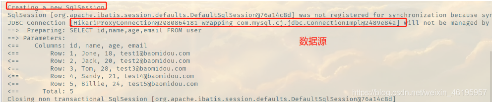

## 配置日志

我们所有的Sql现在是不可见的，我们希望知道它是怎么执行的，所以我们必须要看日志！

```properties
# 配置日志
mybatis-plus.configuration.log-impl=org.apache.ibatis.logging.stdout.StdOutImpl
```



配置完毕日志之后，后面的学习就需要注意这个自动生成的SQL，我们也就会喜欢MyBatis-Plus！

