## 本篇笔记操作表使用的软件，也可以使用SQL语句

## 插入操作

> Insert

```java
// 测试插入
@Test
public void testInsert(){
    User user = new User();
    user.setName("小爽帅到拖网速");
    user.setAge(20);
    user.setEmail("1372713212@qq.com");
    int result = userMapper.insert(user);  // 帮我们自动生成id
    System.out.println(result); // 受影响的行数
    System.out.println(user); // 发现，id自动回填
}
```

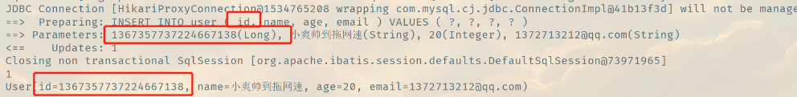

> 数据库插入id的默认值为：全局唯一ID

## **主键生成策略**

> 默认id_worker 全局唯一

分布式系统唯一ID生成方案：https://www.cnblogs.com/haoxinyue/p/5208136.html

**雪花算法：**

snowflake是Twitter开源的分布式ID生成算法，结果是一个long型的ID。其核心思想是：使用41bit作为毫秒数，10bit作为机器的ID（5个bit是数据中心，5个bit的机器ID），12bit作为毫秒内的流水号（意味着每个节点在每毫秒可以产生 4096 个 ID），最后还有一个符号位，永远是0。可以保证几乎全球唯一！

> 主键自增

我们需要配置**主键自增**：

1、实体类字段上增加 `@TableId(type = IdType.AUTO)`

2、数据库字段一定要是**设置自增auto_increment**的！

```sql
CREATE TABLE `user` (
   `id` bigint(20) NOT NULL COMMENT '主键ID' auto_increment, -- auto_increment
   `name` varchar(30) DEFAULT NULL COMMENT '姓名',
   `age` int(11) DEFAULT NULL COMMENT '年龄',
   `email` varchar(50) DEFAULT NULL COMMENT '邮箱',
   PRIMARY KEY (`id`)
 ) ENGINE=InnoDB DEFAULT CHARSET=utf8;
```

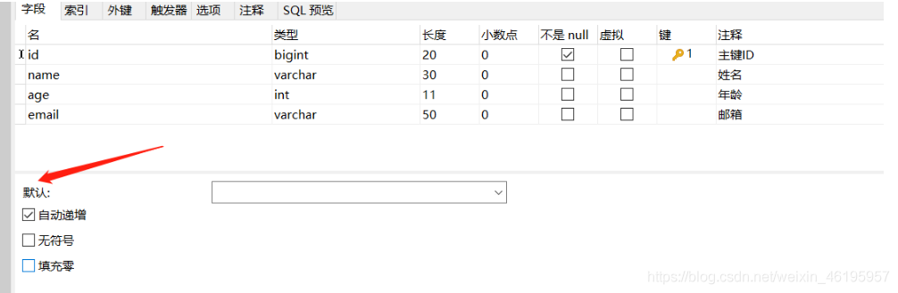


> 其余的源码解释

```java
public enum IdType {
    AUTO(0),  // 数据库id自增
    NONE(1),  // 未设置主键
    INPUT(2), // 手动输入
    ID_WORKER(3), // 默认的全局id
    UUID(4),  // 全局唯一id
    ID_WORKER_STR(5); // ID_WORKER 字符串表示法
}
```

改为手动输入之后，就需要自己配置id

```java
public class User {

    // 对应数据库的主键（uuid、自增id、雪花算法、redis、zookeeper）
    @TableId(type = IdType.INPUT)  // 默认方案
    private Long id;
    @TableField("name")
    private String name;
    @TableField("age")
    private Integer age;
    @TableField("email")
    private String email;
}
```

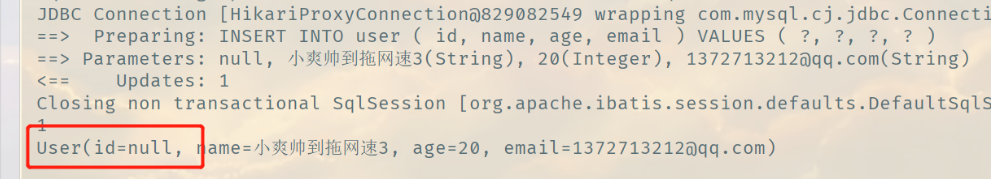


## 更新操作

> update

```java
// 测试更新
@Test
public void testUpdate(){
    User user = new User();
    user.setId(10L);
    user.setName("小爽10L");
    user.setAge(100);
    // 注意： updateById 但是参数是一个对象
    int i = userMapper.updateById(user);
    User user1 = userMapper.selectById(10L);
    System.out.println(user1);
    System.out.println("受影响的行数"+i);
}
```

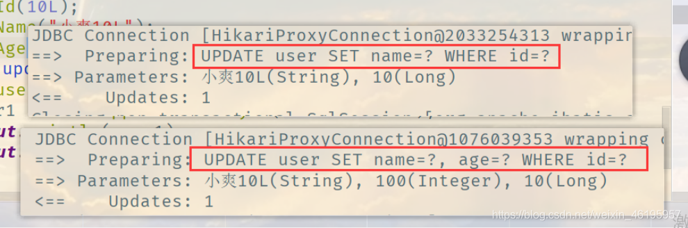

所有的sql都是自动帮你配置的！

## 自动填充

创建时间、修改时间！这些个操作一般都是自动化完成的，我们不希望手动更新！

阿里巴巴开发手册：所有的数据库表：gmt_create 、gmt_modify几乎所有的表都要配置上，而且需要自动化（默认值`default now()`）！

> 方式一：数据库级别的修改 （工作中是不允许你修改数据库）

1、在表中新增字段create_time、update_time

```sql
alter table user add column create_time datetime default now() comment '创建时间';
alter table user add column update_time datetime default now() comment '修改时间';
```

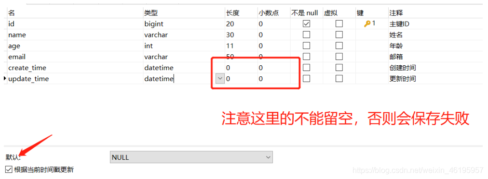

2、再次测试插入方法，我们需要先把实体类同步！

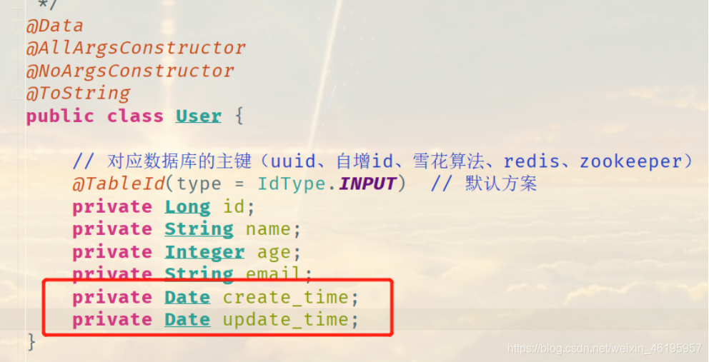

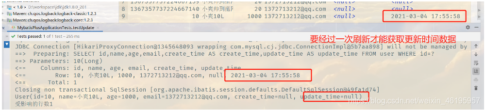

> 方式二：代码级别

**1、删除数据库的默认值，更新操作**


```sql
alter table user add column create_time datetime comment '创建时间';
alter table user add column update_time datetime comment '修改时间';
```

**2、实体类字段属性上需要增加注解**

```java
// 字段添加填充内容
@TableField(fill = FieldFill.INSERT)
private Date create_time;
@TableField(fill = FieldFill.INSERT_UPDATE)
private Date update_time;
```

​	**完整实体类**

```java
import com.baomidou.mybatisplus.annotation.FieldFill;
import com.baomidou.mybatisplus.annotation.IdType;
import com.baomidou.mybatisplus.annotation.TableField;
import com.baomidou.mybatisplus.annotation.TableId;
import lombok.AllArgsConstructor;
import lombok.Data;
import lombok.NoArgsConstructor;
import lombok.ToString;

import java.util.Date;


@Data
@AllArgsConstructor
@NoArgsConstructor
@ToString
public class User {
    @TableId(type = IdType.AUTO)
    private Long id;
    private String name;
    private Integer age;
    private String email;
    @TableField(fill = FieldFill.INSERT)
    private Date create_time;
    @TableField(fill = FieldFill.INSERT_UPDATE)
    private Date update_time;
}
```

**3、编写处理器来处理这个注解即可！**

`由于这个处理器在Springboot下面， mybatis会自动处理我们写的所有的处理器`

当我们执行插入操作的时候，自动帮我们通过反射去读取哪边有对应注解的字段，从而把处理器代码插入成功，会自动帮我把createTime，updateTime插入值

```java
package com.shuang.handler;

import com.baomidou.mybatisplus.core.handlers.MetaObjectHandler;
import lombok.extern.slf4j.Slf4j;
import org.apache.commons.logging.Log;
import org.apache.ibatis.reflection.MetaObject;
import org.springframework.stereotype.Component;

import java.util.Date;

/**
 * @DATE: 2021/3/4 0004 21:43
 * @Author: 小爽帅到拖网速
 */

@Slf4j
@Component  // 一定不要忘记把处理器加到IOC容器中！
public class MyMetaObjectHandler implements MetaObjectHandler {

    // 插入时的填充策略
    @Override
    public void insertFill(MetaObject metaObject) {
        log.info("start insert fill.....");
        // setFieldValByName(String fieldName, Object fieldVal, MetaObject metaObject)
        this.setFieldValByName("createTime",new Date(),metaObject);
        this.setFieldValByName("updateTime",new Date(),metaObject);
    }
    // 更新时的填充策略
    @Override
    public void updateFill(MetaObject metaObject) {
        this.setFieldValByName("updateTime",new Date(),metaObject);
    }
}
```

注意：处理器指定字段中大写字母不能被识别成_小写字母的格式

在填充策略中需修改为

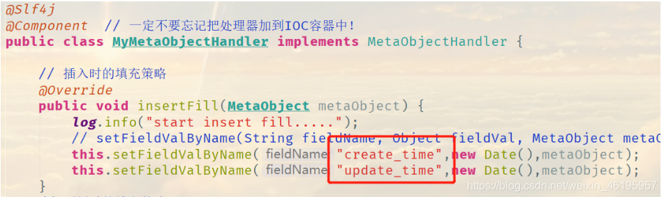

**4、测试插入**

**5、测试更新、观察时间即可**


## 乐观锁

在面试过程中，我们经常会被问道乐观锁，悲观锁，其实原理非常简单

> 乐观锁 **OptimisticLockerInnerInterceptor**

顾名思义十分乐观，它总是认为不会出现问题，无论干什么都不会上锁！如果出现问题就再次更新测试

这里引出 旧version 新version

乐观锁：当要更新一条记录的时候，希望这条记录没有被别人更新
乐观锁实现方式：

- 查询记录时，获取当前version，更新时带上这个version
- 执行更新时， set version = newVersion where version = oldVersion
- 如果version不对，就更新失败

```sql
乐观锁：1、先查询，获得版本号 version = 1
-- A
update user set name = "xiaoshaung",version = version + 1
where id = 2 and version = 1

-- B 线程抢先完成，这个时候 version = 2 ，会导致 A 修改失败！
update user set name = "小爽"，version = version + 1
where id = 2 and version = 1
```

> 测试Mybatis-Plus的乐观锁实现

**1、给数据库中增加version字段**

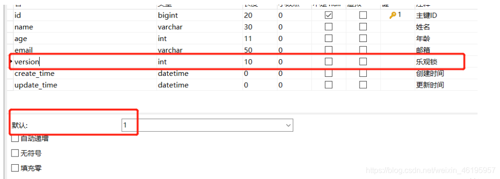

```sql
-- 必须设置默认值，如果为null，更新时不会判断version值
alter table user add column version int default 1 comment '乐观锁';
```

**2、实体类加对应的字段**

```java
//乐观锁version注解 
@Version  
private Integer version;
```

**3、注册组件**

```java
// 这个扫描本来是在我们MybatisPlusApplication 主启动类中，现在我们把它放在配置类中
// 扫描mapper文件夹
@MapperScan("com.shuang.mapper")
@EnableTransactionManagement  // 自动开启事务管理
@Configuration // 配置类
public class MybatisPlusConfig {

    // 注册乐观锁插件
    @Bean
    public OptimisticLockerInterceptor optimisticLockerInterceptor(){
        return new OptimisticLockerInterceptor();
    }
    //新版本MybatisPlus3.4.x注册
    /*
    @Bean
    public MybatisPlusInterceptor optimisticLockerInnerInterceptor(){
        MybatisPlusInterceptor interceptor = new MybatisPlusInterceptor();
        interceptor.addInnerInterceptor(new OptimisticLockerInnerInterceptor());
        return interceptor;
    }
    */
}
```

**4、测试一下乐观锁的使用**

```java
// 测试乐观锁单线程成功
@Test
public void testOptimisticLock(){
    // 1、查询用户信息
    User user = userMapper.selectById(1);
    // 2、修改用户信息
    user.setName("xiaoshaung");
    user.setEmail("123123132@qq.com");
    // 3、执行更新操作
    userMapper.updateById(user);
}
```


```java
// 测试乐观锁多线程失败  多线程
 /*
 线程1 虽然执行了赋值语句，但是还没进行更新操作，线程2就插队了抢先更新了，
 由于并发下，可能导致线程1执行不成功
 如果没有乐观锁就会覆盖线程2的值
 */
@Test
public void testOptimisticLock2(){
    // 线程1
    User user = userMapper.selectById(1);
    user.setName("xiaoshaung111");
    user.setEmail("123123132@qq.com");

    // 模拟另外一个线程执行了插队操作
    // 线程2
    User user2 = userMapper.selectById(1);
    user2.setName("xiaoshaung222");
    user2.setEmail("123123132@qq.com");
    userMapper.updateById(user2);

    // 自旋锁来多次尝试提交
    userMapper.updateById(user);
}
```

完成修改的是线程2


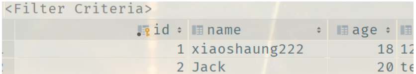

> 悲观锁

顾名思义十分悲观，它总是认为会出现问题，无论干什么都上锁！再去操作

我们这里主要讲究乐观锁机制


## 查询操作

```java
 // 测试查询
    @Test
    public void testSelectById(){
        // 查询一个
        User user = userMapper.selectById(1);
        // 查询批量查询
        List<User> users = userMapper.selectBatchIds(Arrays.asList(1, 2, 3));
        users.forEach(System.out::println);
        System.out.println(user);
    }
```

- selectById的参数类型最好和主键类型一样，比如说主键类型为L，**最好传1L，而不是1**

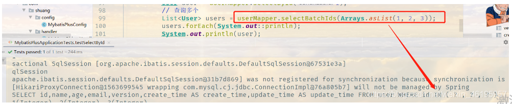

### selectByMap

传入一个map参数，键对应数据字段，值对应数据值。查询到的记录，指定字段必须等于map集合该键的值

```java
// 条件查询 map
@Test
public void testSelectByBatchIds(){
    HashMap<String, Object> map = new HashMap<>();
    // 自定义要查询的条件
    map.put("name","宇智波佐助");
    List<User> users = userMapper.selectByMap(map);
    users.forEach(System.out::println);
}
```

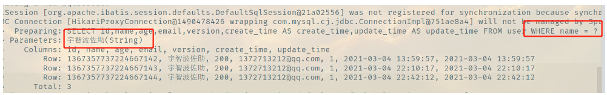

```java
// 条件查询 map
@Test
public void testSelectByBatchIds(){
    HashMap<String, Object> map = new HashMap<>();
    // 自定义要查询的条件
    map.put("name","Tom");
    map.put("age","28");
    List<User> users = userMapper.selectByMap(map);
    users.forEach(System.out::println);
}
```

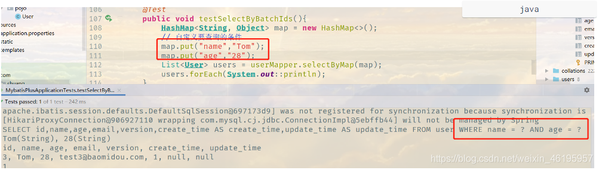


## 分页查询

分页在网站使用的十分之多！

1. 原始的limit 进行分页
2. pageHepler 第三方插件
3. Mybatis-Plus其实也内置了分页插件！

> 如何使用分页插件

**1、拦截器组件即可**

```java
public class MybatisPlusConfig {
    //分页插件
    @Bean
    public PaginationInterceptor paginationInterceptor() {
        PaginationInterceptor paginationInterceptor = new PaginationInterceptor();
        // 设置请求的页面大于最大页后操作， true调回到首页，false 继续请求  默认false
        // paginationInterceptor.setOverflow(false);
        // 设置最大单页限制数量，默认 500 条，-1 不受限制
        // paginationInterceptor.setLimit(500);
        // 开启 count 的 join 优化,只针对部分 left join
        paginationInterceptor.setCountSqlParser(new JsqlParserCountOptimize(true));
        return paginationInterceptor;
    }
    
    /**
   * 3.4.0之后新的分页插件,一缓和二缓遵循mybatis的规则,需要设置 MybatisConfiguration#useDeprecatedExecutor = false 避免缓存出现问题(该属性会在旧插件移除后一同移除)
   */
  /*@Bean
  public MybatisPlusInterceptor mybatisPlusInterceptor() {
    MybatisPlusInterceptor interceptor = new MybatisPlusInterceptor();
    //向Mybatis过滤器链中添加分页拦截器
    interceptor.addInnerInterceptor(new PaginationInnerInterceptor(DbType.MYSQL));
    //还可以添加i他的拦截器
    return interceptor;
  }*/
}
```

**2、直接使用Page对象即可！**

本质上还是调用了limit语句

```java
// 测试分页查询
@Test
public void testPage(){
    // 参数1 当前页 ；参数2 页面大小
    // 创建一个page对象充当容器
    // 将Page对象传入selectPage方法，selectPage方法查询到数据后装入Page对象
    Page<User> page = new Page<>(1,5);
    userMapper.selectPage(page,null);
	
    //查询Page对象中的数据元素
    page.getRecords().forEach(System.out::println);
    //查询当前是第几页
    System.out.println("Current->"+page.getCurrent());
    //查询一共有多少页
    System.out.println("Pages->"+page.getPages());
    //查询每页有多少条数据
    System.out.println("Size->"+page.getSize());
    //查询一共有多少条数据
    System.out.println("Total->"+page.getTotal());
}

/*
运行结果：
User(id=1, name=二, age=null, email=null, create_time=null, update_time=null, version=5)
User(id=2, name=张三, age=null, email=null, create_time=null, update_time=null, version=1)
User(id=3, name=张三0, age=null, email=null, create_time=null, update_time=null, version=1)
User(id=4, name=张三1, age=null, email=null, create_time=null, update_time=null, version=1)
User(id=5, name=张三2, age=null, email=null, create_time=null, update_time=null, version=1)
Current->1
Pages->5
Size->5
Total->22
*/
```

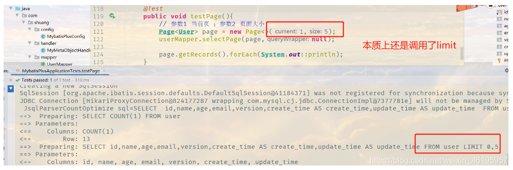

其实每次做分页查询之前都会进行总数查询

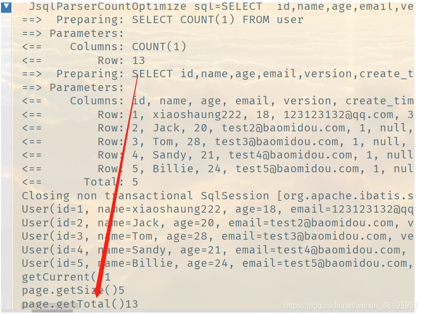


## 删除操作

**1、根据id删除记录**

```java
// 测试删除
@Test
public void testDeleteId(){
    userMapper.deleteById(1367357737224667139L );
}
```

- 报错

  ```
  org.mybatis.spring.MyBatisSystemException: nested exception is org.apache.ibatis.type.TypeException: Could not set parameters for mapping: ParameterMapping{property='id', mode=IN, javaType=class java.lang.Long, jdbcType=null, numericScale=null, resultMapId='null', jdbcTypeName='null', expression='null'}. Cause: org.apache.ibatis.type.TypeException: Error setting non null for parameter #1 with JdbcType null . Try setting a different JdbcType for this parameter or a different configuration property. Cause: java.lang.ClassCastException: java.lang.Integer cannot be cast to java.lang.Long
  ```

- 可能是因为deleteById的参数类型没对上，比如Id类型为Long，**传10会报错，必须传10L**

**2、批量删除**

```java
// 批量删除
@Test
public void testDeleteBatchId(){
    userMapper.deleteBatchIds(Arrays.asList(1367357737224667142L,1367357737224667143L));
}
```

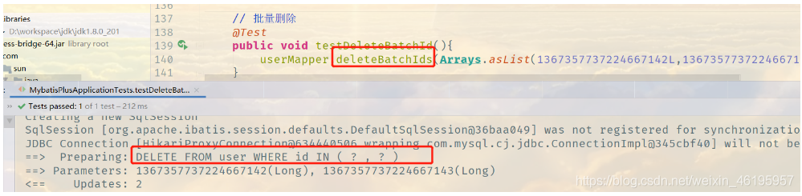

**3、通过map定制删除**

```java
//通过map删除
@Test
public void testDeleteMap(){
    HashMap<String, Object> map = new HashMap<>();
    map.put("id","1367357737224667144");
    userMapper.deleteByMap(map);
}
```


## 逻辑删除

> 物理删除：从数据库中直接移除
>
> 逻辑删除：在数据库中没有被移除，而是通过一个变量来让它失效！ deleted = 0 => deleted = 1
>
> 说明:
>
> ​	只对自动注入的sql起效:
>
> - 插入: 不作限制
> - 查找: 追加where条件过滤掉已删除数据,且使用 wrapper.entity 生成的where条件会忽略该字段
> - 更新: 追加where条件防止更新到已删除数据,且使用 wrapper.entity 生成的where条件会忽略该字段
>
> - 删除: 转变为 更新，将逻辑删除字段值改变，deleted = 0 => deleted = 1
>
> 例如:
>
> - 删除: update user set deleted=1 where id = 1 and deleted=0
> - 查找: select id,name,deleted from user where deleted=0
>
> 字段类型支持说明:
>
> - 支持所有数据类型(推荐使用 Integer,Boolean,LocalDateTime)
> - 如果数据库字段使用datetime,逻辑未删除值和已删除值支持配置为字符串null,另一个值支持配置为函数来获取值如now()
>
> 附录:
>
> - 逻辑删除是为了方便数据恢复和保护数据本身价值等等的一种方案，但实际就是删除。
> - 如果你需要频繁查出来看就不应使用逻辑删除，而是以一个状态去表示。

管理员可以查看被删除的记录！ 防止数据的丢失，类似于回收站！

测试一下：

1、在数据表中增加一个deleted字段，默认为0（不要管图片里的1）

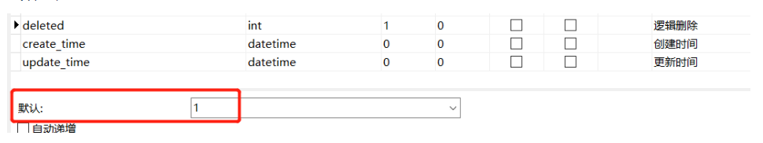

```java
alter table user add column deleted int default 0 comment '删除标记';
```

2、实体类中增加字段

```java
// 逻辑删除注解
@TableLogic
private Integer deleted;
```

3、配置

```java
public class MybatisPlusConfig {
    // 逻辑删除组件
    @Bean
    public ISqlInjector iSqlInjector(){
        return new LogicSqlInjector();
    }
}
```

```yml
# 配置逻辑删除
#删除为1
mybatis-plus.global-config.db-config.logic-delete-value= 1
#没有删除为0，数据库deleted字段的默认值
mybatis-plus.global-config.db-config.logic-not-delete-value= 0
#如果不配置逻辑删除组件，可以用这条配置替代，值为实体类@TableLogic注解的属性
#mybatis-plus.global-config.db-config.logic-delete-field= deleted
```

4、测试一下删除

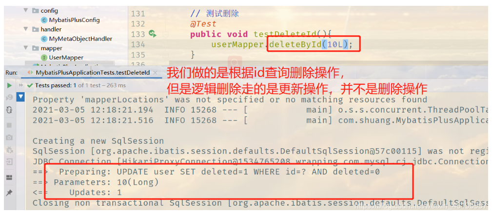

让我们来查看一下数据库

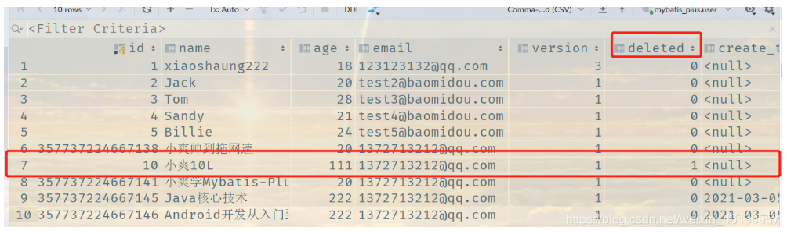

发现记录还在数据库中，但是deleted已经变化了

让我们来重新查询刚才被删除的记录

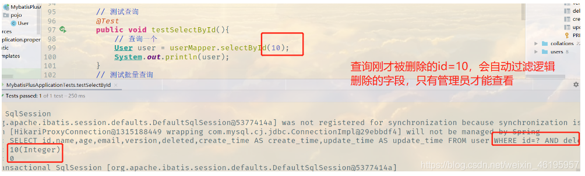

```
Creating a new SqlSession
SqlSession [org.apache.ibatis.session.defaults.DefaultSqlSession@5377414a] was not registered for synchronization because synchronization is not active
JDBC Connection [HikariProxyConnection@1315188449 wrapping com.mysql.cj.jdbc.ConnectionImpl@29ebbdf4] will not be managed by Spring
==>  Preparing: SELECT id,name,age,email,version,deleted,create_time AS create_time,update_time AS update_time FROM user WHERE id=? AND deleted=0  																		// 这里查询的是默认未被删除的 0
==> Parameters: 10(Integer)
<==      Total: 0
```

**彻底删除需要自己编写sql，最方便mapper方法加上@Delete注解Sql**

## 总结

以上的所有CRUD操作以及其拓展操作，我们都必须精通掌握，会大大提高我们的工作和写项目的效率