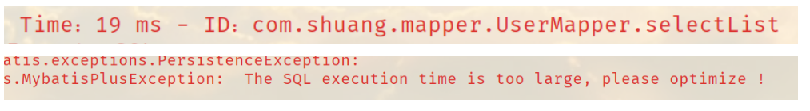

我们在平时的开发中，会遇到一些慢sql。测试 druid…

MP也提供性能分析插件，如果超过这个时间就停止运行！

**1、导入插件**

```java
// SQL 执行效率插件
@Bean
@Profile({"dev","test"}) // 设置 dev  test 环境开启, 保证我们的效率
public PerformanceInterceptor performanceInterceptor(){
    PerformanceInterceptor performanceInterceptor = new PerformanceInterceptor();
    // 在工作中，不允许用户等待
    performanceInterceptor.setMaxTime(100); // 设置sql执行的最大时间，毫秒，如果超过了则不执行
    performanceInterceptor.setFormat(true); // 开启sql格式化
    return performanceInterceptor;
}
```

**2、配置Springboot测试环境为dev 或test**

```properties
# 设置开发环境
spring.profiles.active=dev
```

**3、测试使用**

```java
@Test
void contextLoads() {
    // 查询全部用户
    // selectList(参数) 这里的参数是一个Wrapper，条件构造器，这里我们先不用，写个null占着
    List<User> users = userMapper.selectList(null);
    /*for (User user : users) {
        System.out.println(user);
    }*/
    // 语法糖
    users.forEach(System.out::println);
}
```

只要超过了测试时间就会报错



这里还使用到了sql格式化工具


使用我们的性能分析插件就会提高的我们的效率

