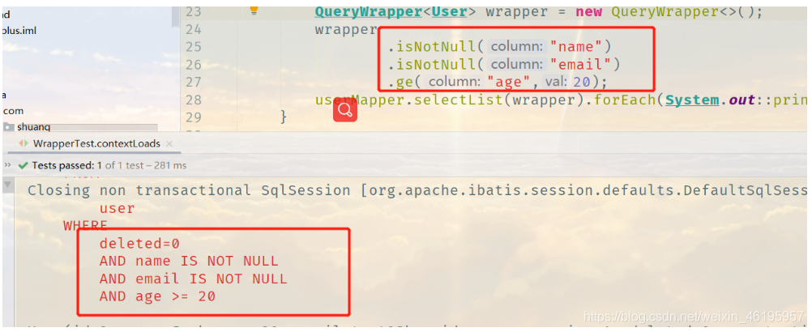
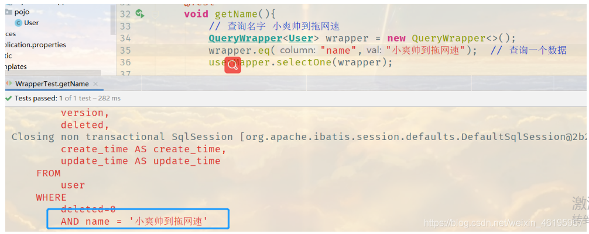
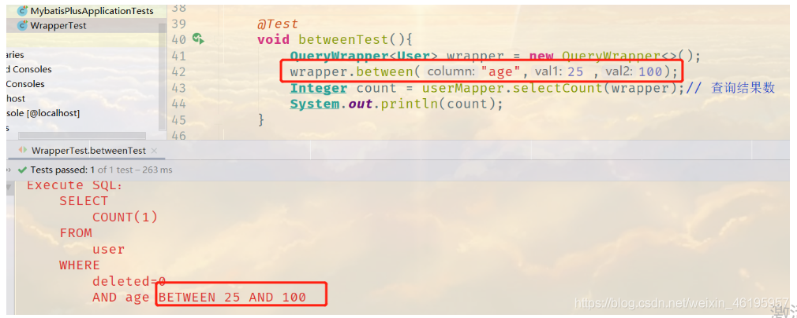
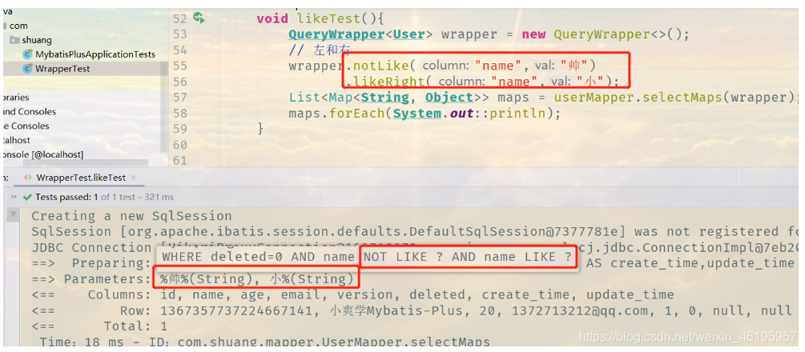
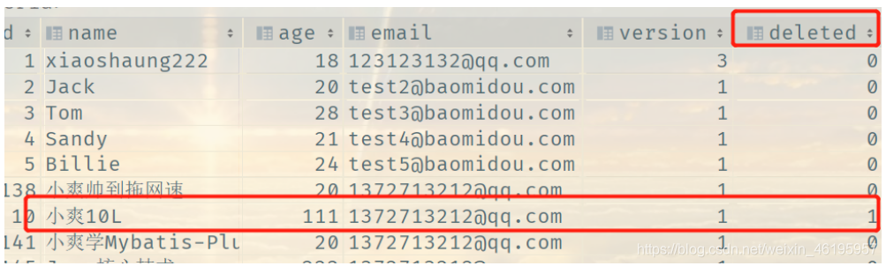
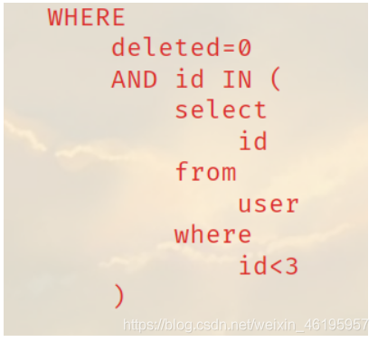
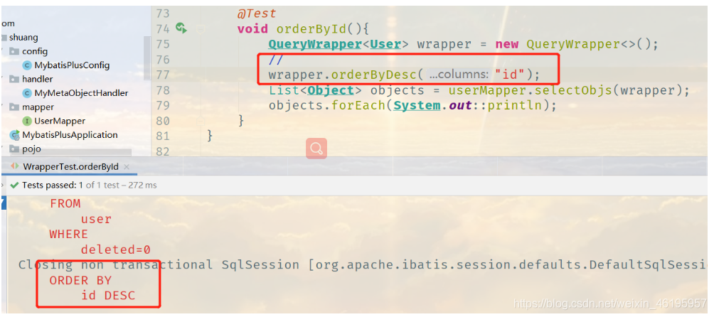

**十分重要：Wrapper**

**wrapper接口有很多实现类**

我们写一些复杂的sql就可以使用它来替代！

### 1、非空 大于

- **isNull(String column)：**查询column字段为空的数据
- **isNotNull(String column)：**查询column字段不为空的数据

```java
@Test
void contextLoads(){
    // 查询 name 不为空的用户，并且邮箱不为空的用户，年龄大于等于20
    //不要Wrapper<User> wrapper = new QueryWrapper<>()，因为很多方法都是QueryWrapper类自定义的
    QueryWrapper<User> wrapper = new QueryWrapper<>();
    wrapper
            .isNotNull("name")
            .isNotNull("email")
            .ge("age",20);
    userMapper.selectList(wrapper).forEach(System.out::println);
}
```



### 2、查询一个名字

**如果查询到的结果太多就会报错**

- **eq(String column,Object obj)：**查询column字段值为obj的数据

```java
@Test
void getOneName(){
    // 查询名字 小爽帅到拖网速
    QueryWrapper<User> wrapper = new QueryWrapper<>();
    wrapper.eq("name","小爽帅到拖网速");  // 查询一个数据
    userMapper.selectOne(wrapper);
}
```



### 3、使用between

- **between(String column, Object val1, Object val2)：**查询column字段值在val1和val2之间的数据
- **notBetween(String column, Object val1, Object val2)：**查询column字段值不在val1和val2之间的数据

```java
@Test
void betweenTest(){
    QueryWrapper<User> wrapper = new QueryWrapper<>();
    wrapper.between("age",25 ,100);
    Integer count = userMapper.selectCount(wrapper);// 查询结果数
    System.out.println(count);
}
```



### 4、使用In

- **in(String column, Object... values)：**查询column字段值符合values中一个的数据，

### 5、like模糊查询

- **like(String column,Object val)：**column是数据库字段名，val是查询的内容，`name like '%张%'`，等价于`like("name","张")`
- **likeRight(String column,Object val)：**`likeRight("name","张")`等价于`name like '张%'`
- **likeLeft(String column,Object val)：**`likeLeft("name","张")`等价于`name like '%张'`
- **notLike(String column,Object val)：**`notLike("name","张")`等价于`name not like '%张%'`

```java
// 模糊查询
@Test
void likeTest(){
    QueryWrapper<User> wrapper = new QueryWrapper<>();
    // 左和右
    wrapper.notLike("name","帅") //不需要notLike("name","%帅%")
           .likeRight("name","小");
    List<Map<String, Object>> maps = userMapper.selectMaps(wrapper);
    maps.forEach(System.out::println);
}
```



注意：这里查询的是 name 中不带“帅”字，且模糊查询为 “小%”，而在我们现在的数据库中有两个是符合查询条件，但是只查询出一个结果，原因是还有一个被我们逻辑删除了，deleted = 1



### 6、连接查询（内查询）

- **inSql(String column,String sql)：**`inSql("id","select id from user where id<3")`等价于`id IN ( select id from user where id < 3 )`
- **notInSql(String column,String sql)：`notInSql("id","select id from user where id<3")`等价于`id NOT IN ( select id from user where id < 3 )`**

```java
// 内查询
@Test
void innerJoinTest(){
    QueryWrapper<User> wrapper = new QueryWrapper<>();
    // id 在子查询中查找出来的
    wrapper.inSql("id","select id from user where id<3");
    List<Object> users = userMapper.selectObjs(wrapper);
    users.forEach(System.out::println);
}
```



### 7、升序排序

```java
// 通过id进行排序
@Test
void orderById(){
    QueryWrapper<User> wrapper = new QueryWrapper<>();
    //
    wrapper.orderByDesc("id");
    List<Object> objects = userMapper.selectObjs(wrapper);
    objects.forEach(System.out::println);
}
```



