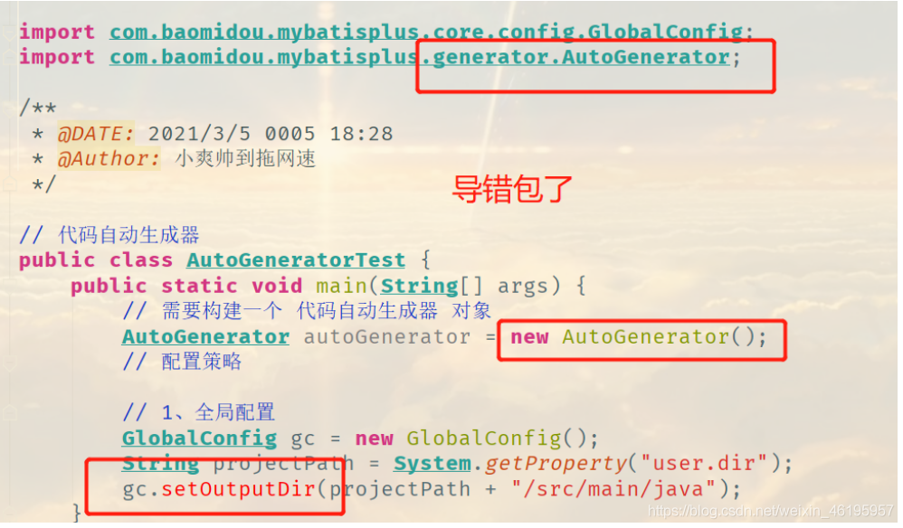
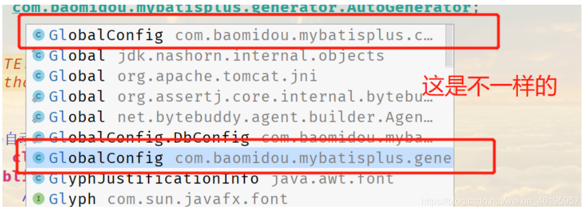
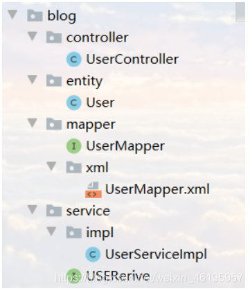

## 代码自动生成器

dao、pojo、service、controller 都自己编写完成

AutoGenerator 是 MyBatis-Plus 的代码生成器，通过 AutoGenerator 可以快速生成 Entity、Mapper、Mapper XML、Service、Controller 等各个模块的代码，极大的提升了开发效率。

注意：在全局配置中总有一句代码，怎么写都是爆红，我一开始以为是依赖冲突，一直去换依赖，步步排查才发现原来是有依赖导错了





## 创建生成器对象

```java
public static void main(String[] args) {
AutoGenerator generator = new AutoGenerator();
}
```

## 全局配置

```java
//全局配置
GlobalConfig gc = new GlobalConfig();
String projectPath = System.getProperty("user.dir");//获取项目路径
gc.setOutputDir(projectPath+"/src/main/java"); // 代码生成位置
gc.setOpen(false); //生成后是否打开资源管理器
gc.setFileOverride(false); //重新生成是文件是否覆盖
gc.setServiceName("%Service"); // 服务接口，去掉Service前面的I前缀
gc.setIdType(IdType.ID_WORKER); // 主键生成策略
gc.setDateType(DateType.ONLY_DATE); // 定义生成的实体类中日期类型
gc.setSwagger2(true); // 开启swagger2模式
// 给代码自动生成器注入全局配置
generator.setGlobalConfig(gc);
```

## 数据库信息配置

```java
// 2、 设置数据源
DataSourceConfig dsc = new DataSourceConfig();
dsc.setUrl("jdbc:mysql://localhost:3306/mybatis_plus?useSSL=false&useUnicode=true&characterEncoding=utf-8&serverTimezone=GMT%2b8");
dsc.setDriverName("com.mysql.cj.jdbc.Driver");
dsc.setUsername("root");
dsc.setPassword("root");
dsc.setDbType(DbType.MYSQL);

// 给代码自动生成器注入数据库配置
generator.setDataSource(dsc);
```

## 包配置

```java
// 3、包的配置
PackageConfig pc = new PackageConfig();
//pc.setModuleName("blog"); //生成com.hzc.blog
pc.setModuleName("null"); // 模块名
pc.setParent("com.hzc");
pc.setEntity("entity"); 
pc.setMapper("mapper");
pc.setService("service");
pc.setController("controller");

// 给代码自动生成器注入包配置
generator.setPackageInfo(pc);
```

## 策略配置

```java
// 4、策略配置
StrategyConfig strategy = new StrategyConfig();
strategy.setInclude("user"); // 设置要映射的表名
strategy.setNaming(NamingStrategy.underline_to_camel);  // 数据库表名映射到实体类的命名策略，内置下划线转驼峰命名
//strategy.setTablePrefix(pc.getModuleName()+"_"); // 生成实体时去掉表前缀
strategy.setColumnNaming(NamingStrategy.underline_to_camel); // 数据库表字段映射到实体类的命名策略，内置下划线转驼峰命名
strategy.setEntityLombokModel(true);  // 自动Lombok，@Accessors(chain = true)
// strategy.setRestControllerStyle(true); //restful api风格控制器
// strategy.setControllerMappingHyphenStyle(true); // url中驼峰转”_“连字符
strategy.setLogicDeleteFieldName("deleted");  // 逻辑删除字段
```

## 完整 MyBatis-Plus 代码生成器代码

```java
import com.baomidou.mybatisplus.annotation.DbType;
import com.baomidou.mybatisplus.annotation.FieldFill;
import com.baomidou.mybatisplus.annotation.IdType;
import com.baomidou.mybatisplus.generator.AutoGenerator;
import com.baomidou.mybatisplus.generator.config.DataSourceConfig;
import com.baomidou.mybatisplus.generator.config.GlobalConfig;
import com.baomidou.mybatisplus.generator.config.PackageConfig;
import com.baomidou.mybatisplus.generator.config.StrategyConfig;
import com.baomidou.mybatisplus.generator.config.po.TableFill;
import com.baomidou.mybatisplus.generator.config.rules.DateType;
import com.baomidou.mybatisplus.generator.config.rules.NamingStrategy;

import java.util.ArrayList;

// 代码自动生成器
public class AutoGeneratorTest {
    public static void main(String[] args) {
        // 需要构建一个 代码自动生成器 对象
        AutoGenerator mpg = new AutoGenerator();
        // 配置策略

        // 1、全局配置
        GlobalConfig gc = new GlobalConfig();
        String projectPath = System.getProperty("user.dir");
        gc.setOutputDir(projectPath + "/src/main/java");
        gc.setAuthor("小爽帅到拖网速");
        gc.setOpen(false);
        gc.setFileOverride(false);  // 是否覆盖
        gc.setServiceName("%Serive"); // 服务接口，去Service的I前缀
        gc.setIdType(IdType.ID_WORKER); // 主键生成策略
        gc.setDateType(DateType.ONLY_DATE);
        gc.setSwagger2(true);

        // 给代码自动生成器注入配置
        mpg.setGlobalConfig(gc);

        // 2、 设置数据源
        DataSourceConfig dsc = new DataSourceConfig();
        dsc.setUrl("jdbc:mysql://localhost:3306/mybatis_plus?useSSL=false&useUnicode=true&characterEncoding=utf-8&serverTimezone=GMT%2b8");
        dsc.setDriverName("com.mysql.cj.jdbc.Driver");
        dsc.setUsername("root");
        dsc.setPassword("83821979Zs");
        dsc.setDbType(DbType.MYSQL);
        mpg.setDataSource(dsc);

        // 3、包的配置

        PackageConfig pc = new PackageConfig();
        pc.setModuleName("blog");
        pc.setParent("com.shuang");
        pc.setEntity("entity");
        pc.setMapper("mapper");
        pc.setService("service");
        pc.setController("controller");

        mpg.setPackageInfo(pc);

        // 4、策略配置
        StrategyConfig strategy = new StrategyConfig();
        strategy.setInclude("user"); // 设置要映射的表名
        strategy.setNaming(NamingStrategy.underline_to_camel);  // 内置下划线转驼峰命名
        strategy.setColumnNaming(NamingStrategy.underline_to_camel);
        strategy.setEntityLombokModel(true);  // 自动Lombok

        strategy.setLogicDeleteFieldName("deleted");  // 逻辑删除字段

        // 自动填充策略
        TableFill gmtCreate = new TableFill("gmt_create", FieldFill.INSERT);
        TableFill gmtModifid = new TableFill("gmt_modifid", FieldFill.UPDATE);

        ArrayList<TableFill> tableFills = new ArrayList<>();
        tableFills.add(gmtCreate);
        tableFills.add(gmtModifid);
        strategy.setTableFillList(tableFills);

        // 乐观锁
        strategy.setVersionFieldName("version");

        strategy.setRestControllerStyle(true);
        strategy.setControllerMappingHyphenStyle(true); // Localhost:8080/hello_id_2

        mpg.setStrategy(strategy);

        // 执行
        mpg.execute();
    }
}

```




**1、**报错

```
Exception in thread "main" java.lang.NoClassDefFoundError: org/apache/velocity/context/Context
```

解决：导入依赖

```xml
<!-- 模板引擎 -->
<dependency>
    <groupId>org.apache.velocity</groupId>
    <artifactId>velocity-engine-core</artifactId>
    <version>2.0</version>
</dependency>
```

**2、**自动生成的swagger2注解爆红

解决：导入Swagger2依赖，如果导致其它依赖变红，用2.7.0看看

```xml
<!-- https://mvnrepository.com/artifact/io.springfox/springfox-swagger2 -->
<dependency>
   <groupId>io.springfox</groupId>
   <artifactId>springfox-swagger2</artifactId>
   <version>2.9.2</version>
</dependency>
<!-- https://mvnrepository.com/artifact/io.springfox/springfox-swagger-ui -->
<dependency>
   <groupId>io.springfox</groupId>
   <artifactId>springfox-swagger-ui</artifactId>
   <version>2.9.2</version>
</dependency>
```

**3、**疑问：策略配置中设置了要映射的表名，它怎么找到是这个数据库的表呢？

原因：数据源配置中的url有数据库

**4、**报错

```
Error creating bean with name 'xxxServiceImpl': Unsatisfied dependency expressed through field 'baseMapper'; 
```

原因：自动生成的Mapper接口没有添加@Mapper和@Repository注解

