# 访问支付宝开放平台注册

## **1、地址：[支付宝开放平台 (alipay.com)](https://open.alipay.com/platform/home.htm)**

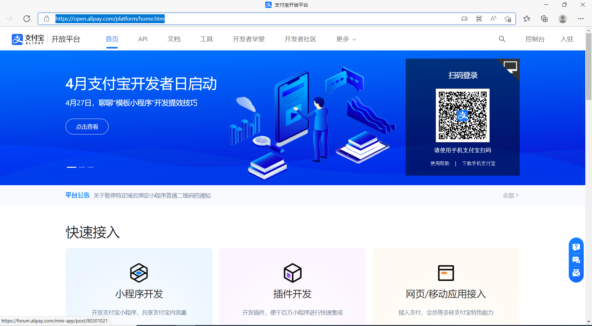

## **2、支付宝扫码登录后跳转如下界面，点击沙箱**

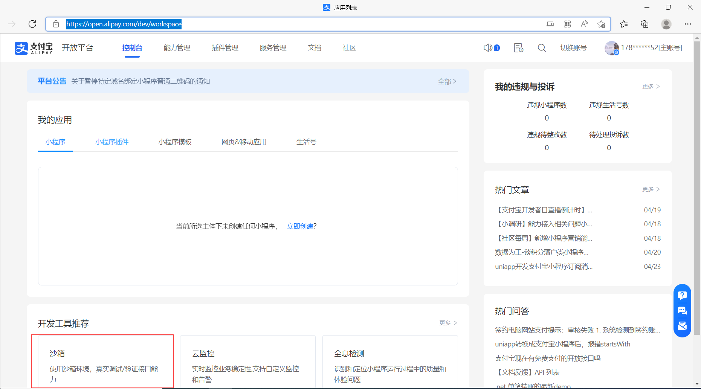

## **3、点击沙箱后，跳转如下页面**

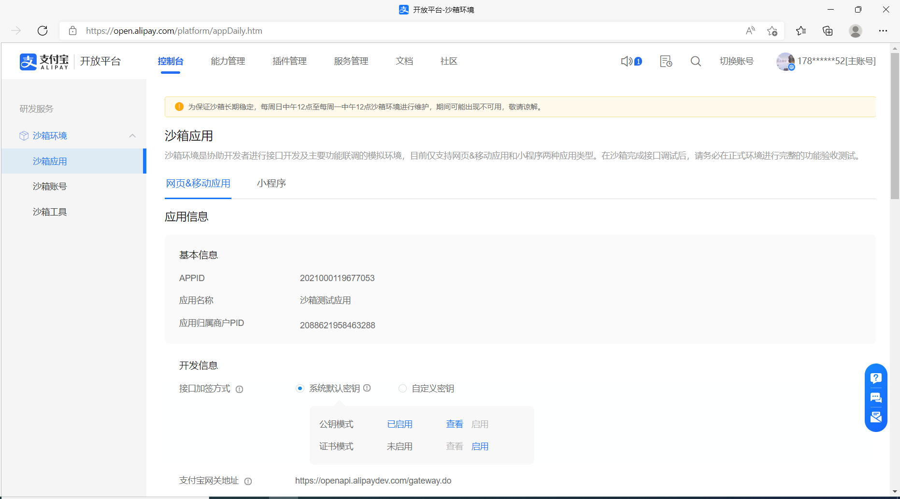

## **4、这里需要修改接口加签方式为自定义**

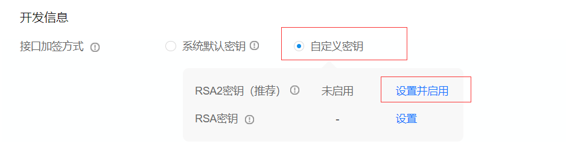

## **5、点击设置并启用，会跳出如下界面**

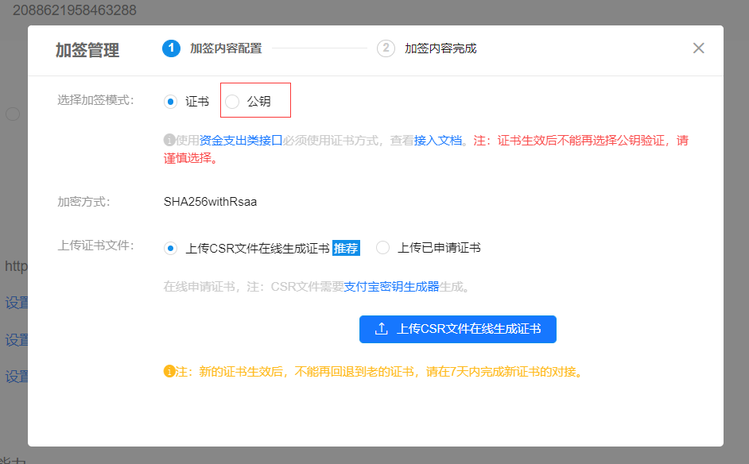

## **6、这里我们选择公钥**

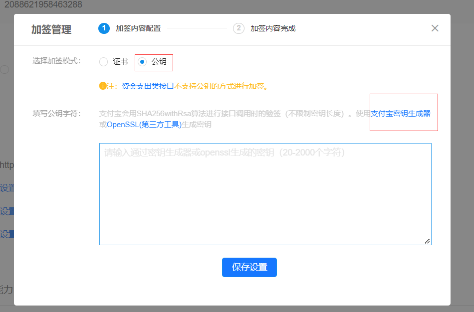

## **7、点击支付宝密钥生成器，下载windows版**

**下载完的安装包放在了素材源码文件夹中**

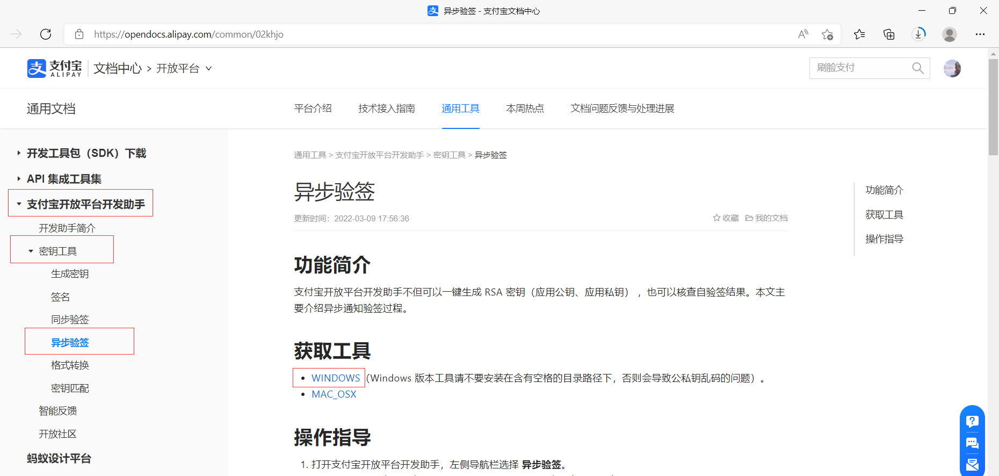

## **8、安装之后打开，点击生成密钥后会生成公钥私钥**

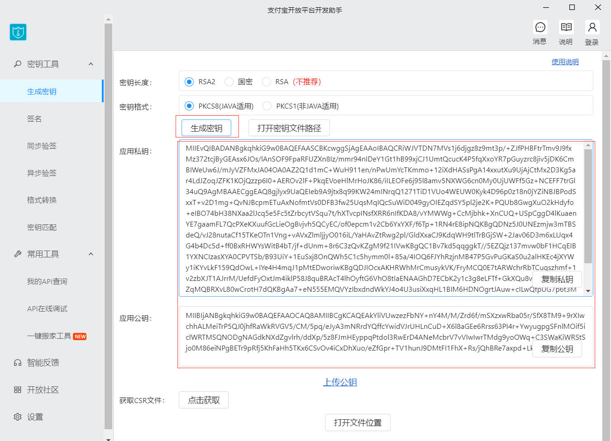

## **9、**密钥会以txt文件格式保存

**密钥会以txt格式保存在`C:\Users\xxx\Documents\支付宝开放平台开发助手\RSA密钥`文件夹中，密钥文件要好好保存，不然以后还要重新设置**

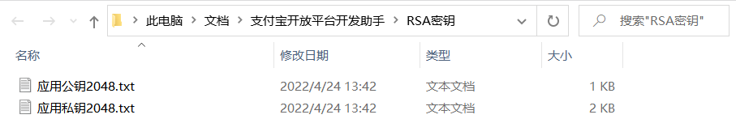

## **10、回到第六步，将公钥填入文本域**

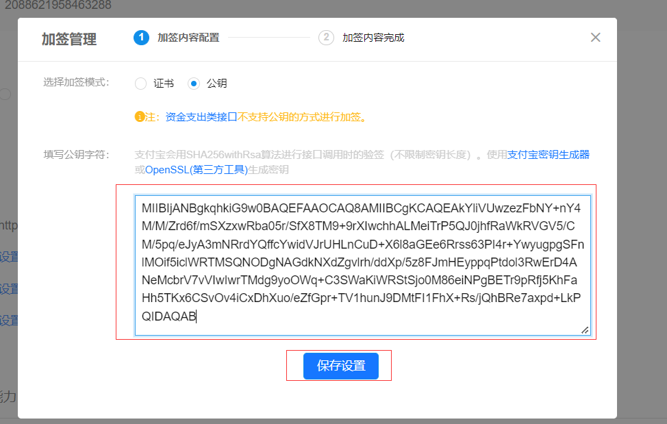

## **11、点击保存设置后，加签管理会跳到第二步骤，可以关闭这个界面了**

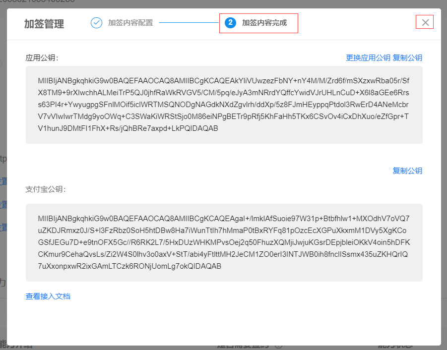

## **12、右侧导航栏的沙箱账号界面**

**有沙箱的卖家账号和卖家账号，到这里我们就可以去看看官方文档了，点击菜单栏中的`文档`跳转支付宝文档中心**

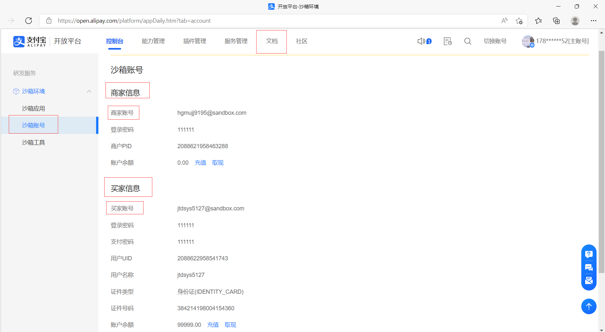

**在沙箱工具界面可以沙箱版支付宝**

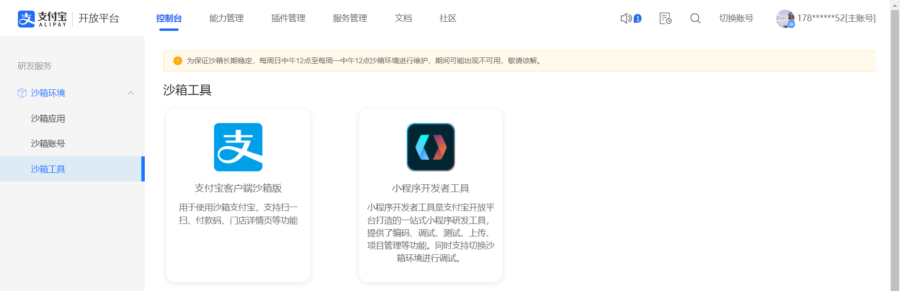

**扫描二维码下载，使用沙箱账号中的商家账号和密码登录**

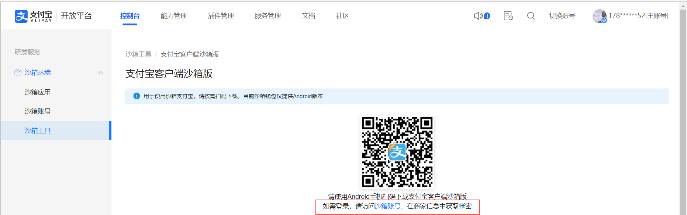

## **13、在支付宝文档中心选择支付能力**

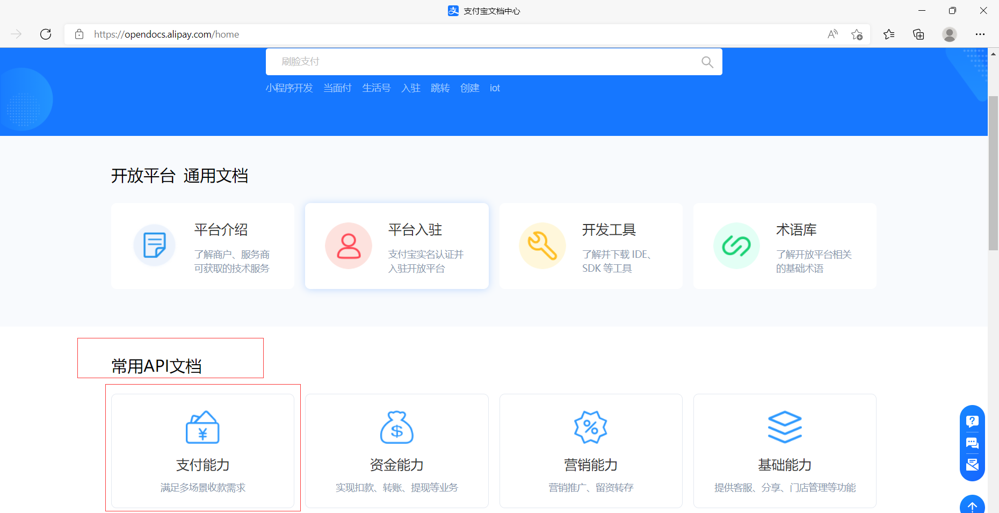

## **14、这里以电脑网站支付为例**

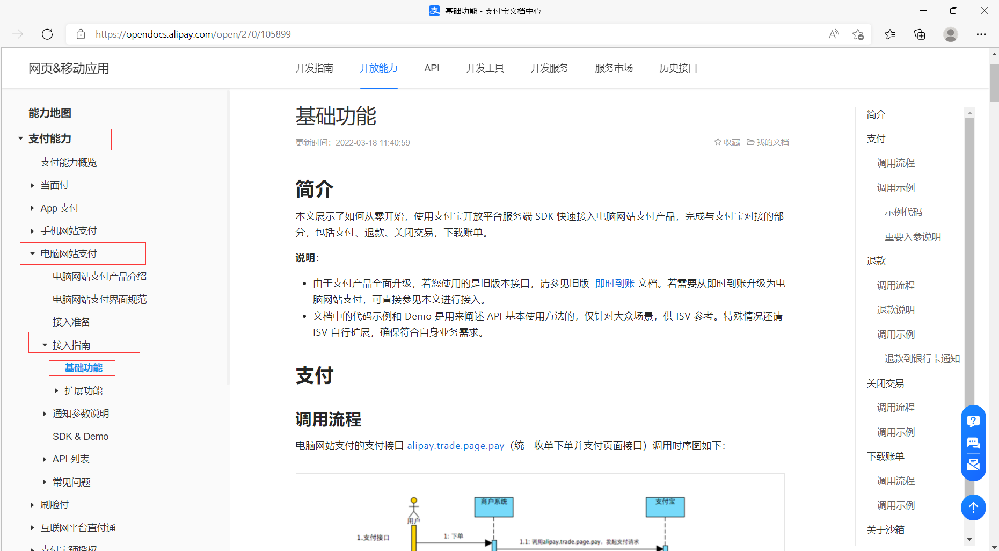

- ## **支付调用流程图**

> 用户向商户系统下单
>
> 商户系统向支付宝发起支付请求
>
> 支付宝给用户一个页面输入用户名密码登录
>
> 用户登录
>
> 用户再输入支付渠道和支付密码
>
> 用户向支付宝确认支付，支付宝通知商户系统支付成功有三种方式
>
> 1、支付宝向商户系统返回同步参数，是get请求
>
> 2、支付宝向商户系统发送异步通知，是post请求
>
> 3、商户系统没有收到同步参数和异步通知，商户系统主动向支付宝查看交易状态，支付宝返回交易信息

## **15、文档中有支付、退款、关闭交易、下载账单的调用流程图和示例**

## **16、查看确认订单后支付宝post通知的参数**

**地址：[异步通知参数说明 - 支付宝文档中心 (alipay.com)](https://opendocs.alipay.com/open/270/105902)**

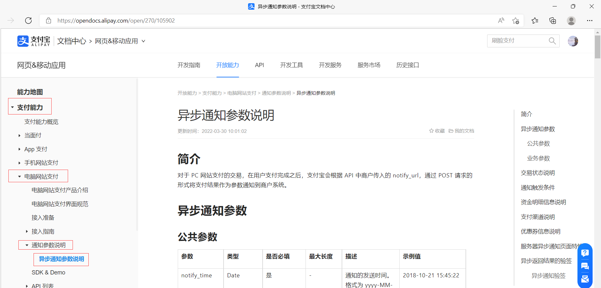

## 17、查看接口调用实例

**地址：[统一收单下单并支付页面接口 - 支付宝文档中心 (alipay.com)](https://opendocs.alipay.com/open/028r8t?scene=22)**

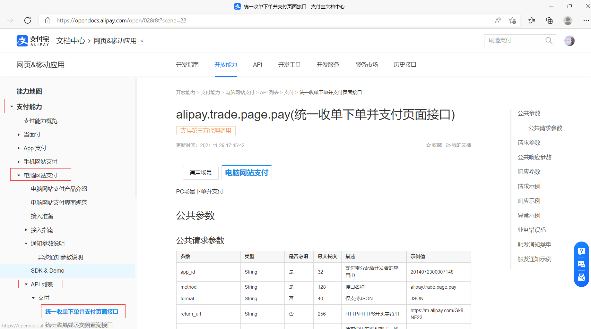

