## 1、新建一个SpringBoot项目

## 2、导入依赖

**进入支付宝文档中心，选择支付能力**


**选择开发工具，选择服务端（通用版）**

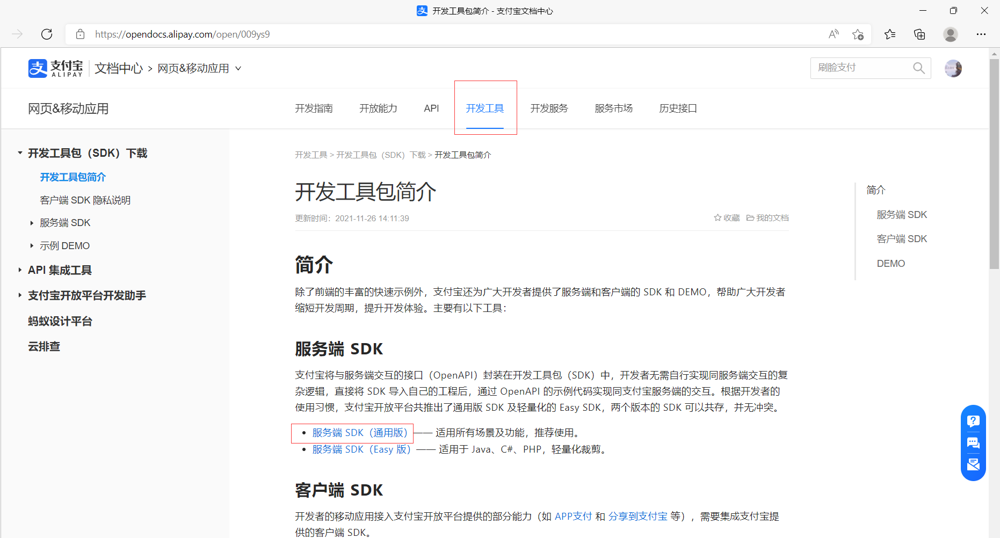

**选择Java的maven依赖**

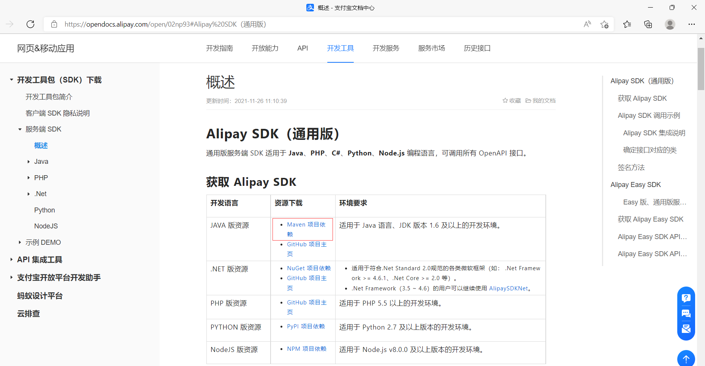

**选择最新版**

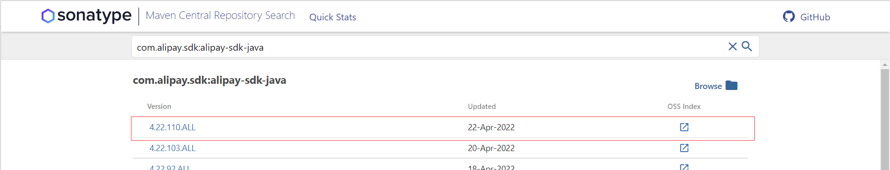

**复制maven依赖，添加到项目中**

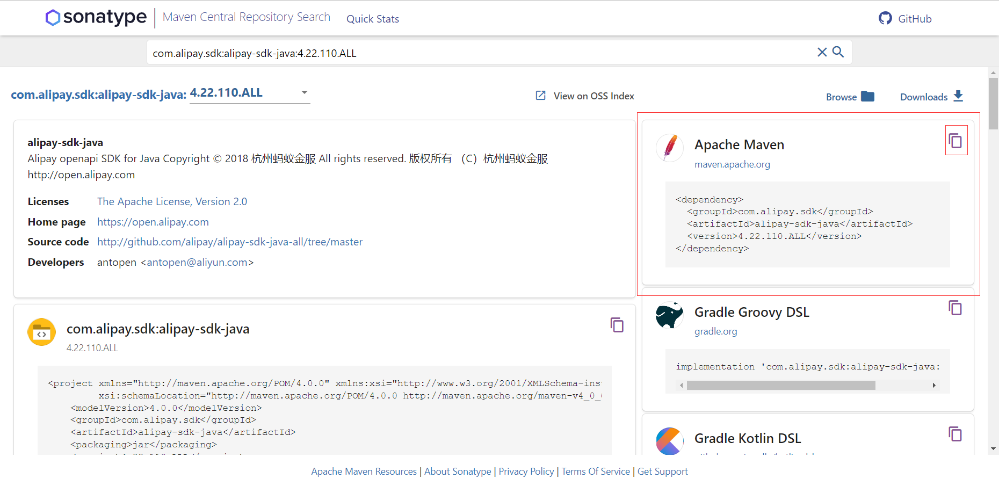

```xml
<!--阿里支付接口-->
<dependency>
    <groupId>com.alipay.sdk</groupId>
    <artifactId>alipay-sdk-java</artifactId>
    <version>4.22.110.ALL</version>
</dependency>
<!--web-->
<dependency>
    <groupId>org.springframework.boot</groupId>
    <artifactId>spring-boot-starter-web</artifactId>
</dependency>
<!--thymeleaf-->
<dependency>
    <groupId>org.springframework.boot</groupId>
    <artifactId>spring-boot-starter-thymeleaf</artifactId>
</dependency>
```

## 3、application.yml文件基本配置

```yml
server:
  port: 8800

spring:
  thymeleaf:
    #关闭缓存
    cache: false
    #前缀
    prefix: classpath:/templates/
    #后缀
    suffix: .html
```

## 4、新建一个控制器AlipayController

```java
package com.hzc.alipay_sandbox_demo.controller;

import org.springframework.stereotype.Controller;

@Controller
public class AlipayController {
}
```

## 5、在resource的templates文件夹下新建一个页面index.html

```html
<!DOCTYPE html>
<html lang="en">
<head>
    <meta charset="UTF-8">
    <title>Title</title>
</head>
<body>
    <h1>支付宝沙箱支付</h1>
</body>
</html>
```

## 6、控制器AlipayController添加接口跳转index.html

```java
@GetMapping("/")
public String index(){
    return "index";
}
```

## 7、查看官方文档的请求示例

**地址：[统一收单下单并支付页面接口 - 支付宝文档中心 (alipay.com)](https://opendocs.alipay.com/apis/api_1/alipay.trade.page.pay#请求示例)**

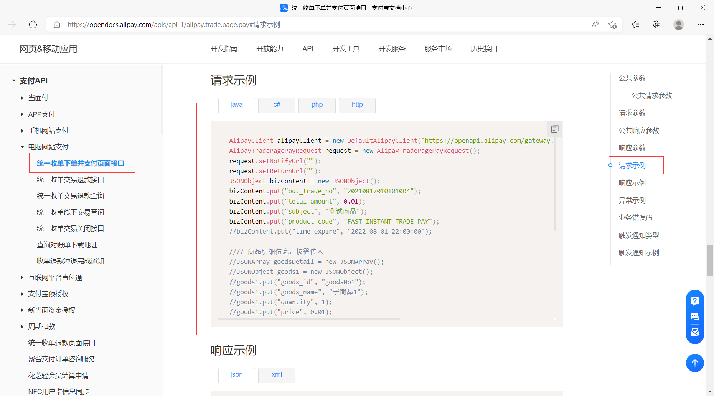

```java
AlipayClient alipayClient = new DefaultAlipayClient("https://openapi.alipay.com/gateway.do","app_id","your private_key","json","GBK","alipay_public_key","RSA2");
AlipayTradePagePayRequest request = new AlipayTradePagePayRequest();
request.setNotifyUrl("");
request.setReturnUrl("");
JSONObject bizContent = new JSONObject();
bizContent.put("out_trade_no", "20210817010101004");
bizContent.put("total_amount", 0.01);
bizContent.put("subject", "测试商品");
bizContent.put("product_code", "FAST_INSTANT_TRADE_PAY");
//bizContent.put("time_expire", "2022-08-01 22:00:00");

//// 商品明细信息，按需传入
//JSONArray goodsDetail = new JSONArray();
//JSONObject goods1 = new JSONObject();
//goods1.put("goods_id", "goodsNo1");
//goods1.put("goods_name", "子商品1");
//goods1.put("quantity", 1);
//goods1.put("price", 0.01);
//goodsDetail.add(goods1);
//bizContent.put("goods_detail", goodsDetail);

//// 扩展信息，按需传入
//JSONObject extendParams = new JSONObject();
//extendParams.put("sys_service_provider_id", "2088511833207846");
//bizContent.put("extend_params", extendParams);

request.setBizContent(bizContent.toString());
AlipayTradePagePayResponse response = alipayClient.pageExecute(request);
if(response.isSuccess()){
    System.out.println("调用成功");
} else {
    System.out.println("调用失败");
}
```

### 代码解析

```java
AlipayClient alipayClient = new DefaultAlipayClient("https://openapi.alipay.com/gateway.do","app_id","your private_key","json","GBK","alipay_public_key","RSA2");
//在文档中查看 公共请求参数
// app_id可以登录支付宝开放平台，找到沙箱，在沙箱应用界面中有APPID，地址：https://open.alipay.com/platform/appDaily.htm
// your private_key：私钥，设置沙箱应用的接口加签方式是保存到了本地，如果没有的话可以重新设置一下保存好
// alipay_public_key：公钥
// 其它参数无需更改

//------------------------------------------------------------

bizContent.put("out_trade_no", "20210817010101004");
bizContent.put("total_amount", 0.01);
bizContent.put("subject", "测试商品");
bizContent.put("product_code", "FAST_INSTANT_TRADE_PAY");
//在文档中查看 请求参数 ，下面四个是必须要填的
// out_trade_no：系统中自动生成的订单号，测试时也可以手动输入假数据
// total_amount：商品总价
// subject：订单标题
// product_code：订单编码，这个不需要修改
```

## 8、index.html中伪造订单请求数据

```html
<h2>伪造数据测试</h2>
<form action="create" method="post">
    订单号：<input type="text" name="id"><br>
    商品总金额：<input type="text" name="price"><br>
    订单名称：<input type="text" name="title"><br>
    <input type="submit"><br>
</form>
```

## 9、定义控制器接口create

```java
@PostMapping("/create")
public String create(String id,String price,String title){
    return "";
}
```

## 10、定义支付工具类AlipayUtil

### 1、定义支付方法pay

**正常情况控制器应该调用service类，这里因为是Demo为了方便就使用工具类，定义一个方法将文档中的请求示例复制过来**

```java
package com.hzc.alipay_sandbox_demo.utils;

import com.alibaba.fastjson.JSONObject;
import com.alipay.api.AlipayApiException;
import com.alipay.api.AlipayClient;
import com.alipay.api.DefaultAlipayClient;
import com.alipay.api.request.AlipayTradePagePayRequest;
import com.alipay.api.response.AlipayTradePagePayResponse;

@Component
public class AlipayUtil {
    public void pay() {
        AlipayClient alipayClient = new DefaultAlipayClient("https://openapi.alipay.com/gateway.do","app_id","your private_key","json","GBK","alipay_public_key","RSA2");
        AlipayTradePagePayRequest request = new AlipayTradePagePayRequest();
        request.setNotifyUrl("");
        request.setReturnUrl("");
        JSONObject bizContent = new JSONObject();
        bizContent.put("out_trade_no", "20210817010101004");
        bizContent.put("total_amount", 0.01);
        bizContent.put("subject", "测试商品");
        bizContent.put("product_code", "FAST_INSTANT_TRADE_PAY");

        request.setBizContent(bizContent.toString());
        AlipayTradePagePayResponse response = alipayClient.pageExecute(request);
        if(response.isSuccess()){
            System.out.println("调用成功");
        } else {
            System.out.println("调用失败");
        }
    }
}
```

## 11、yml配置支付配置

**这个配置不是依赖中必须的，只是将工具类的一些参数提取出来**

```yml
alipay:
  #沙箱环境网关
  url: https://openapi.alipaydev.com/gateway.do
  #正式环境网关
  #url: https://openapi.alipay.com/gateway.do
  appId: 2021000119677053
  privateKey: ...
  publicKey: ...
  #异步通知url
  notifyUrl: http://localhost:8800/notify
  #订单完成回调url
  returnUrl: http://localhost:8800/return
```

**privateKey：设置接口加签方式时保存的私钥，在C:\Users\xxx\Documents\支付宝开放平台开发助手\RSA密钥文件夹**

**publicKey：【注意】不是设置接口加签时保存的公钥，而是加签管理中的支付宝公钥**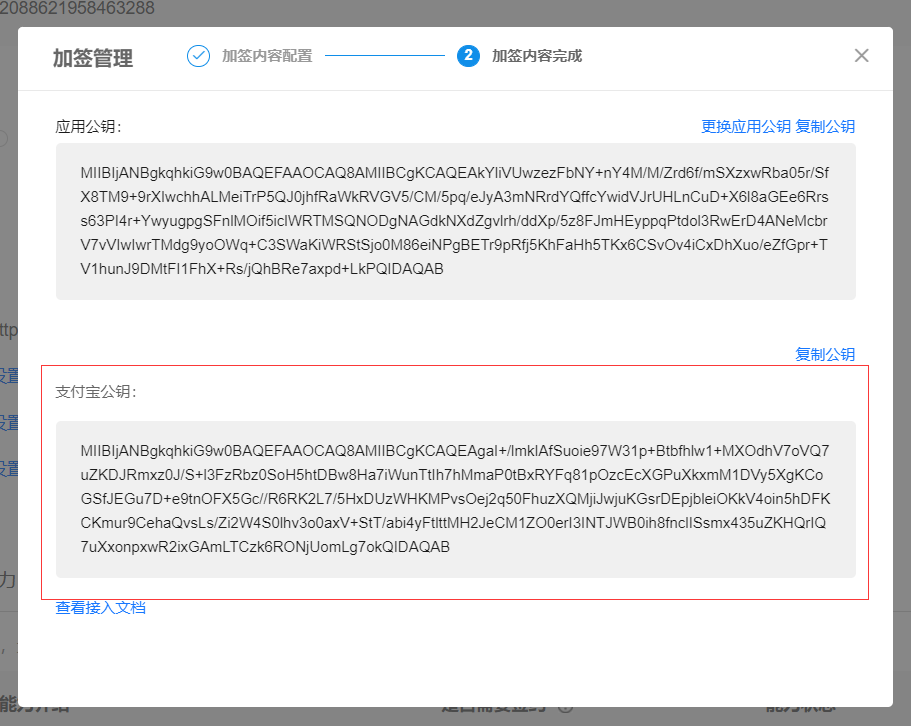

## 12、完善AlipayUtil的pay方法

**查看文档我们发现请求示例的响应是一个表单**

```xml
// 响应为表单格式，可嵌入页面，具体以返回的结果为准
<form name="submit_form" method="post" action="https://openapi.alipay.com/gateway.do?charset=UTF-8&method=alipay.trade.page.pay&sign=k0w1DePFqNMQWyGBwOaEsZEJuaIEQufjoPLtwYBYgiX%2FRSkBFY38VuhrNumXpoPY9KgLKtm4nwWz4DEQpGXOOLaqRZg4nDOGOyCmwHmVSV5qWKDgWMiW%2BLC2f9Buil%2BEUdE8CFnWhM8uWBZLGUiCrAJA14hTjVt4BiEyiPrtrMZu0o6%2FXsBu%2Fi6y4xPR%2BvJ3KWU8gQe82dIQbowLYVBuebUMc79Iavr7XlhQEFf%2F7WQcWgdmo2pnF4tu0CieUS7Jb0FfCwV%2F8UyrqFXzmCzCdI2P5FlMIMJ4zQp%2BTBYsoTVK6tg12stpJQGa2u3%2BzZy1r0KNzxcGLHL%2BwWRTx%2FCU%2Fg%3D%3D&notify_url=http%3A%2F%2F114.55.81.185%2Fopendevtools%2Fnotify%2Fdo%2Fbf70dcb4-13c9-4458-a547-3a5a1e8ead04&version=1.0&app_id=2014100900013222&sign_type=RSA&timestamp=2021-02-02+14%3A11%3A40&alipay_sdk=alipay-sdk-java-dynamicVersionNo&format=json">
    <input type="submit" value="提交" style="display:none" >
</form>
<!-- 自动提交这个表单，提交之后会跳转支付宝的支付平台 -->
<!-- 支付成功会跳转到request.setReturnUrl(xxx);中设置的地址 -->
<script>document.forms[0].submit();</script>
```

**所有我们需要获取这个表单然后返回，通过response.getBody()方法**

**默认编码GBK，改成UTF-8**

```java
package com.hzc.alipay_sandbox_demo.utils;

import com.alibaba.fastjson.JSONObject;
import com.alipay.api.AlipayApiException;
import com.alipay.api.AlipayClient;
import com.alipay.api.DefaultAlipayClient;
import com.alipay.api.request.AlipayTradePagePayRequest;
import com.alipay.api.response.AlipayTradePagePayResponse;
import org.springframework.beans.factory.annotation.Value;
import org.springframework.stereotype.Component;

@Component
public class AlipayUtil {
    @Value("${alipay.url}")
    public String url;
    @Value("${alipay.appId}")
    public String appId;
    @Value("${alipay.privateKey}")
    public String privateKey;
    @Value("${alipay.publicKey}")
    public String publicKey;
    @Value("${alipay.notifyUrl}")
    public String notifyUrl;
    @Value("${alipay.returnUrl}")
    public String returnUrl;

    public String pay(String id,String price,String title) {
        AlipayClient alipayClient = new DefaultAlipayClient(url,appId,privateKey,"json","UTF-8",publicKey,"RSA2");
        AlipayTradePagePayRequest request = new AlipayTradePagePayRequest();
        request.setNotifyUrl(notifyUrl);
        request.setReturnUrl(returnUrl);
        JSONObject bizContent = new JSONObject();
        bizContent.put("out_trade_no", id);
        bizContent.put("total_amount", price);
        bizContent.put("subject", title);
        bizContent.put("product_code", "FAST_INSTANT_TRADE_PAY");

        request.setBizContent(bizContent.toString());
        AlipayTradePagePayResponse response = null;
        String form = null;
        try {
            response = alipayClient.pageExecute(request);
            form = response.getBody();
        } catch (AlipayApiException e) {
            e.printStackTrace();
        }
        if(response.isSuccess()){
            System.out.println("调用成功");
        } else {
            System.out.println("调用失败");
        }
        return form;
    }
}
```

## 13、完善控制器接口create（创建订单）

```java
@Autowired
private AlipayUtil alipayUtil;
@PostMapping("/create")
public String create(String id, String price, String title, Model model){
    String pay = alipayUtil.pay(id, price, title);
    model.addAttribute("form",pay);
    return "pay";
}
```

14、创建pay.html用于显示`form`值

**使用thymeleaf语法：xmlns:th="http://www.thymeleaf.org"**

```java
<!DOCTYPE html>
<html lang="en" xmlns:th="http://www.thymeleaf.org">
<head>
    <meta charset="UTF-8">
    <title>Title</title>
</head>
<body>
    
<!-- th:utext="${form}"：将form的值赋在<div></div>之间 -->
<div th:utext="${form}"></div>
    
</body>
</html>
```

## 14、定义回调接口return（支付成功后回调）

```java
@GetMapping("/return")
public String returnNotice(){
    return "index";
    //如果是前后端分离就重定向
    //return "redirect:http://192.168.10.31:8081/#/mainPage"
}
```

## 15、测试订单

**访问localhost:8800**

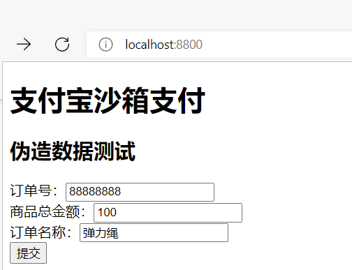

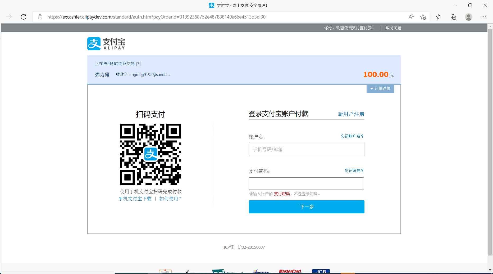

**如果显示钓鱼网站，就把浏览器的缓存清理一下**

**使用手机版支付宝沙箱版扫码支付，再输入支付密码**

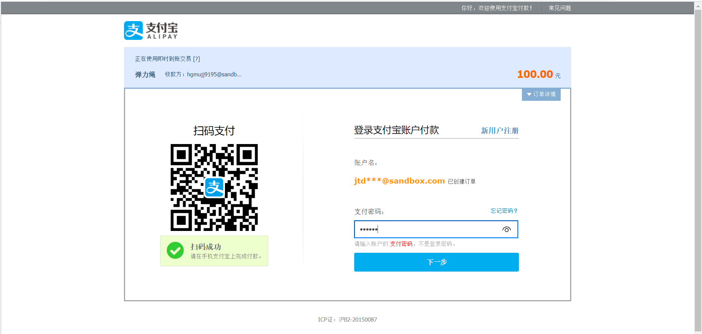

**再次输入支付密码**

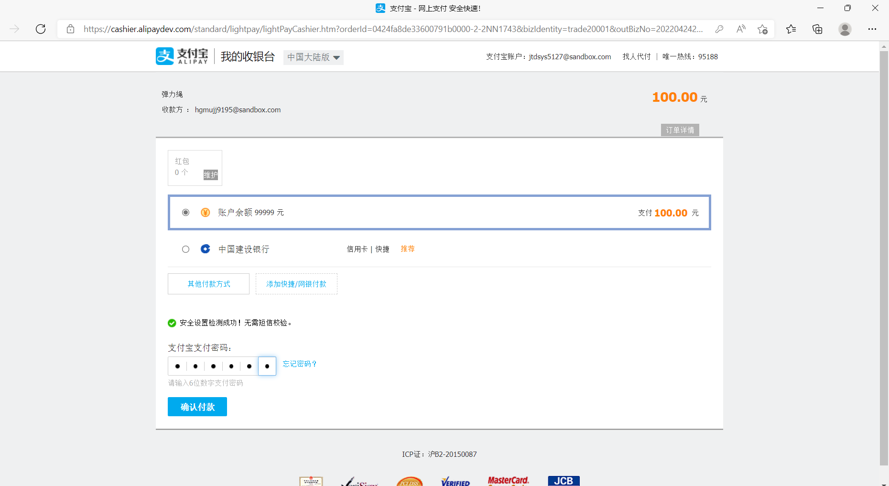

**支付完成**

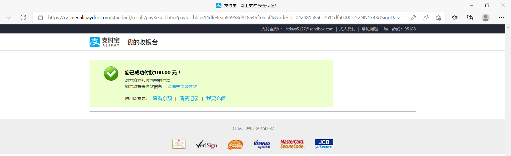

**等待一段时间后跳转回return接口中设置的index页面**

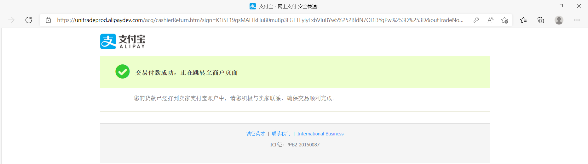


### 处理支付宝支付返回的form表单

```js
<iframe :srcdoc="payForm"
    frameborder="no"
    border="0"
    marginwidth="0"
    marginheight="0"
    scrolling="no"
    width="300"
    height="300"
    style="overflow:hidden;">
</iframe>

let data = new URLSearchParams();
data.append("goodsId",this.goods.gid);
axios({
    headers: {
        'Content-Type': 'application/x-www-form-urlencoded',
        token:this.token
    },
    method: 'post',
    url: 'service/pay/create',
    data:data
}).then(data=> {
    console.log(data)
    this.payForm = data.data.data;
})
```

## 16、查询订单

**同样去官方文档查询请求示例，地址：[统一收单线下交易查询接口 - 支付宝文档中心 (alipay.com)](https://opendocs.alipay.com/open/028woa#请求示例)**

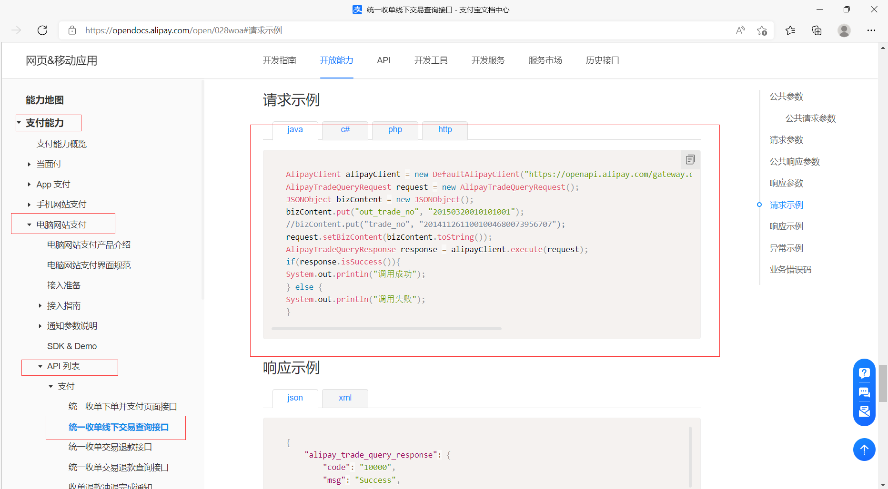

```java
AlipayClient alipayClient = new DefaultAlipayClient("https://openapi.alipay.com/gateway.do","app_id","your private_key","json","GBK","alipay_public_key","RSA2");
AlipayTradeQueryRequest request = new AlipayTradeQueryRequest();
JSONObject bizContent = new JSONObject();
bizContent.put("out_trade_no", "20150320010101001");
//bizContent.put("trade_no", "2014112611001004680073956707");
request.setBizContent(bizContent.toString());
AlipayTradeQueryResponse response = alipayClient.execute(request);
if(response.isSuccess()){
    System.out.println("调用成功");
} else {
    System.out.println("调用失败");
}
```

## 17、在AlipayUtil中定义query方法

```java
public String query(String id){
    AlipayClient alipayClient = new DefaultAlipayClient(url,appId,privateKey,"json","UTF-8",publicKey,"RSA2");
    AlipayTradeQueryRequest request = new AlipayTradeQueryRequest();
    JSONObject bizContent = new JSONObject();
    bizContent.put("out_trade_no", id);
    //bizContent.put("trade_no", "2014112611001004680073956707");
    request.setBizContent(bizContent.toString());
    AlipayTradeQueryResponse response = null;
    String form = null;
    try {
        response = alipayClient.execute(request);
        form = response.getBody();
    } catch (AlipayApiException e) {
        e.printStackTrace();
    }
    if(response.isSuccess()){
        System.out.println("调用成功");
    } else {
        System.out.println("调用失败");
    }
    return form;
}
```

**返回的form是一个json数据，有以下信息，这里有订单的所有信息**

```json
{
    "alipay_trade_query_response": {
        "code": "10000",
        "msg": "Success",
        "trade_no": "2013112011001004330000121536",
        "out_trade_no": "6823789339978248",
        "buyer_logon_id": "159****5620",
        "trade_status": "TRADE_CLOSED",
        "total_amount": 88.88,
        "trans_currency": "TWD",
        "settle_currency": "USD",
        "settle_amount": 2.96,
        "pay_currency": 1,
        "pay_amount": "8.88",
        "settle_trans_rate": "30.025",
        "trans_pay_rate": "0.264",
        "buyer_pay_amount": 8.88,
        "point_amount": 10,
        "invoice_amount": 12.11,
        "send_pay_date": "2014-11-27 15:45:57",
        "receipt_amount": "15.25",
        "store_id": "NJ_S_001",
        "terminal_id": "NJ_T_001",
        "fund_bill_list": [
            {
                "fund_channel": "ALIPAYACCOUNT",
                "amount": 10,
                "real_amount": 11.21
            }
        ],
        "store_name": "证大五道口店",
        "buyer_user_id": "2088101117955611",
        "industry_sepc_detail_gov": "{\"registration_order_pay\":{\"brlx\":\"1\",\"cblx\":\"1\"}}",
        "industry_sepc_detail_acc": "{\"registration_order_pay\":{\"brlx\":\"1\",\"cblx\":\"1\"}}",
        "charge_amount": "8.88",
        "charge_flags": "bluesea_1",
        "settlement_id": "2018101610032004620239146945",
        "trade_settle_info": {
            "trade_settle_detail_list": [
                {
                    "operation_type": "replenish",
                    "operation_serial_no": "2321232323232",
                    "operation_dt": "2019-05-16 09:59:17",
                    "trans_out": "208811****111111",
                    "trans_in": "208811****111111",
                    "amount": 10,
                    "ori_trans_out": "2088111111111111",
                    "ori_trans_in": "2088111111111111"
                }
            ]
        },
        "auth_trade_pay_mode": "CREDIT_PREAUTH_PAY",
        "buyer_user_type": "PRIVATE",
        "mdiscount_amount": "88.88",
        "discount_amount": "88.88",
        "subject": "Iphone6 16G",
        "body": "Iphone6 16G",
        "alipay_sub_merchant_id": "2088301372182171",
        "ext_infos": "{\"action\":\"cancel\"}",
        "passback_params": "merchantBizType%3d3C%26merchantBizNo%3d2016010101111",
        "hb_fq_pay_info": {
            "user_install_num": "3"
        },
        "credit_pay_mode": "creditAdvanceV2",
        "credit_biz_order_id": "ZMCB99202103310000450000041833",
        "enterprise_pay_info": {
            "invoice_amount": 80
        }
    },
    "sign": "ERITJKEIJKJHKKKKKKKHJEREEEEEEEEEEE"
}
```

## 18、改造控制器return接口

**需求：订单支付完成后，查看订单状态**

**out_trade_no：[统一收单线下交易查询接口 - 支付宝文档中心 (alipay.com)](https://opendocs.alipay.com/open/028woa#请求参数)中的一个参数，参数名乱写得不到值**

```java
@GetMapping("/return")
public String returnNotice(String out_trade_no,Model model){
    System.out.println(out_trade_no);
    String query = alipayUtil.query(out_trade_no);
    model.addAttribute("form",query);
    return "query";
}
```

## 19、创建query.html

```xml
<!DOCTYPE html>
<html lang="en" xmlns:th="http://www.thymeleaf.org">
<head>
    <meta charset="UTF-8">
    <title>Title</title>
</head>
<body>
<div th:utext="${form}"></div>
</body>
</html>
```

## 20、测试查询订单

**支付完成后回调接口，接口调用AlipayUtil中的query方法，返回Json数据，将json数据共享到query.html作为div的子文本**

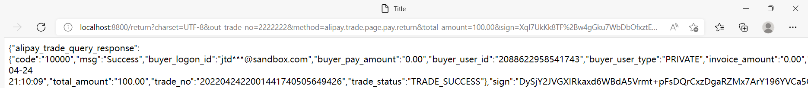

### **响应的Json数据参数**

#### 公共响应参数

| 参数     | 类型   | 是否必填 | 最大长度 | 描述                                                         | 示例值                                                       |
| -------- | ------ | -------- | -------- | ------------------------------------------------------------ | ------------------------------------------------------------ |
| code     | String | 是       | -        | 网关返回码,[详见文档](https://doc.open.alipay.com/docs/doc.htm?treeId=291&articleId=105806&docType=1) | 40004                                                        |
| msg      | String | 是       | -        | 网关返回码描述,[详见文档](https://doc.open.alipay.com/docs/doc.htm?treeId=291&articleId=105806&docType=1) | Business Failed                                              |
| sub_code | String | 否       | -        | 业务返回码，参见具体的API接口文档                            | ACQ.TRADE_HAS_SUCCESS                                        |
| sub_msg  | String | 否       | -        | 业务返回码描述，参见具体的API接口文档                        | 交易已被支付                                                 |
| sign     | String | 是       | -        | 签名,[详见文档](https://doc.open.alipay.com/docs/doc.htm?treeId=291&articleId=106074&docType=1) | DZXh8eeTuAHoYE3w1J+POiPhfDxOYBfUNn1lkeT/V7P4zJdyojWEa6IZs6Hz0yDW5Cp/viufUb5I0/V5WENS3OYR8zRedqo6D+fUTdLHdc+EFyCkiQhBxIzgngPdPdfp1PIS7BdhhzrsZHbRqb7o4k3Dxc+AAnFauu4V6Zdwczo= |

#### 响应参数

| 参数                     | 类型              | 是否必填 | 最大长度 | 描述                                                         | 示例值                                               |
| ------------------------ | ----------------- | -------- | -------- | ------------------------------------------------------------ | ---------------------------------------------------- |
| trade_no                 | String            | 必填     | 64       | 支付宝交易号                                                 | 2013112011001004330000121536                         |
| out_trade_no             | String            | 必填     | 64       | 商家订单号                                                   | 6823789339978248                                     |
| buyer_logon_id           | String            | 必填     | 100      | 买家支付宝账号                                               | 159****5620                                          |
| **trade_status**         | String            | 必填     | 32       | 交易状态：WAIT_BUYER_PAY（交易创建，等待买家付款）、TRADE_CLOSED（未付款交易超时关闭，或支付完成后全额退款）、TRADE_SUCCESS（交易支付成功）、TRADE_FINISHED（交易结束，不可退款），**根据这个状态判断进行数据库的操作** | TRADE_CLOSED                                         |
| total_amount             | Price             | 必填     | 11       | 交易的订单金额，单位为元，两位小数。该参数的值为支付时传入的total_amount | 88.88                                                |
| trans_currency           | String            | 选填     | 8        | 标价币种，该参数的值为支付时传入的trans_currency，支持英镑：GBP、港币：HKD、美元：USD、新加坡元：SGD、日元：JPY、加拿大元：CAD、澳元：AUD、欧元：EUR、新西兰元：NZD、韩元：KRW、泰铢：THB、瑞士法郎：CHF、瑞典克朗：SEK、丹麦克朗：DKK、挪威克朗：NOK、马来西亚林吉特：MYR、印尼卢比：IDR、菲律宾比索：PHP、毛里求斯卢比：MUR、以色列新谢克尔：ILS、斯里兰卡卢比：LKR、俄罗斯卢布：RUB、阿联酋迪拉姆：AED、捷克克朗：CZK、南非兰特：ZAR、人民币：CNY、新台币：TWD。当trans_currency 和 settle_currency 不一致时，trans_currency支持人民币：CNY、新台币：TWD | TWD                                                  |
| settle_currency          | String            | 选填     | 8        | 订单结算币种，对应支付接口传入的settle_currency，支持英镑：GBP、港币：HKD、美元：USD、新加坡元：SGD、日元：JPY、加拿大元：CAD、澳元：AUD、欧元：EUR、新西兰元：NZD、韩元：KRW、泰铢：THB、瑞士法郎：CHF、瑞典克朗：SEK、丹麦克朗：DKK、挪威克朗：NOK、马来西亚林吉特：MYR、印尼卢比：IDR、菲律宾比索：PHP、毛里求斯卢比：MUR、以色列新谢克尔：ILS、斯里兰卡卢比：LKR、俄罗斯卢布：RUB、阿联酋迪拉姆：AED、捷克克朗：CZK、南非兰特：ZAR | USD                                                  |
| settle_amount            | Price             | 选填     | 11       | 结算币种订单金额                                             | 2.96                                                 |
| pay_currency             | Price             | 选填     | 8        | 订单支付币种                                                 | CNY                                                  |
| pay_amount               | String            | 选填     | 11       | 支付币种订单金额                                             | 8.88                                                 |
| settle_trans_rate        | String            | 选填     | 11       | 结算币种兑换标价币种汇率                                     | 30.025                                               |
| trans_pay_rate           | String            | 选填     | 11       | 标价币种兑换支付币种汇率                                     | 0.264                                                |
| buyer_pay_amount         | Price             | 选填     | 11       | 买家实付金额，单位为元，两位小数。该金额代表该笔交易买家实际支付的金额，不包含商户折扣等金额 | 8.88                                                 |
| point_amount             | Price             | 选填     | 11       | 积分支付的金额，单位为元，两位小数。该金额代表该笔交易中用户使用积分支付的金额，比如集分宝或者支付宝实时优惠等 | 10                                                   |
| invoice_amount           | Price             | 选填     | 11       | 交易中用户支付的可开具发票的金额，单位为元，两位小数。该金额代表该笔交易中可以给用户开具发票的金额 | 12.11                                                |
| send_pay_date            | Date              | 选填     | 32       | 本次交易打款给卖家的时间                                     | 2014-11-27 15:45:57                                  |
| receipt_amount           | String            | 选填     | 11       | 实收金额，单位为元，两位小数。该金额为本笔交易，商户账户能够实际收到的金额 | 15.25                                                |
| store_id                 | String            | 选填     | 32       | 商户门店编号                                                 | NJ_S_001                                             |
| terminal_id              | String            | 选填     | 32       | 商户机具终端编号                                             | NJ_T_001                                             |
| fund_bill_list           | TradeFundBill[]   | 必填     |          | 交易支付使用的资金渠道。 只有在签约中指定需要返回资金明细，或者入参的query_options中指定时才返回该字段信息。 |                                                      |
| store_name               | String            | 选填     | 512      | 请求交易支付中的商户店铺的名称                               | 证大五道口店                                         |
| buyer_user_id            | String            | 必填     | 16       | 买家在支付宝的用户id                                         | 2088101117955611                                     |
| industry_sepc_detail_gov | String            | 选填     | 4096     | 行业特殊信息-统筹相关                                        | {"registration_order_pay":{"brlx":"1","cblx":"1"}}   |
| industry_sepc_detail_acc | String            | 选填     | 4096     | 行业特殊信息-个账相关                                        | {"registration_order_pay":{"brlx":"1","cblx":"1"}}   |
| charge_amount            | String            | 选填     | 11       | 该笔交易针对收款方的收费金额； 只在银行间联交易场景下返回该信息； | 8.88                                                 |
| charge_flags             | String            | 选填     | 64       | 费率活动标识。 当交易享受特殊行业或活动费率时，返回该场景的标识。具体场景如下： trade_special_00：订单优惠费率； industry_special_on_00：线上行业特殊费率0； industry_special_on_01：线上行业特殊费率1； industry_special_00：线下行业特殊费率0； industry_special_01：线下行业特殊费率1； bluesea_1：蓝海活动优惠费率标签； 注：只在机构间联模式下返回，其它场景下不返回该字段； | bluesea_1                                            |
| settlement_id            | String            | 选填     | 64       | 支付清算编号，用于清算对账使用； 只在银行间联交易场景下返回该信息； | 2018101610032004620239146945                         |
| trade_settle_info        | TradeSettleInfo   | 选填     |          | 返回的交易结算信息，包含分账、补差等信息。 只有在query_options中指定时才返回该字段信息。 |                                                      |
| auth_trade_pay_mode      | String            | 选填     | 64       | 预授权支付模式，该参数仅在信用预授权支付场景下返回。信用预授权支付：CREDIT_PREAUTH_PAY | CREDIT_PREAUTH_PAY                                   |
| buyer_user_type          | String            | 选填     | 18       | 买家用户类型。CORPORATE:企业用户；PRIVATE:个人用户。         | PRIVATE                                              |
| mdiscount_amount         | String            | 选填     | 11       | 商家优惠金额                                                 | 88.88                                                |
| discount_amount          | String            | 选填     | 11       | 平台优惠金额                                                 | 88.88                                                |
| subject                  | String            | 选填     | 256      | 订单标题； 只在银行间联交易场景下返回该信息；                | Iphone6 16G                                          |
| body                     | String            | 选填     | 1000     | 订单描述； 只在银行间联交易场景下返回该信息；                | Iphone6 16G                                          |
| alipay_sub_merchant_id   | String            | 选填     | 32       | 间连商户在支付宝端的商户编号； 只在银行间联交易场景下返回该信息； | 2088301372182171                                     |
| ext_infos                | String            | 选填     | 1024     | 交易额外信息，特殊场景下与支付宝约定返回。 json格式。        | {"action":"cancel"}                                  |
| passback_params          | String            | 选填     | 512      | 公用回传参数。 返回支付时传入的passback_params参数信息       | merchantBizType%3d3C%26merchantBizNo%3d2016010101111 |
| hb_fq_pay_info           | HbFqPayInfo       | 选填     |          | 若用户使用花呗分期支付，且商家开通返回此通知参数，则会返回花呗分期信息。json格式其它说明详见花呗分期信息说明。 注意：商家需与支付宝约定后才返回本参数。 |                                                      |
| credit_pay_mode          | String            | 必填     | 64       | 信用支付模式。表示订单是采用信用支付方式（支付时买家没有出资，需要后续履约）。"creditAdvanceV2"表示芝麻先用后付模式，用户后续需要履约扣款。 此字段只有信用支付场景才有值，商户需要根据字段值单独处理。此字段以后可能扩展其他值，建议商户使用白名单方式识别，对于未识别的值做失败处理，并联系支付宝技术支持人员。 | creditAdvanceV2                                      |
| credit_biz_order_id      | String            | 必填     | 64       | 信用业务单号。信用支付场景才有值，先用后付产品里是芝麻订单号。 | ZMCB99202103310000450000041833                       |
| enterprise_pay_info      | EnterprisePayInfo | 必填     |          | 因公付支付信息                                               |                                                      |


# 总结

配置文件

创建控制器

复制阿里的请求实例改改

控制器回调接口，可传入参数，参数名看文档的响应实例


# 示例

## application.yml

```yml
alipay:
  #沙箱环境网关
  url: https://openapi.alipaydev.com/gateway.do
  #正式环境网关
  #url: https://openapi.alipay.com/gateway.do
  appId: 2021000119677053
  privateKey: MIIEvgIBADANBgkqhkiG9w0BAQEFAASCBKgwggSkAgEAAoIBAQCmTpjpQ1YOT6DGgVQvAeL2PASzM1zZtSApuJ2W5ZQedMiBAWWeqZzvrl2xVXg7fDB4AmDDWaNUIZzqBUuezuKQgM9hubyrisP4+2+J4KyPF6ytnKJzOiIMJmya0U85aSa1QOCvLyNDmnKi1A3d9uAtyFaVMbQaoTI/1JyqzlVUlzR/D0kATKbikNHJdbHwXIctL4fZLFIgup+jIozdo9SC8cI8yTK/Mu7pd4ktiYIbCk/pSzGS5tsUX3wrfaVQoBNb522NKp+MnSv64pmEH/5QO0QaZDP5EaKmB+gvV+dq9brVejBN6RBAbu6XZaJ8k5nYBw74J1zcV1B1NRTO0C57AgMBAAECggEBAJC9axvo/OarqtPZDzlyPOPtTHHiS/c2Sm3FPXJtEMKJBVAxtQ2ntOxtJyIFrwSmi1CHUUvzodDBCF4siaoHiOwXD2aQToJF3VW/D05Ceix3gFQBNOlwON22O2Nqs7bVq1ioxGPzdI+LxiWsxPzftjBiYeirP4LFtIQVONz3gxCAt+CYRKXNpmQIri5f6I4JiNBwqZ6PFoBWA6zKfDKKjz7UZ/qJHcLtyNkdY/pWJMInQtpE1i1eoFwihsBxa3O77gTRZMCWeHbs8TAqOUNSZXm/BTiayK9jDYEAhAq7b81Q0fRefgt6jphSzFCcgF8UCG6zEN9ysq78ZwwjVqyAp2ECgYEA4x7798MI/YkcgVlXFRppJ5bWcwUENLMAjr25kiYdXNVpXr1LrECQbGLssMc33vGTMPu61KOD0fWEtbaH85V/Unzy9MoeFwlglZVRnthL5iRj5j6bE/mNyoBoCCk16g3U8d3IakuVoqV5biqQCkkVdZX06lbImlkK9cKS11w942kCgYEAu3QOck7tvOSDVwEGv77YR1Cl5Iw76YwVOyLDd3w5Kb8zNRFFtVVtBSNehghlxEQQAOmrZe24/I8cQS3I1tyIPDsw277cRWFctG1TG1/hTeB4+9G2ygww44UZIjFiPar4H/id85nIf7vcSKzHcXXoaET/3CSd+LbYYxjrPfW9GkMCgYAQJyL6cwePqJG7bVQxLwithR/JXGD5MoXmoP2ytD1AXfk5gLMCFDFxU/PLes+xbnLud+jIuLxmUVTX65xtqYM9pZ9N45YSQ1t4J/9/EZkMTChCts8ms4fvEATWF8A63jL35LMdRDTnNWeWezZ1VM9O5pRdmkB4Ib8SzXzODkRkiQKBgQCYeCuP+ncQ32WdDO6qY9aTGxv0K8RHkHNsaDhJJbdxJ13FWkky10sXlM87gfUUkK/brjSFcbi3ZMf8k/r6GOKO6y4wbqvHmwvGje29JF2j9GMzoD5nVUcmqInq7/QSaM/tYVFIZNtaWjkwu6h1twvUU9sw+m+rbz3OTOR6vziS9QKBgBZqW33yOJ60Y4LURsdEgEULcK33HVIcyRU60EWiwt5oamel0rUI3dTaeczz+lHfPiiLJASPbC5LfNjUJM/STmJ/TbEOotgpacq9xikRP/vkxM5Xrx8CkFTEgeO7ADDMl5lEepDJsJ0KECiMcnwX2OP+hvtDMXmhGra3mVyZJL7l
  publicKey: MIIBIjANBgkqhkiG9w0BAQEFAAOCAQ8AMIIBCgKCAQEAgaI+/lmkIAfSuoie97W31p+Btbfhlw1+MXOdhV7oVQ7uZKDJRmxz0J/S+l3FzRbz0SoH5htDBw8Ha7iWunTtIh7hMmaP0tBxRYFq81pOzcEcXGPuXkxmM1DVy5XgKCoGSfJEGu7D+e9tnOFX5Gc//R6RK2L7/5HxDUzWHKMPvsOej2q50FhuzXQMjiJwjuKGsrDEpjbleiOKkV4oin5hDFKCKmur9CehaQvsLs/Zi2W4S0lhv3o0axV+StT/abi4yFtlttMH2JeCM1ZO0erI3INTJWB0ih8fnclISsmx435uZKHQrIQ7uXxonpxwR2ixGAmLTCzk6RONjUomLg7okQIDAQAB
#  privateKey:
#  publicKey:
  #异步通知url
  notifyUrl: http://120.77.96.250:8001/notify
  #订单完成回调url
  returnUrl: http://localhost:8001/pay/return
  #应用公钥证书文件路径
  certPath: E:\AppData\文档\支付宝开放平台开发助手\CSR\appCertPublicKey_2021000119677053.crt
  #支付宝公钥证书文件路径
  alipayPublicCertPath: E:\AppData\文档\支付宝开放平台开发助手\CSR\alipayCertPublicKey_RSA2.crt
  #支付宝根证书文件路径
  rootCertPath: E:\AppData\文档\支付宝开放平台开发助手\CSR\alipayRootCert.crt
```

## 控制器

```java
package com.hzc.barter.controller;

import com.alipay.api.AlipayApiException;
import com.hzc.barter.service.PayService;
import io.swagger.annotations.ApiOperation;
import org.springframework.beans.factory.annotation.Autowired;
import org.springframework.web.bind.annotation.PostMapping;
import org.springframework.web.bind.annotation.RequestMapping;
import org.springframework.web.bind.annotation.RestController;

import javax.servlet.http.HttpServletRequest;

@RestController
@RequestMapping("/pay")
public class PayController {
    @Autowired
    private PayService service;

    @PostMapping("/create")
    @ApiOperation("创建订单")
    public String create(String id, Double price, String goodsName, HttpServletRequest request){
        String pay = service.create(id, price, goodsName);
        return pay;
    }

    @RequestMapping("/return")
    @ApiOperation("支付回调")
    //MVC会自动将请求中的out_trade_no属性赋值到方法参数上
    public String create(String out_trade_no){
        String pay = service.query(out_trade_no);
        return pay;
    }

    @RequestMapping("/refund")
    @ApiOperation("退款")
    public String refund(String out_trade_no,Double refund_amount) throws AlipayApiException {
        String refund = service.refund(out_trade_no, refund_amount);
        return refund;
    }
    @RequestMapping("/refundQuery")
    @ApiOperation("查询退款")
    public String refundQuery(String out_trade_no) throws AlipayApiException {
        String refund = service.refundQuery(out_trade_no);
        return refund;
    }
    @RequestMapping("/close")
    @ApiOperation("关闭交易")
    public String close(String trade_no) throws AlipayApiException {
        String close = service.close(trade_no);
        return close;
    }
    @RequestMapping("/transfer")
    @ApiOperation("转账")
    public String transfer(String goodsName) throws AlipayApiException {
        String close = service.transfer(goodsName);
        return close;
    }
}

```

## 业务层

```java
package com.hzc.barter.service;

import com.alibaba.fastjson.JSONObject;
import com.alipay.api.AlipayApiException;
import com.alipay.api.AlipayClient;
import com.alipay.api.CertAlipayRequest;
import com.alipay.api.DefaultAlipayClient;
import com.alipay.api.domain.AlipayFundTransUniTransferModel;
import com.alipay.api.domain.Participant;
import com.alipay.api.request.*;
import com.alipay.api.response.*;
import org.springframework.beans.factory.annotation.Value;
import org.springframework.stereotype.Service;

import javax.servlet.http.HttpServletRequest;
import java.util.UUID;

@Service
public class PayService {
    @Value("${alipay.url}")
    public String url;
    @Value("${alipay.appId}")
    public String appId;
    @Value("${alipay.privateKey}")
    public String privateKey;
    @Value("${alipay.publicKey}")
    public String publicKey;
    @Value("${alipay.notifyUrl}")
    public String notifyUrl;
    @Value("${alipay.returnUrl}")
    public String returnUrl;
    @Value("${alipay.certPath}")
    public String certPath;
    @Value("${alipay.alipayPublicCertPath}")
    public String alipayPublicCertPath;
    @Value("${alipay.rootCertPath}")
    public String rootCertPath;

    public String create(String id, Double price, String title){
        String pay = pay(id, price, title);
        return pay;
    }

    public String pay(String id, Double price, String title) {
        AlipayClient alipayClient = new DefaultAlipayClient(url,appId,privateKey,"json","UTF-8",publicKey,"RSA2");
        AlipayTradePagePayRequest request = new AlipayTradePagePayRequest();
        request.setNotifyUrl(notifyUrl);
        request.setReturnUrl(returnUrl);
        JSONObject bizContent = new JSONObject();
        //这里不设置trade_no，因为设置了支付宝也会将其覆盖，不设置还能不被误导
        //        bizContent.put("trade_no", id);
        //设置外部订单号，这个可以当作本系统独有的订单号
        //该外部订单号，可用于查询订单和退款
        bizContent.put("out_trade_no", id);
        bizContent.put("total_amount", price);
        bizContent.put("subject", title);
        bizContent.put("product_code", "FAST_INSTANT_TRADE_PAY");

        request.setBizContent(bizContent.toString());
        AlipayTradePagePayResponse response = null;
        String form = null;
        try {
            response = alipayClient.pageExecute(request);
            form = response.getBody();
        } catch (AlipayApiException e) {
            e.printStackTrace();
        }
        /*if(response.isSuccess()){
            System.out.println("调用成功");
        } else {
            System.out.println("调用失败");
        }*/
        return form;
    }

    public String query(String out_trade_no){
        AlipayClient alipayClient = new DefaultAlipayClient(url,appId,privateKey,"json","UTF-8",publicKey,"RSA2");
        AlipayTradeQueryRequest request = new AlipayTradeQueryRequest();
        JSONObject bizContent = new JSONObject();
        //        System.out.println(trade_no);
        bizContent.put("out_trade_no", out_trade_no);
        //        bizContent.put("trade_no", trade_no);
        request.setBizContent(bizContent.toString());
        AlipayTradeQueryResponse response = null;
        String form = null;
        try {
            response = alipayClient.execute(request);
            form = response.getBody();
        } catch (AlipayApiException e) {
            e.printStackTrace();
        }
        /*if(response.isSuccess()){
            System.out.println("调用成功");
        } else {
            System.out.println("调用失败");
        }*/
        return form;
    }

    public String refund(String out_trade_no,Double price) throws AlipayApiException {
        AlipayClient alipayClient = new DefaultAlipayClient(url,appId,privateKey,"json","UTF-8",publicKey,"RSA2");
        AlipayTradeRefundRequest request = new AlipayTradeRefundRequest();
        JSONObject bizContent = new JSONObject();
        bizContent.put("out_trade_no", out_trade_no);
        bizContent.put("refund_amount", price);
        //多次退款，或者退款失败重试时，退款请求号不能变，现在只有一次退款需求，所以这里退款号和订单号相同
        bizContent.put("request_no", out_trade_no);

        //// 返回参数选项，按需传入
        //JSONArray queryOptions = new JSONArray();
        //queryOptions.add("refund_detail_item_list");
        //bizContent.put("query_options", queryOptions);

        request.setBizContent(bizContent.toString());
        AlipayTradeRefundResponse response = alipayClient.execute(request);

        return response.getBody();
    }

    public String refundQuery(String out_trade_no) throws AlipayApiException {
        AlipayClient alipayClient = new DefaultAlipayClient(url,appId,privateKey,"json","UTF-8",publicKey,"RSA2");
        AlipayTradeFastpayRefundQueryRequest request = new AlipayTradeFastpayRefundQueryRequest();
        JSONObject bizContent = new JSONObject();
        bizContent.put("out_trade_no", out_trade_no);
        bizContent.put("out_request_no", out_trade_no);

        //// 返回参数选项，按需传入
        //JSONArray queryOptions = new JSONArray();
        //queryOptions.add("refund_detail_item_list");
        //bizContent.put("query_options", queryOptions);

        request.setBizContent(bizContent.toString());
        AlipayTradeFastpayRefundQueryResponse response = alipayClient.execute(request);

        return response.getBody();
    }

    public String close(String trade_no) throws AlipayApiException {
        AlipayClient alipayClient = new DefaultAlipayClient(url,appId,privateKey,"json","UTF-8",publicKey,"RSA2");
        AlipayTradeCloseRequest request = new AlipayTradeCloseRequest();
        JSONObject bizContent = new JSONObject();
        bizContent.put("trade_no", trade_no);
        request.setBizContent(bizContent.toString());
        AlipayTradeCloseResponse response = alipayClient.execute(request);
        return response.getBody();
    }

    public String transfer(String goodsName) throws AlipayApiException {
        CertAlipayRequest alipayConfig = new CertAlipayRequest();
        alipayConfig.setPrivateKey(privateKey);
        alipayConfig.setServerUrl(url);
        alipayConfig.setAppId(appId);
        alipayConfig.setCharset("UTF8");
        alipayConfig.setSignType("RSA2");
        alipayConfig.setEncryptor("");
        alipayConfig.setFormat("json");
        //请填写您的应用公钥证书文件路径，例如：/foo/appCertPublicKey_2019051064521003.crt
        alipayConfig.setCertPath(certPath);
        //请填写您的支付宝公钥证书文件路径，例如：/foo/alipayCertPublicKey_RSA2.crt
        alipayConfig.setAlipayPublicCertPath(alipayPublicCertPath);
        //请填写您的支付宝根证书文件路径，例如：/foo/alipayRootCert.crt
        alipayConfig.setRootCertPath(rootCertPath);
        AlipayClient alipayClient = new DefaultAlipayClient(alipayConfig);
        AlipayFundTransUniTransferRequest request = new AlipayFundTransUniTransferRequest();
        AlipayFundTransUniTransferModel model = new AlipayFundTransUniTransferModel();
        //商家侧唯一订单号，由商家自定义。对于不同转账请求，商家需保证该订单号在自身系统唯一。
        model.setOutBizNo(UUID.randomUUID().toString());
        //业务备注。
        model.setRemark("共院易物网：【"+goodsName+"】金额结算");
        //转账业务请求的扩展参数，支持传入的扩展参数如下：
        //payer_show_name_use_alias：是否展示付款方别名，可选，收款方在支付宝账单中可见。枚举支持：
        //* true：展示别名，将展示商家支付宝在商家中心 商户信息 > 商户基本信息 页面配置的 商户别名。
        //* false：不展示别名。默认为 false。
        model.setBusinessParams("{\"payer_show_name_use_alias\":\"true\"}");
        //业务场景。单笔无密转账固定为 DIRECT_TRANSFER。
        model.setBizScene("DIRECT_TRANSFER");
        Participant payeeInfo = new Participant();
        //参与方的标识 ID。
        //当 identity_type=ALIPAY_USER_ID 时，填写支付宝用户 UID。示例值：2088123412341234。
        //当 identity_type=ALIPAY_LOGON_ID 时，填写支付宝登录号。示例值：186xxxxxxxx。
        payeeInfo.setIdentity("jtdsys5127@sandbox.com");
        //参与方的标识类型，目前支持如下枚举：
        //ALIPAY_USER_ID：支付宝会员的用户 ID，可通过 获取会员信息 能力获取。
        //ALIPAY_LOGON_ID：支付宝登录号，支持邮箱和手机号格式。
        payeeInfo.setIdentityType("ALIPAY_LOGON_ID");
        //参与方真实姓名。如果非空，将校验收款支付宝账号姓名一致性。
        //当 identity_type=ALIPAY_LOGON_ID 时，本字段必填。若传入该属性，则在支付宝回单中将会显示这个属性。
        payeeInfo.setName("jtdsys5127");
        //收款方信息
        model.setPayeeInfo(payeeInfo);
        //转账金额
        model.setTransAmount("23.00");
        //销售产品码。单笔无密转账固定为 TRANS_ACCOUNT_NO_PWD。
        model.setProductCode("TRANS_ACCOUNT_NO_PWD");
        //转账业务的标题，用于在支付宝用户的账单里显示。
        model.setOrderTitle("共院易物网：【"+goodsName+"】金额结算");
        request.setBizModel(model);
        AlipayFundTransUniTransferResponse response = alipayClient.certificateExecute(request);
        //        System.out.println(response.getBody());
        return response.getBody();
    }
}
```

# 生成证书

因为单笔转账不能使用公钥模式了，必须使用公钥证书模式，所以我们需要获取到“应用公钥证书”、“支付宝公钥证书”、“支付宝根证书”

打开支付宝开放平台开发助手app

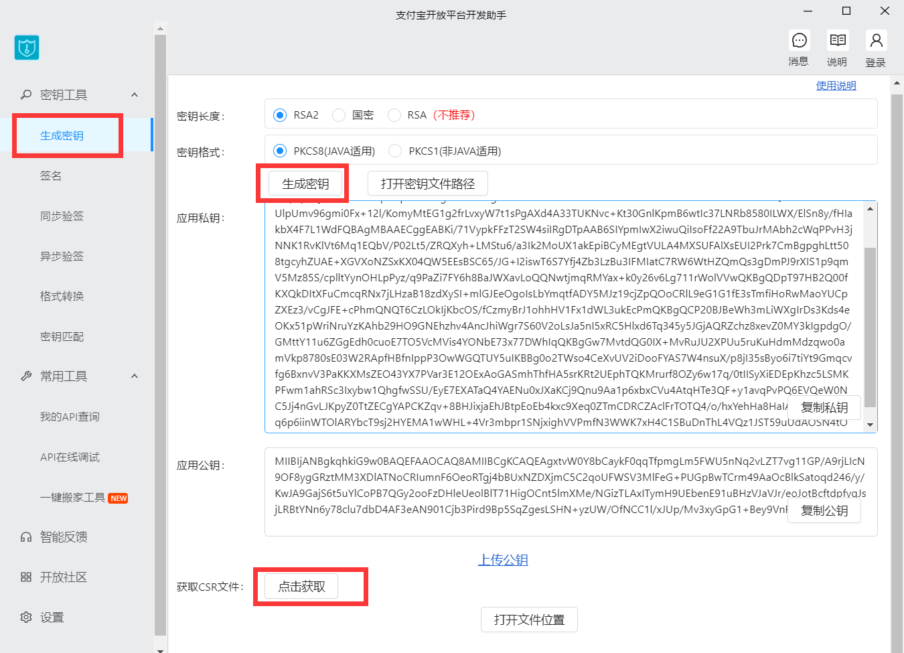

组织/公司，名称一定要和开发者中心门户账号信息的公司名称保持一致，否则会导致后续步骤中上传CSR证书文件校验失败

沙箱填写组织/公司时，名称必须是“商家账号”

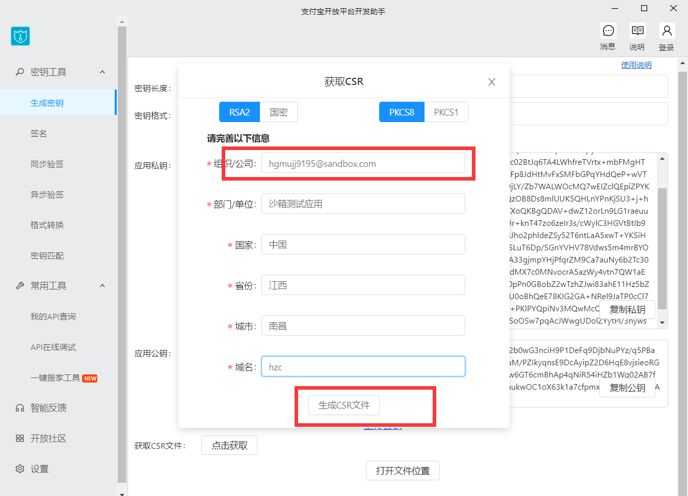

前往沙箱应用：[支付宝开放平台 (alipay.com)](https://open.alipay.com/develop/sandbox/app)

下载三个证书

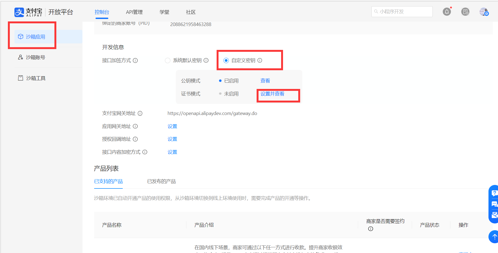

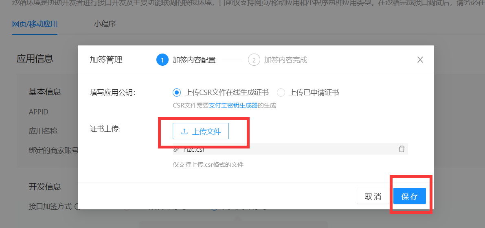

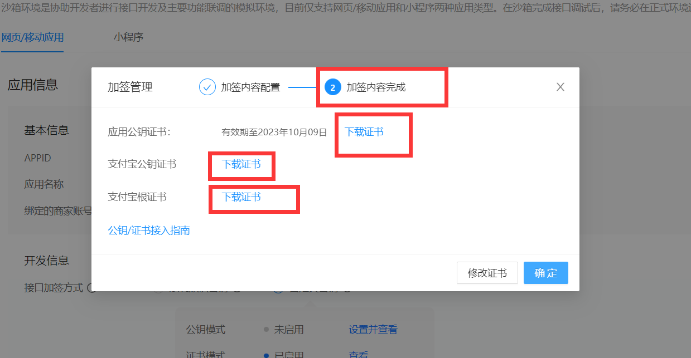


## 问题

设置完证书之后可以单笔转账了，但是回过头去生成订单返回的表单数据，请求时会报错：验签出错，建议检查签名字符串或签名私钥与应用公钥是否匹配

**解决：**

1. application.yml的私钥换成“CRS在线生成证书”**xxx.crs文件**同目录的**xxx\_私钥.txt**
2. 将沙箱设回**公钥模式**，应用公钥填“CRS在线生成证书”**xxx.crs文件**同目录的**xxx\_公钥.txt**，得到支付宝公钥，将支付宝公钥填入application的公钥部分（为了使生成订单和回调的支付宝公钥有效）
3. 再换回**证书模式**，注意要**重新下载证书**，因为重新设置证书模式证书会变（为了使转账的证书有效）

