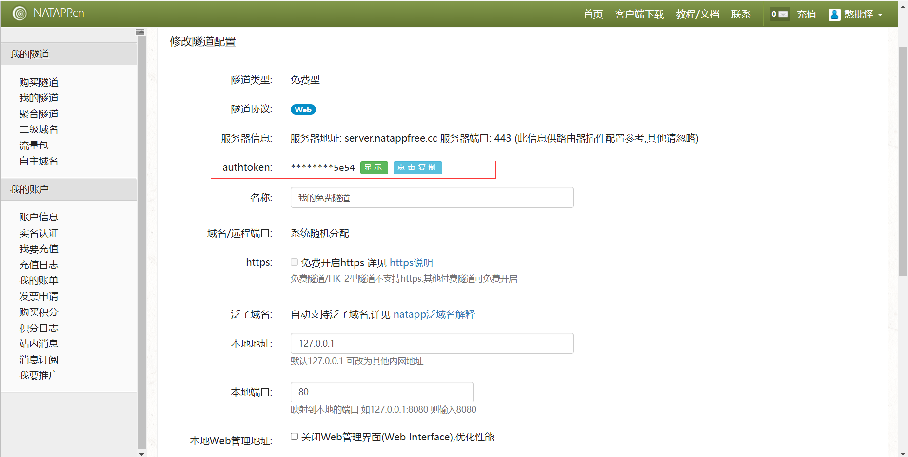

我们自己定义的通知配置是：

```yml
notifyUrl: http://localhost:8800/notify
```

**问题：**可是之前生成了好几次订单却没有调用该接口，就算是因为我们没有定义该接口也总会报404吧

**原因：**异步通知需要公网IP，localhost是无法接受到通知的，因为我们对于外网的IP是不固定的，需要用到服务器或者是内网穿透技术，这里我们主要使用内网穿透来解决通知不到的问题


## 使用natapp内网穿透工具

**地址：[NATAPP-内网穿透 基于ngrok的国内高速内网映射工具](https://natapp.cn/)**

### 注册一个免费的隧道


### 点击注册


### 注册完成自动进入主页


### 购买免费的隧道


### 点击免费隧道


### 查看我的隧道，这里就是刚刚购买的隧道


### 点击配置查看隧道信息

**因为项目端口是8800，所以将本地端口80改成8800**



## 修改yml（这里好像还有问题，实在不行就部署到服务器上）

```yml
notifyUrl: http://server.natappfree.cc:443/notify
```

## 定义控制器的notify接口

**必须是post类型**

```java
@PostMapping("/notify")
public String notifyNotice(){
    return "notify";
}
```

## 创建notify.html

```html
<!DOCTYPE html>
<html lang="en" xmlns:th="http://www.thymeleaf.org">
    <head>
        <meta charset="UTF-8">
        <title>Title</title>
    </head>
    <body>
        <h1>支付宝沙箱支付异步通知</h1>
    </body>
</html>
```

**问题：生成订单后发现并没有跳转notify.html**

**原因：因为这是一个post请求，是支付宝发起的异步通知消息，只能接受消息数据，不用返回什么东西**

**消息是一个有很多键的url，notify接口可以传入这些键作为参数获取值**

## 查看官方文档的通知示例

地址：[统一收单下单并支付页面接口 - 支付宝文档中心 (alipay.com)](https://opendocs.alipay.com/open/028r8t?scene=22#触发通知示例_2)

```
https://www.merchant.com/receive_notify.htm?notify_type=trade_status_sync&notify_id=91722adff935e8cfa58b3aabf4dead6ibe&notify_time=2017-02-16 21:46:15&sign_type=RSA2&sign=WcO+t3D8Kg71dTlKwN7r9PzUOXeaBJwp8/FOuSxcuSkXsoVYxBpsAidprySCjHCjmaglNcjoKJQLJ28/Asl93joTW39FX6i07lXhnbPknezAlwmvPdnQuI01HZsZF9V1i6ggZjBiAd5lG8bZtTxZOJ87ub2i9GuJ3Nr/NUc9VeY=&fund_bill_list=null&receipt_amount=null&invoice_amount=null&buyer_pay_amount=null&point_amount=null&voucher_detail_list=null&passback_params=null&out_channel_type=null&trade_no=null&app_id=null&out_trade_no=null&out_biz_no=null&buyer_id=null&seller_id=null&trade_status=null&total_amount=null&refund_fee=null&subject=null&body=null&gmt_create=null&gmt_payment=null&gmt_refund=null&gmt_close=null&buyer_logon_id=180****0062&charge_amount=8.88&charge_flags=bluesea_1&settlement_id=2018101610032004620239146945&receipt_currency_type=DC
```

B站up木木伟写了一个网站，用于解析url键值对转Json：http://json.mumuwei.xyz/


```json
{
  "notify_type": "trade_status_sync",
  "notify_id": "91722adff935e8cfa58b3aabf4dead6ibe",
  "notify_time": "2017-02-16 21:46:15",
  "sign_type": "RSA2",
  "sign": "WcO+t3D8Kg71dTlKwN7r9PzUOXeaBJwp8/FOuSxcuSkXsoVYxBpsAidprySCjHCjmaglNcjoKJQLJ28/Asl93joTW39FX6i07lXhnbPknezAlwmvPdnQuI01HZsZF9V1i6ggZjBiAd5lG8bZtTxZOJ87ub2i9GuJ3Nr/NUc9VeY",
  "fund_bill_list": "null",
  "receipt_amount": "null",
  "invoice_amount": "null",
  "buyer_pay_amount": "null",
  "point_amount": "null",
  "voucher_detail_list": "null",
  "passback_params": "null",
  "out_channel_type": "null",
  "trade_no": "null",
  "app_id": "null",
  "out_trade_no": "null",
  "out_biz_no": "null",
  "buyer_id": "null",
  "seller_id": "null",
  "trade_status": "null",
  "total_amount": "null",
  "refund_fee": "null",
  "subject": "null",
  "body": "null",
  "gmt_create": "null",
  "gmt_payment": "null",
  "gmt_refund": "null",
  "gmt_close": "null",
  "buyer_logon_id": "180****0062",
  "charge_amount": "8.88",
  "charge_flags": "bluesea_1",
  "settlement_id": "2018101610032004620239146945",
  "receipt_currency_type": "DC"
}
```

## 上面Json中所有键都可以作为notify接口的参数

```java
@PostMapping("/notify")
public void notifyNotice(String out_trade_no,String trade_status,String total_amount){
    System.out.println("订单编号："+out_trade_no);
    System.out.println("订单状态："+trade_status);
    System.out.println("订单金额："+total_amount);
}
```


# 其它功能例如退款去看文档

**地址：[统一收单交易创建接口 - 支付宝文档中心 (alipay.com)](https://opendocs.alipay.com/apis)**

