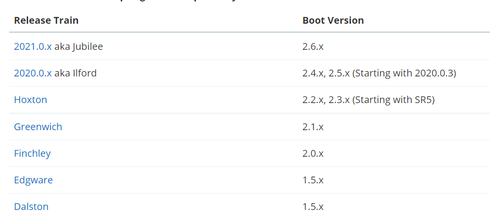

# springBoot和SpringCloud




# springcloud和eureka

匹配太麻烦了，版本太多了，让cloud自己匹配吧

spring-cloud-dependencies中的spring-cloud-netflix.version标签已经定义了Netflix版本

```xml
<dependency>
    <groupId>org.springframework.cloud</groupId>
    <artifactId>spring-cloud-dependencies</artifactId>
    <version>${springcloud.version}</version>
    <type>pom</type>
    <scope>import</scope>
</dependency>
```

```xml
<!--服务端-->
<dependency>
    <groupId>org.springframework.cloud</groupId>
    <artifactId>spring-cloud-starter-netflix-eureka-server</artifactId>
</dependency>
<!--客户端-->
<dependency>
    <groupId>org.springframework.cloud</groupId>
    <artifactId>spring-cloud-starter-netflix-eureka-client</artifactId>
</dependency>
```

# springboot和swagger

swagger2依赖

```xml
<!-- https://mvnrepository.com/artifact/io.springfox/springfox-swagger2 -->
<dependency>
   <groupId>io.springfox</groupId>
   <artifactId>springfox-swagger2</artifactId>
   <version>2.9.2</version>
</dependency>
<!-- https://mvnrepository.com/artifact/io.springfox/springfox-swagger-ui -->
<dependency>
   <groupId>io.springfox</groupId>
   <artifactId>springfox-swagger-ui</artifactId>
   <version>2.9.2</version>
</dependency>
```

swagger3依赖，需要springboot2.2+

```xml
<!--Swagger3-->
<dependency>
    <groupId>io.springfox</groupId>
    <artifactId>springfox-boot-starter</artifactId>
    <version>3.0.0</version>
</dependency>
```

