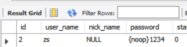
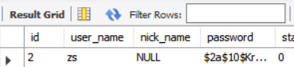
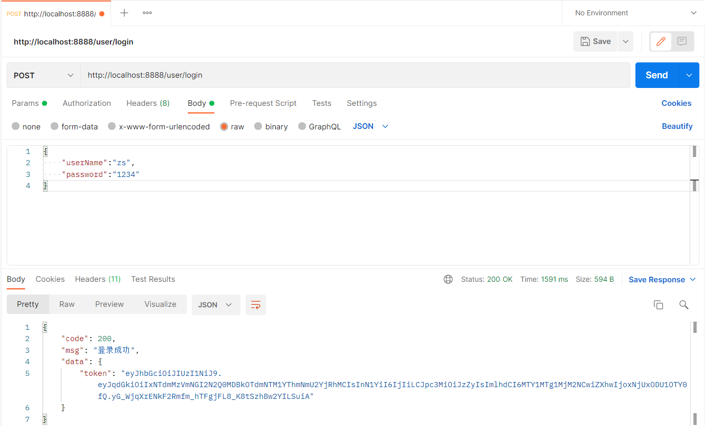
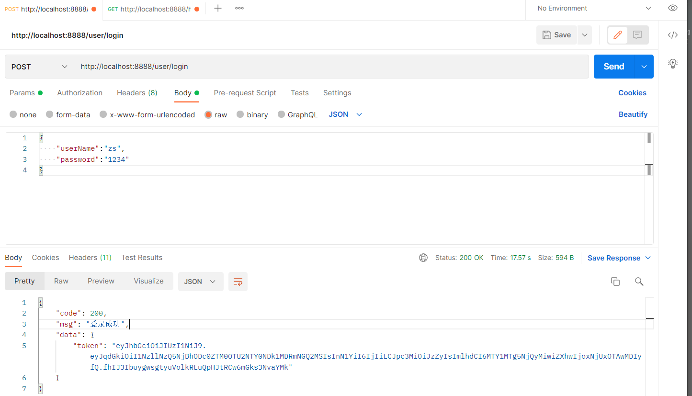
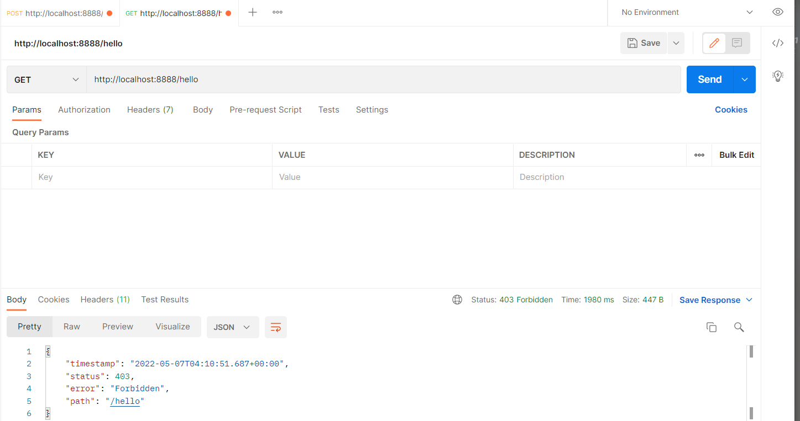
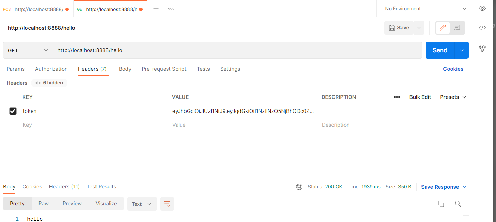
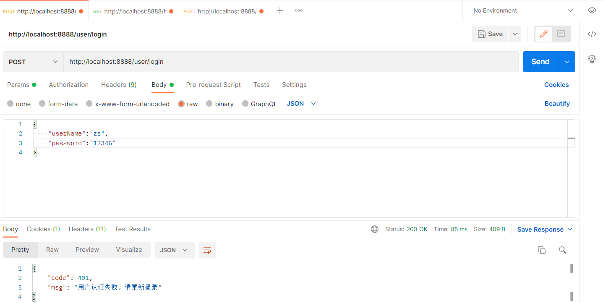
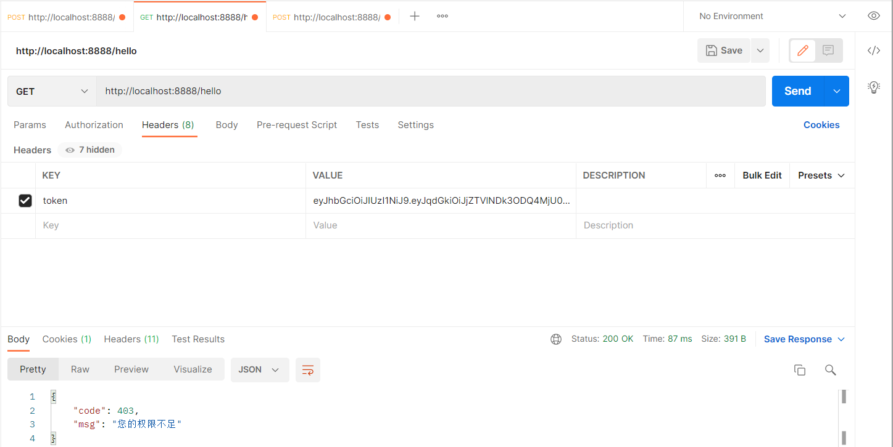
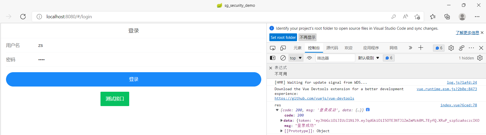
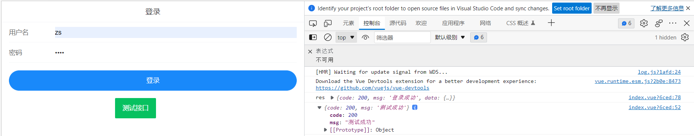

# 前后端不分离版，去SpringBoot笔记文件夹中找

# 后端准备工作

## 导入基本依赖

```xml
<dependencies>
    <dependency>
        <groupId>org.springframework.boot</groupId>
        <artifactId>spring-boot-starter</artifactId>
    </dependency>
    <dependency>
        <groupId>org.springframework.boot</groupId>
        <artifactId>spring-boot-starter-web</artifactId>
    </dependency>

    <dependency>
        <groupId>org.springframework.boot</groupId>
        <artifactId>spring-boot-devtools</artifactId>
        <scope>runtime</scope>
        <optional>true</optional>
    </dependency>
    <dependency>
        <groupId>org.springframework.boot</groupId>
        <artifactId>spring-boot-configuration-processor</artifactId>
        <optional>true</optional>
    </dependency>
    <dependency>
        <groupId>org.projectlombok</groupId>
        <artifactId>lombok</artifactId>
        <optional>true</optional>
    </dependency>
    <dependency>
        <groupId>org.springframework.boot</groupId>
        <artifactId>spring-boot-starter-test</artifactId>
        <scope>test</scope>
    </dependency>
</dependencies>
```

## 测试接口

```java
package com.hzc.security.controller;

import org.springframework.web.bind.annotation.RequestMapping;
import org.springframework.web.bind.annotation.RestController;

@RestController
public class HelloController {
    @RequestMapping("/hello")
    public String hello(){
        return "hello";
    }
}
```

## 加入security依赖

```xml
<dependency>
    <groupId>org.springframework.boot</groupId>
    <artifactId>spring-boot-starter-security</artifactId>
</dependency>
```

重启服务发现需要登录了，/hello自动跳转/login登录页面

默认用户名是`user`，密码是控制台打印的`Using generated security password: 0cb21184-05b0-4994-a44d-72bd3df3f2c3`

前后端分离应该只提供登录接口，不应该跳转页面，前后端分离通过token认证，需要重写过滤器

## 导入jwt和redis依赖

```xml
<!--fastjson依赖-->
<dependency>
    <groupId>com.alibaba</groupId>
    <artifactId>fastjson</artifactId>
    <version>1.2.33</version>
</dependency>
<!--jwt依赖-->
<dependency>
    <groupId>io.jsonwebtoken</groupId>
    <artifactId>jjwt</artifactId>
    <version>0.9.0</version>
</dependency>
<!--redis依赖-->
<dependency>
    <groupId>org.springframework.boot</groupId>
    <artifactId>spring-boot-starter-data-redis</artifactId>
</dependency>
```

## Redis相关

### 复制redis的序列化器

这个不用自己敲，避免数据存入redis的乱码现象

```java
package com.sangeng.utils;

import com.alibaba.fastjson.JSON;
import com.alibaba.fastjson.serializer.SerializerFeature;
import com.fasterxml.jackson.databind.JavaType;
import com.fasterxml.jackson.databind.ObjectMapper;
import com.fasterxml.jackson.databind.type.TypeFactory;
import org.springframework.data.redis.serializer.RedisSerializer;
import org.springframework.data.redis.serializer.SerializationException;
import com.alibaba.fastjson.parser.ParserConfig;
import org.springframework.util.Assert;
import java.nio.charset.Charset;

/**
 * Redis使用FastJson序列化
 * 
 * @author sg
 */
public class FastJsonRedisSerializer<T> implements RedisSerializer<T>
{

    public static final Charset DEFAULT_CHARSET = Charset.forName("UTF-8");

    private Class<T> clazz;

    static
    {
        ParserConfig.getGlobalInstance().setAutoTypeSupport(true);
    }

    public FastJsonRedisSerializer(Class<T> clazz)
    {
        super();
        this.clazz = clazz;
    }

    @Override
    public byte[] serialize(T t) throws SerializationException
    {
        if (t == null)
        {
            return new byte[0];
        }
        return JSON.toJSONString(t, SerializerFeature.WriteClassName).getBytes(DEFAULT_CHARSET);
    }

    @Override
    public T deserialize(byte[] bytes) throws SerializationException
    {
        if (bytes == null || bytes.length <= 0)
        {
            return null;
        }
        String str = new String(bytes, DEFAULT_CHARSET);

        return JSON.parseObject(str, clazz);
    }


    protected JavaType getJavaType(Class<?> clazz)
    {
        return TypeFactory.defaultInstance().constructType(clazz);
    }
}
```

### 定义redis相关配置

```java
package com.hzc.security.config;

import com.hzc.security.utils.FastJsonRedisSerializer;
import org.springframework.context.annotation.Bean;
import org.springframework.context.annotation.Configuration;
import org.springframework.data.redis.connection.RedisConnectionFactory;
import org.springframework.data.redis.core.RedisTemplate;
import org.springframework.data.redis.serializer.StringRedisSerializer;

@Configuration
public class RedisConfig {

    @Bean
    @SuppressWarnings(value = { "unchecked", "rawtypes" })
    public RedisTemplate<Object, Object> redisTemplate(RedisConnectionFactory connectionFactory)
    {
        RedisTemplate<Object, Object> template = new RedisTemplate<>();
        template.setConnectionFactory(connectionFactory);

        FastJsonRedisSerializer serializer = new FastJsonRedisSerializer(Object.class);

        // 使用StringRedisSerializer来序列化和反序列化redis的key值
        template.setKeySerializer(new StringRedisSerializer());
        template.setValueSerializer(serializer);

        // Hash的key也采用StringRedisSerializer的序列化方式
        template.setHashKeySerializer(new StringRedisSerializer());
        template.setHashValueSerializer(serializer);

        template.afterPropertiesSet();
        return template;
    }
}
```

### redis工具类

对redisTemplate的方法进行了进一步的封装，百度上很多

```java
package com.hzc.security.utils;

import org.springframework.beans.factory.annotation.Autowired;
import org.springframework.data.redis.core.BoundSetOperations;
import org.springframework.data.redis.core.HashOperations;
import org.springframework.data.redis.core.RedisTemplate;
import org.springframework.data.redis.core.ValueOperations;
import org.springframework.stereotype.Component;

import java.util.*;
import java.util.concurrent.TimeUnit;

@SuppressWarnings(value = { "unchecked", "rawtypes" })
@Component
public class RedisCache
{
    @Autowired
    public RedisTemplate redisTemplate;

    /**
     * 缓存基本的对象，Integer、String、实体类等
     *
     * @param key 缓存的键值
     * @param value 缓存的值
     */
    public <T> void setCacheObject(final String key, final T value)
    {
        redisTemplate.opsForValue().set(key, value);
    }

    /**
     * 缓存基本的对象，Integer、String、实体类等
     *
     * @param key 缓存的键值
     * @param value 缓存的值
     * @param timeout 时间
     * @param timeUnit 时间颗粒度
     */
    public <T> void setCacheObject(final String key, final T value, final Integer timeout, final TimeUnit timeUnit)
    {
        redisTemplate.opsForValue().set(key, value, timeout, timeUnit);
    }

    /**
     * 设置有效时间
     *
     * @param key Redis键
     * @param timeout 超时时间
     * @return true=设置成功；false=设置失败
     */
    public boolean expire(final String key, final long timeout)
    {
        return expire(key, timeout, TimeUnit.SECONDS);
    }

    /**
     * 设置有效时间
     *
     * @param key Redis键
     * @param timeout 超时时间
     * @param unit 时间单位
     * @return true=设置成功；false=设置失败
     */
    public boolean expire(final String key, final long timeout, final TimeUnit unit)
    {
        return redisTemplate.expire(key, timeout, unit);
    }

    /**
     * 获得缓存的基本对象。
     *
     * @param key 缓存键值
     * @return 缓存键值对应的数据
     */
    public <T> T getCacheObject(final String key)
    {
        ValueOperations<String, T> operation = redisTemplate.opsForValue();
        return operation.get(key);
    }

    /**
     * 删除单个对象
     *
     * @param key
     */
    public boolean deleteObject(final String key)
    {
        return redisTemplate.delete(key);
    }

    /**
     * 删除集合对象
     *
     * @param collection 多个对象
     * @return
     */
    public long deleteObject(final Collection collection)
    {
        return redisTemplate.delete(collection);
    }

    /**
     * 缓存List数据
     *
     * @param key 缓存的键值
     * @param dataList 待缓存的List数据
     * @return 缓存的对象
     */
    public <T> long setCacheList(final String key, final List<T> dataList)
    {
        Long count = redisTemplate.opsForList().rightPushAll(key, dataList);
        return count == null ? 0 : count;
    }

    /**
     * 获得缓存的list对象
     *
     * @param key 缓存的键值
     * @return 缓存键值对应的数据
     */
    public <T> List<T> getCacheList(final String key)
    {
        return redisTemplate.opsForList().range(key, 0, -1);
    }

    /**
     * 缓存Set
     *
     * @param key 缓存键值
     * @param dataSet 缓存的数据
     * @return 缓存数据的对象
     */
    public <T> BoundSetOperations<String, T> setCacheSet(final String key, final Set<T> dataSet)
    {
        BoundSetOperations<String, T> setOperation = redisTemplate.boundSetOps(key);
        Iterator<T> it = dataSet.iterator();
        while (it.hasNext())
        {
            setOperation.add(it.next());
        }
        return setOperation;
    }

    /**
     * 获得缓存的set
     *
     * @param key
     * @return
     */
    public <T> Set<T> getCacheSet(final String key)
    {
        return redisTemplate.opsForSet().members(key);
    }

    /**
     * 缓存Map
     *
     * @param key
     * @param dataMap
     */
    public <T> void setCacheMap(final String key, final Map<String, T> dataMap)
    {
        if (dataMap != null) {
            redisTemplate.opsForHash().putAll(key, dataMap);
        }
    }

    /**
     * 获得缓存的Map
     *
     * @param key
     * @return
     */
    public <T> Map<String, T> getCacheMap(final String key)
    {
        return redisTemplate.opsForHash().entries(key);
    }

    /**
     * 往Hash中存入数据
     *
     * @param key Redis键
     * @param hKey Hash键
     * @param value 值
     */
    public <T> void setCacheMapValue(final String key, final String hKey, final T value)
    {
        redisTemplate.opsForHash().put(key, hKey, value);
    }

    /**
     * 获取Hash中的数据
     *
     * @param key Redis键
     * @param hKey Hash键
     * @return Hash中的对象
     */
    public <T> T getCacheMapValue(final String key, final String hKey)
    {
        HashOperations<String, String, T> opsForHash = redisTemplate.opsForHash();
        return opsForHash.get(key, hKey);
    }

    /**
     * 删除Hash中的数据
     *
     * @param key
     * @param hkey
     */
    public void delCacheMapValue(final String key, final String hkey)
    {
        HashOperations hashOperations = redisTemplate.opsForHash();
        hashOperations.delete(key, hkey);
    }

    /**
     * 获取多个Hash中的数据
     *
     * @param key Redis键
     * @param hKeys Hash键集合
     * @return Hash对象集合
     */
    public <T> List<T> getMultiCacheMapValue(final String key, final Collection<Object> hKeys)
    {
        return redisTemplate.opsForHash().multiGet(key, hKeys);
    }

    /**
     * 获得缓存的基本对象列表
     *
     * @param pattern 字符串前缀
     * @return 对象列表
     */
    public Collection<String> keys(final String pattern)
    {
        return redisTemplate.keys(pattern);
    }
}
```

## ResponseResult响应类

前后端分离应该定义规范的响应体

```java
package com.hzc.security.entity;

import com.fasterxml.jackson.annotation.JsonInclude;

/**
 * @Author 三更  B站： https://space.bilibili.com/663528522
 */
@JsonInclude(JsonInclude.Include.NON_NULL)
public class ResponseResult<T> {
    /**
     * 状态码
     */
    private Integer code;
    /**
     * 提示信息，如果有错误时，前端可以获取该字段进行提示
     */
    private String msg;
    /**
     * 查询到的结果数据，
     */
    private T data;

    public ResponseResult(Integer code, String msg) {
        this.code = code;
        this.msg = msg;
    }

    public ResponseResult(Integer code, T data) {
        this.code = code;
        this.data = data;
    }

    public Integer getCode() {
        return code;
    }

    public void setCode(Integer code) {
        this.code = code;
    }

    public String getMsg() {
        return msg;
    }

    public void setMsg(String msg) {
        this.msg = msg;
    }

    public T getData() {
        return data;
    }

    public void setData(T data) {
        this.data = data;
    }

    public ResponseResult(Integer code, String msg, T data) {
        this.code = code;
        this.msg = msg;
        this.data = data;
    }
}
```

## 创建Jwt工具类

```java
package com.hzc.security.utils;

import io.jsonwebtoken.Claims;
import io.jsonwebtoken.JwtBuilder;
import io.jsonwebtoken.Jwts;
import io.jsonwebtoken.SignatureAlgorithm;

import javax.crypto.SecretKey;
import javax.crypto.spec.SecretKeySpec;
import java.util.Base64;
import java.util.Date;
import java.util.UUID;

/**
 * JWT工具类
 */
public class JwtUtil {

    //有效期为
    public static final Long JWT_TTL = 60 * 60 *1000L;// 60 * 60 *1000  一个小时
    //设置秘钥明文
    public static final String JWT_KEY = "sangeng";

    public static String getUUID(){
        String token = UUID.randomUUID().toString().replaceAll("-", "");
        return token;
    }

    /**
     * 生成jtw
     * @param subject token中要存放的数据（json格式）
     * @return
     */
    public static String createJWT(String subject) {
        JwtBuilder builder = getJwtBuilder(subject, null, getUUID());// 设置过期时间
        return builder.compact();
    }

    /**
     * 生成jtw
     * @param subject token中要存放的数据（json格式）
     * @param ttlMillis token超时时间
     * @return
     */
    public static String createJWT(String subject, Long ttlMillis) {
        JwtBuilder builder = getJwtBuilder(subject, ttlMillis, getUUID());// 设置过期时间
        return builder.compact();
    }

    private static JwtBuilder getJwtBuilder(String subject, Long ttlMillis, String uuid) {
        SignatureAlgorithm signatureAlgorithm = SignatureAlgorithm.HS256;
        SecretKey secretKey = generalKey();
        long nowMillis = System.currentTimeMillis();
        Date now = new Date(nowMillis);
        if(ttlMillis==null){
            ttlMillis=JwtUtil.JWT_TTL;
        }
        long expMillis = nowMillis + ttlMillis;
        Date expDate = new Date(expMillis);
        return Jwts.builder()
            .setId(uuid)              //唯一的ID
            .setSubject(subject)   // 主题  可以是JSON数据
            .setIssuer("sg")     // 签发者
            .setIssuedAt(now)      // 签发时间
            .signWith(signatureAlgorithm, secretKey) //使用HS256对称加密算法签名, 第二个参数为秘钥
            .setExpiration(expDate);
    }

    /**
     * 创建token
     * @param id
     * @param subject
     * @param ttlMillis
     * @return
     */
    public static String createJWT(String id, String subject, Long ttlMillis) {
        JwtBuilder builder = getJwtBuilder(subject, ttlMillis, id);// 设置过期时间
        return builder.compact();
    }

    /**
     * 生成加密后的秘钥 secretKey
     * @return
     */
    public static SecretKey generalKey() {
        byte[] encodedKey = Base64.getDecoder().decode(JwtUtil.JWT_KEY);
        SecretKey key = new SecretKeySpec(encodedKey, 0, encodedKey.length, "AES");
        return key;
    }

    /**
     * 解析
     *
     * @param jwt
     * @return
     * @throws Exception
     */
    public static Claims parseJWT(String jwt) throws Exception {
        SecretKey secretKey = generalKey();
        return Jwts.parser()
            .setSigningKey(secretKey)
            .parseClaimsJws(jwt)
            .getBody();
    }
}
```

## 创建WebUtil

后面可能会涉及到往响应中写入一些数据

```java
package com.hzc.security.utils;

import javax.servlet.http.HttpServletResponse;
import java.io.IOException;

public class WebUtils
{
    /**
     * 将字符串渲染到客户端
     *
     * @param response 渲染对象
     * @param string 待渲染的字符串
     * @return null
     */
    public static String renderString(HttpServletResponse response, String string) {
        try
        {
            response.setStatus(200);
            response.setContentType("application/json");
            response.setCharacterEncoding("utf-8");
            response.getWriter().print(string);
        }
        catch (IOException e)
        {
            e.printStackTrace();
        }
        return null;
    }
}
```

## 创建User实体类

先导入mybatis-plus依赖

```xml
<dependency>
    <groupId>com.baomidou</groupId>
    <artifactId>mybatis-plus-boot-starter</artifactId>
    <version>3.4.3</version>
</dependency>
<dependency>
    <groupId>mysql</groupId>
    <artifactId>mysql-connector-java</artifactId>
</dependency>
```

因为涉及登录，需要用户实体

```java
package com.hzc.security.entity;


import com.baomidou.mybatisplus.annotation.TableId;
import com.baomidou.mybatisplus.annotation.TableName;
import lombok.AllArgsConstructor;
import lombok.Data;
import lombok.NoArgsConstructor;

import java.io.Serializable;
import java.util.Date;


/**
 * 用户表(User)实体类
 *
 * @author 三更
 */
@Data
@AllArgsConstructor
@NoArgsConstructor
@TableName("sys_user")
public class User implements Serializable {
    private static final long serialVersionUID = -40356785423868312L;

    /**
     * 主键
     */
    @TableId
    private Long id;
    /**
     * 用户名
     */
    private String userName;
    /**
     * 昵称
     */
    private String nickName;
    /**
     * 密码
     */
    private String password;
    /**
     * 账号状态（0正常 1停用）
     */
    private String status;
    /**
     * 邮箱
     */
    private String email;
    /**
     * 手机号
     */
    private String phonenumber;
    /**
     * 用户性别（0男，1女，2未知）
     */
    private String sex;
    /**
     * 头像
     */
    private String avatar;
    /**
     * 用户类型（0管理员，1普通用户）
     */
    private String userType;
    /**
     * 创建人的用户id
     */
    private Long createBy;
    /**
     * 创建时间
     */
    private Date createTime;
    /**
     * 更新人
     */
    private Long updateBy;
    /**
     * 更新时间
     */
    private Date updateTime;
    /**
     * 删除标志（0代表未删除，1代表已删除）
     */
    private Integer delFlag;
}
```

sql

```sql
create database sg_security;
use sg_security;
alter database bbs character set utf8;

CREATE TABLE `sys_user` (
  `id` BIGINT(20) NOT NULL AUTO_INCREMENT COMMENT '主键',
  `user_name` VARCHAR(64) NOT NULL DEFAULT 'NULL' COMMENT '用户名',
  `nick_name` VARCHAR(64) NOT NULL DEFAULT 'NULL' COMMENT '昵称',
  `password` VARCHAR(64) NOT NULL DEFAULT 'NULL' COMMENT '密码',
  `status` CHAR(1) DEFAULT '0' COMMENT '账号状态（0正常 1停用）',
  `email` VARCHAR(64) DEFAULT NULL COMMENT '邮箱',
  `phonenumber` VARCHAR(32) DEFAULT NULL COMMENT '手机号',
  `sex` CHAR(1) DEFAULT NULL COMMENT '用户性别（0男，1女，2未知）',
  `avatar` VARCHAR(128) DEFAULT NULL COMMENT '头像',
  `user_type` CHAR(1) NOT NULL DEFAULT '1' COMMENT '用户类型（0管理员，1普通用户）',
  `create_by` BIGINT(20) DEFAULT NULL COMMENT '创建人的用户id',
  `create_time` DATETIME DEFAULT NULL COMMENT '创建时间',
  `update_by` BIGINT(20) DEFAULT NULL COMMENT '更新人',
  `update_time` DATETIME DEFAULT NULL COMMENT '更新时间',
  `del_flag` INT(11) DEFAULT '0' COMMENT '删除标志（0代表未删除，1代表已删除）',
  PRIMARY KEY (`id`)
) ENGINE=INNODB AUTO_INCREMENT=2 DEFAULT CHARSET=utf8mb4 COMMENT='用户表';

-- 插入一个用户
insert into sys_user (user_name,password) values('zs','1234');
```

## yml配置

```yml
spring:
  datasource:
    url: jdbc:mysql://localhost:3306/sg_security?characterEncoding=utf-8&serverTimezone=UTC
    username: root
    password: root
    driver-class-name: com.mysql.cj.jdbc.Driver
  redis: #redis
    host: 120.77.96.250 #主机
    port: 6379 #端口
    password: 17870033452 #密码
mybatis-plus:
  mapper-locations: classpath*:/mapper/**/*.xml
  #开启驼峰命名转换
  configuration:
    map-underscore-to-camel-case: true
server:
  port: 8888
```

## mybatis配置

启动器mapper扫描

```java
package com.hzc.security;

import org.mybatis.spring.annotation.MapperScan;
import org.springframework.boot.SpringApplication;
import org.springframework.boot.autoconfigure.SpringBootApplication;

@SpringBootApplication
//mapper扫描
@MapperScan("com.hzc.security.mapper")
public class SecurityApplication {
    public static void main(String[] args) {
        SpringApplication.run(SecurityApplication.class, args);
    }
}
```

## 创建UserMapper接口

```java
package com.hzc.security.mapper;

import com.baomidou.mybatisplus.core.mapper.BaseMapper;
import com.hzc.security.entity.User;

public interface UserMapper extends BaseMapper<User> {
}
```

## 测试数据库连通

```java
@Autowired
private UserMapper userMapper;

@Test
void contextLoads() {
    List<User> users = userMapper.selectList(null);
    users.forEach(System.out::println);
}
```

# 实战开始

## 自定义UserDetails对象

因为security校验只能识别UserDetails对象，不能识别我们自己创建的user

```java
package com.hzc.security.entity;

import lombok.AllArgsConstructor;
import lombok.Data;
import lombok.NoArgsConstructor;
import org.springframework.security.core.GrantedAuthority;
import org.springframework.security.core.userdetails.UserDetails;

import java.util.Collection;

@Data
@NoArgsConstructor
@AllArgsConstructor
public class LoginUser implements UserDetails {
    
    private User user;
    
    @Override
    //返回权限信息
    public Collection<? extends GrantedAuthority> getAuthorities() {
        return null;
    }

    @Override
    //获取密码
    public String getPassword() {
        return user.getUsername();
    }

    @Override
    //获取用户名
    public String getUsername() {
        return user.getPassword();
    }

    @Override
    //判断权限是否没过期
    public boolean isAccountNonExpired() {
        return true;
    }

    @Override
    //判断权限是否没被锁定
    public boolean isAccountNonLocked() {
        return true;
    }

    @Override
    //判断权限是否没超时
    public boolean isCredentialsNonExpired() {
        return true;
    }

    @Override
    //判断用户是否可用
    public boolean isEnabled() {
        return true;
    }
}
```

## 自定义校验类UserDetailsServiceImpl

```java
package com.hzc.security.service.impl;

import com.baomidou.mybatisplus.core.conditions.query.QueryWrapper;
import com.hzc.security.entity.LoginUser;
import com.hzc.security.entity.User;
import com.hzc.security.mapper.UserMapper;
import org.springframework.beans.factory.annotation.Autowired;
import org.springframework.security.core.userdetails.UserDetails;
import org.springframework.security.core.userdetails.UserDetailsService;
import org.springframework.security.core.userdetails.UsernameNotFoundException;
import org.springframework.stereotype.Service;

import java.util.Objects;

@Service
public class UserDetailsServiceImpl implements UserDetailsService {
    @Autowired
    private UserMapper userMapper;
    @Override
    public UserDetails loadUserByUsername(String username) throws UsernameNotFoundException {
        //查询用户信息
        QueryWrapper<User> wrapper = new QueryWrapper<>();
        wrapper.eq("user_name",username);
        User user = userMapper.selectOne(wrapper);
        //如果用户不存在
        if (Objects.isNull(user)){
            throw new RuntimeException("用户名或密码错误");
        }
        //TODO 查询对应的权限信息
        
        //把user封装成UserDetails对象返回
        return new LoginUser(user);
    }
}
```

**测试：**

1. 访问http://localhost:8888/hello
2. 跳转登录界面，因为我们只重写了校验，没有改变登录方式
3. 输入用户名`zs`，密码`1234`
4. 提示用户名密码错误，因为数据库密码前需要加上{noop}，表示该数据是明文存在数据库的，否则取出时会解密

## 密码加密

我们数据库存储密码不可能一直加上{noop}，太麻烦了，而且不安全

加上{noop}是默认的加密方式，我们要重新定义加密器

```java
package com.hzc.security.config;

import org.springframework.context.annotation.Bean;
import org.springframework.context.annotation.Configuration;
import org.springframework.security.config.annotation.web.configuration.WebSecurityConfigurerAdapter;
import org.springframework.security.crypto.bcrypt.BCryptPasswordEncoder;
import org.springframework.security.crypto.password.PasswordEncoder;

@Configuration
public class SecurityConfig extends WebSecurityConfigurerAdapter {
    @Bean
    public PasswordEncoder passwordEncoder(){
        return new BCryptPasswordEncoder();
    }
}
```

## 将`zs`的密码修改成BCryptPasswordEncoder密文

**查看密文**

```java
@Test
void password() {
    BCryptPasswordEncoder encoder = new BCryptPasswordEncoder();
    //对1234加密，其实每次加密的密文都不一样，但是都能匹配上，因为盐值
    //多个密文对应一个明文，盐值会存在密文中，解析时反向编码
    String encode = encoder.encode("1234");
    System.out.println(encode);
}

/*
运行结果：
$2a$10$Kr5SgMSxSSDCueKy0.mHjOp8gf1Aay8b1adFHHPdX0V6WnnO8K2sa
*/
@Test
void matchPassword() {
    BCryptPasswordEncoder encoder = new BCryptPasswordEncoder();
    //判断密文是否匹配
    System.out.println(encoder.matches("1234"
                                       ,"$2a$10$Kr5SgMSxSSDCueKy0.mHjOp8gf1Aay8b1adFHHPdX0V6WnnO8K2sa"));
    System.out.println(encoder.matches("12345"
                                       ,"$2a$10$Kr5SgMSxSSDCueKy0.mHjOp8gf1Aay8b1adFHHPdX0V6WnnO8K2sa"));
}

/*
运行结果：
true
false
*/
```

**修改数据库，将密码改成密文**



**测试**

访问[localhost:8888/hello](http://localhost:8888/hello)跳转登录，输入用户名`zs`，密码`1234`成功认证

## 登录Service和Controller

### SecurityConfig配置

**注入AuthenticationManager**

- AuthenticationManager：定义了认证Authentication的方法

**放行登录接口**：如果登录接口需要登录才能访问，那就矛盾了

```java
@Bean
@Override
public AuthenticationManager authenticationManagerBean() throws Exception {
    //注意是authenticationManagerBean方法，不是authenticationManager方法
    return super.authenticationManagerBean();
}

@Override
protected void configure(HttpSecurity http) throws Exception {
    http
        //关闭csrf
        .csrf().disable()
        //security将不再创建HttpSession对象，也不再使用它，因为前后端分离不再使用session，使用jwt的token
        //不通过Session获取SecurityContext  
        .sessionManagement().sessionCreationPolicy(SessionCreationPolicy.STATELESS)
        .and()
        .authorizeRequests()
        // 对于登录接口 允许匿名访问
        .antMatchers("/user/login").anonymous()
        //                .antMatchers("/testCors").hasAuthority("system:dept:list222")
        // 除上面外的所有请求全部需要鉴权认证
        .anyRequest().authenticated();
}
```

### 定义登录service接口

```java
package com.hzc.security.service;

import com.hzc.security.entity.ResponseResult;
import com.hzc.security.entity.User;

public interface LoginService {
    ResponseResult login(User user);

    ResponseResult logout();
}
```

### 定义登录service实现类

因为认证需要调用Authentication方法，而该方法的参数是Authentication接口对象，这里我们需要使用其实现类UsernamePasswordAuthenticationToken对象

```java
package com.hzc.security.service.impl;

import com.hzc.security.entity.LoginUser;
import com.hzc.security.entity.ResponseResult;
import com.hzc.security.entity.User;
import com.hzc.security.service.LoginService;
import com.hzc.security.utils.JwtUtil;
import com.hzc.security.utils.RedisCache;
import org.springframework.beans.factory.annotation.Autowired;
import org.springframework.security.authentication.AuthenticationManager;
import org.springframework.security.authentication.UsernamePasswordAuthenticationToken;
import org.springframework.security.core.Authentication;
import org.springframework.stereotype.Service;

import java.util.HashMap;
import java.util.Map;
import java.util.Objects;

@Service
public class LoginServiceImpl implements LoginService {
    @Autowired
    private AuthenticationManager authenticationManager;
    @Autowired
    private RedisCache redisCache;

    @Override
    public ResponseResult login(User user) {
        //AuthenticationManager authenticate进行用户认证
        UsernamePasswordAuthenticationToken authenticationToken = new UsernamePasswordAuthenticationToken(user.getUserName(),user.getPassword());
        Authentication authenticate = authenticationManager.authenticate(authenticationToken);
        //如果认证没通过，给出对应提示
        if (Objects.isNull(authenticate)){
            throw new RuntimeException("登录失败");
        }
        //如果认证通过了，使用userid生成一个jwt jwt存入ResponseResult返回
        LoginUser loginUser = (LoginUser)authenticate.getPrincipal();
        String userId = loginUser.getUser().getId().toString();
        String jwt = JwtUtil.createJWT(userId);
        //把token返回给前端
        Map<Object, Object> map = new HashMap<>();
        map.put("token",jwt);
        //把完整的用户信息存入redis  userid作为key
        redisCache.setCacheObject("login:"+userId,loginUser);
        return new ResponseResult(200,"登录成功",map);
    }

    @Override
    public ResponseResult logout() {
        return null;
    }
}
```

### 定义登录控制器

```java
package com.hzc.security.controller;

import com.hzc.security.entity.ResponseResult;
import com.hzc.security.entity.User;
import com.hzc.security.service.impl.LoginServiceImpl;
import org.springframework.beans.factory.annotation.Autowired;
import org.springframework.web.bind.annotation.PostMapping;
import org.springframework.web.bind.annotation.RequestBody;
import org.springframework.web.bind.annotation.ResponseBody;
import org.springframework.web.bind.annotation.RestController;

@RestController
public class LoginController {
    @Autowired
    private LoginServiceImpl loginService;

    @PostMapping("/user/login")
    public ResponseResult login(@RequestBody User user){
        return loginService.login(user);
    }
}
```

### 使用PostMan测试

登录失败返回403



## token校验过滤器JwtAuthenticationTokenFilter

**为什么继承spring提供的OncePerRequestFilter接口，不继承security默认的过滤器接口呢？**

- 因为不同版本的security会导致一个请求过来默认过滤器会被调用多次，OncePerRequestFilter只会调用一次

**为什么放行之后要return;**

- 因为security过滤器链是一层一层的，一层一层请求进去，然后再一层一层响应出来
  - 请求—>...UsernamePasswordAuthenticationFilter—>...ExceptionTranslationFilter—>FilterSecurityInterceptor—>API
  - 请求<—...UsernamePasswordAuthenticationFilter<—...ExceptionTranslationFilter<—FilterSecurityInterceptor<—API
- 请求时放行后，之后的过滤器会返回响应
- 如果不加return，响应的内容会继续执行后面的代码

**SecurityContextHolder**

- 登录认证时调用authenticate方法传入authentication对象，该对象构造方法有两个参数，用户的用户名和密码
- 登录状态校验调用getContext().setAuthentication传入authentication，第一个参数是用户信息，用来比对用户名和密码是否符合authentication方法传入的用户名和密码，应该是这样吧

```java
package com.hzc.security.filter;

import com.hzc.security.entity.LoginUser;
import com.hzc.security.utils.JwtUtil;
import com.hzc.security.utils.RedisCache;
import io.jsonwebtoken.Claims;
import org.springframework.beans.factory.annotation.Autowired;
import org.springframework.security.authentication.UsernamePasswordAuthenticationToken;
import org.springframework.security.core.context.SecurityContextHolder;
import org.springframework.stereotype.Component;
import org.springframework.util.StringUtils;
import org.springframework.web.filter.OncePerRequestFilter;

import javax.servlet.FilterChain;
import javax.servlet.ServletException;
import javax.servlet.http.HttpServletRequest;
import javax.servlet.http.HttpServletResponse;
import java.io.IOException;
import java.util.Objects;

@Component
public class JwtAuthenticationTokenFilter extends OncePerRequestFilter {
    @Autowired
    private RedisCache redisCache;

    @Override
    protected void doFilterInternal(HttpServletRequest request, HttpServletResponse response, FilterChain filterChain) throws ServletException, IOException {
//        获取token
        String token = request.getHeader("token");
        //如果token不存在，就直接放行
        //不需要去解析然后将用户信息存入SecurityContextHolder中了
        //后面FilterSecurityInterceptor从SecurityContextHolder中拿不到用户信息自然就认证失败
        if (!StringUtils.hasText(token)){
            filterChain.doFilter(request,response);
            return;
        }
//        解析token
        String userId;
        try {
            Claims claims = JwtUtil.parseJWT(token);
            userId = claims.getSubject();
        } catch (Exception e) {
            e.printStackTrace();
            throw new RuntimeException("token非法");
        }
//        从redis中获取用户信息
        String redisKey = "login:"+userId;
        LoginUser loginUser = redisCache.getCacheObject(redisKey);
        if (Objects.isNull(loginUser)){
            throw new RuntimeException("用户未登录");
        }
//        存入SecurityContextHolder
        //TODO 获取权限信息封装到Authentication中，这里的权限authorities暂定为null
        UsernamePasswordAuthenticationToken authenticationToken
                = new UsernamePasswordAuthenticationToken(loginUser,null,null);
        SecurityContextHolder.getContext().setAuthentication(authenticationToken);
        //放行
        filterChain.doFilter(request,response);

    }
}
```

## 指定token校验过滤器的位置

总不能把这个过滤器放在FilterSecurityInterceptor后面吧

这里我们放在UsernamePasswordAuthenticationFilter前面，毕竟如果用户已经进行了账号密码的过滤，那jwt令牌过滤就没有意义了

```java
@Autowired
private JwtAuthenticationTokenFilter jwtAuthenticationTokenFilter;

@Override
protected void configure(HttpSecurity http) throws Exception {

    //接口鉴权配置
	...

    //该过滤器放在哪个过滤器之前
    http.addFilterBefore(jwtAuthenticationTokenFilter,UsernamePasswordAuthenticationFilter.class);

}
```

## 测试

### 登录

登录成功



**登录密码正确却还是403？**

### hello接口

返回4.3，表示没有权限，因为请求头没有token



在请求头中添加token再测试，成功访问



## 退出登录

退出登录比登录简单多了

退出登录就是说之后访问页面时jwt校验提示未登录

因为jwt校验过滤器中判断用户是否登录是从token中取用户id，然后凭借用户id去redis中查找，找到了就传给FilterSecurityInterceptor去校验

所以我们只需要让校验时找不到redis中的该用户信息，就会抛出未登录异常，不需要管authentication方法传入的用户名和密码，反正下次登录会覆盖掉，那redis的该用户的键怎么取呢

- 解析前端传过来的token，因为键的格式是`login:id`，所以前面拼接`login:`
- 直接获取SecurityContextHolder中的LoginUser对象，获取其中User对象的id，前面拼接`login:`

**创建注销的service方法**

```java
@Override
public ResponseResult logout() {
    //获取SecurityContextHolder中已认证的用户的id
    UsernamePasswordAuthenticationToken authentication
        = (UsernamePasswordAuthenticationToken) SecurityContextHolder.getContext().getAuthentication();
    LoginUser loginUser = (LoginUser) authentication.getPrincipal();
    Long userId = loginUser.getUser().getId();
    //凭借用户ID清除redis中的用户登录信息
    redisCache.deleteObject("login:"+userId);
    return new ResponseResult(200,"注销成功");
}
```

**注销接口**

```java
@PostMapping("/user/logout")
public ResponseResult logout(){
    return loginService.logout();
}
```

问题：注销之后重新登录，旧token没过期的话也能提供校验

## 授权

只在前端判断，隐藏不够权限不让使用的按钮是远远不够的。因为别人完全可以直接调用你的接口，所以需要在后端对权限进行限制，权限不够就拒绝访问，甚至根本就看不到高级权限的功能

### 流程

- 在SpringSecurity中，会使用默认的FilterSecurityInterceptor来进行权限校验。在FilterSecurityInterceptor中会从SecurityContextHolder获取其中的Authentication，然后获取其中的权限信息。当前用户是否拥有访问当前资源所需的权限。
-  所以我们在项目中只需要把当前登录用户的权限信息也存入Authentication。
-  然后设置我们的资源所需要的权限即可。

权限配置有基于注解和基于配置，常用一般是基于注解

使用权限配置注解需要先在SecurityConfig配置类是加上EnableGlobalMethodSecurity注解，开启相关配置。

```java
@EnableGlobalMethodSecurity(prePostEnabled = true)
```

然后就可以使用对应的注解。@PreAuthorize

```java
@RestController
public class HelloController {

    @RequestMapping("/hello")
    @PreAuthorize("hasAuthority('test')")
    public String hello(){
        return "hello";
    }
}
```

但是现在我们的用户是没有添加权限的

并且UserDetailsServiceImpl类现在返回的UserDetails实现类LoginUser还只有用户信息，没有权限信息，getAuthorities方法的返回值还是null

token校验过滤器中SecurityContextHolder.getContext().setAuthentication方法的参数Authentication对象中只有用户信息，没有权限，权限还是null

修改UserDetailsServiceImpl类和UserDetails实现类LoginUser，这里先把权限定死，后面还是要从数据库中取的，测试一下hello接口能否提供权限校验

### 登录时权限分配

#### 修改UserDetails实现类LoginUser

1. 添加成员属性：权限字符串集合
2. 重写getAuthorities获取权限集合，将权限集合grantedAuthorities提取成成员变量
   1. 注释掉@AllArgsConstructor注解，创建LoginUser构造方法LoginUser(User user, List<String> permissions)，避免lombok创建全参构造方法时将grantedAuthorities也传进去

```java
package com.hzc.security.entity;

import com.alibaba.fastjson.annotation.JSONField;
import lombok.AllArgsConstructor;
import lombok.Data;
import lombok.NoArgsConstructor;
import org.springframework.data.annotation.Transient;
import org.springframework.security.core.GrantedAuthority;
import org.springframework.security.core.authority.SimpleGrantedAuthority;
import org.springframework.security.core.userdetails.UserDetails;

import java.util.ArrayList;
import java.util.Collection;
import java.util.List;
import java.util.stream.Collectors;

@Data
@NoArgsConstructor
//@AllArgsConstructor
public class LoginUser implements UserDetails {

    private User user;

    //字符串类型的权限信息
    private List<String> permissions;

    public LoginUser(User user, List<String> permissions) {
        this.user = user;
        this.permissions = permissions;
    }

    //用户权限集合，写在方法外面用来判null避免每次调用getAuthorities方法都转换一次
    // 提高性能
    //SimpleGrantedAuthority没有实现序列化接口，redis存储时会报错：autoType is not support. org.springframework.security.core.authority.SimpleGrantedAuthority
    //加上@JSONField(serialize = false)，LoginUser对象转json时将忽略grantedAuthorities属性，不会序列化到redis中
    //只要permissions存进了redis，之后框架调用getAuthorities方法也能转换
    @JSONField(serialize = false)
    private List<SimpleGrantedAuthority> authorities;
    @Override
    //返回权限信息
    public Collection<? extends GrantedAuthority> getAuthorities() {
        //如果grantedAuthorities有值就不再转换，避免性能浪费
        if (authorities!=null){
            return authorities;
        }


        //传统增强for遍历
        //将字符串转换成权限对象，封装到权限对象集合中，然后返回
        /*List<GrantedAuthority> grantedAuthorities = new ArrayList<>();
        for (String permission : permissions) {
            SimpleGrantedAuthority authority = new SimpleGrantedAuthority(permission);
            grantedAuthorities.add(authority);
        }*/

        //函数式编程
        // 使用jdk8新特性 Stream流 来封装权限对象集合
        authorities
                //将字符串集合转换成Stream流：Stream<String>对象
                = permissions.stream()
                //将流中元素挨个封装到SimpleGrantedAuthority对象
                //然后转回Stream流：Stream<SimpleGrantedAuthority>对象
                .map(SimpleGrantedAuthority::new)
                //将Stream<SimpleGrantedAuthority>对象转换成List集合
                .collect(Collectors.toList());

        return authorities;
    }

    @Override
    //获取密码
    public String getPassword() {
        return user.getPassword();
    }

    @Override
    //获取用户名
    public String getUsername() {
        return user.getUserName();
    }

    @Override
    //判断权限是否没过期
    public boolean isAccountNonExpired() {
        return true;
    }

    @Override
    //判断权限是否没被锁定
    public boolean isAccountNonLocked() {
        return true;
    }

    @Override
    //判断权限是否没超时
    public boolean isCredentialsNonExpired() {
        return true;
    }

    @Override
    //判断用户是否可用
    public boolean isEnabled() {
        return true;
    }
}
```

#### 修改UserDetailsServiceImpl

返回LoginUser对象时传入权限字符串信息集合

这里先把权限定死，后面还是要从数据库中取的，测试一下hello接口能否提供权限校验

只要接口的权限满足`test、admin`其中一个就可以访问

```java
package com.hzc.security.service.impl;

import com.baomidou.mybatisplus.core.conditions.query.QueryWrapper;
import com.hzc.security.entity.LoginUser;
import com.hzc.security.entity.User;
import com.hzc.security.mapper.UserMapper;
import org.springframework.beans.factory.annotation.Autowired;
import org.springframework.security.core.userdetails.UserDetails;
import org.springframework.security.core.userdetails.UserDetailsService;
import org.springframework.security.core.userdetails.UsernameNotFoundException;
import org.springframework.stereotype.Service;

import java.util.ArrayList;
import java.util.Arrays;
import java.util.Objects;

@Service
public class UserDetailsServiceImpl implements UserDetailsService {
    @Autowired
    private UserMapper userMapper;
    @Override
    public UserDetails loadUserByUsername(String username) throws UsernameNotFoundException {
        //查询用户信息
        QueryWrapper<User> wrapper = new QueryWrapper<>();
        wrapper.eq("user_name",username);
        User user = userMapper.selectOne(wrapper);
        //如果用户不存在
        if (Objects.isNull(user)){
            throw new RuntimeException("用户名或密码错误");
        }
        //TODO 查询对应的权限信息
        ArrayList<String> list = new ArrayList<>(Arrays.asList("test","admin"));

        //把user封装成UserDetails对象返回
        return new LoginUser(user,list);
    }
}

```

### 校验时权限分配

#### 修改token校验过滤器

修改JwtAuthenticationTokenFilter的doFilterInternal方法

```java
package com.hzc.security.filter;

import com.hzc.security.entity.LoginUser;
import com.hzc.security.utils.JwtUtil;
import com.hzc.security.utils.RedisCache;
import io.jsonwebtoken.Claims;
import org.springframework.beans.factory.annotation.Autowired;
import org.springframework.security.authentication.UsernamePasswordAuthenticationToken;
import org.springframework.security.core.context.SecurityContextHolder;
import org.springframework.stereotype.Component;
import org.springframework.util.StringUtils;
import org.springframework.web.filter.OncePerRequestFilter;

import javax.servlet.FilterChain;
import javax.servlet.ServletException;
import javax.servlet.http.HttpServletRequest;
import javax.servlet.http.HttpServletResponse;
import java.io.IOException;
import java.util.ArrayList;
import java.util.Arrays;
import java.util.Objects;

@Component
public class JwtAuthenticationTokenFilter extends OncePerRequestFilter {
    @Autowired
    private RedisCache redisCache;

    @Override
    protected void doFilterInternal(HttpServletRequest request, HttpServletResponse response, FilterChain filterChain) throws ServletException, IOException {
//        获取token
        String token = request.getHeader("token");
        //如果token不存在，就直接放行
        //不需要去解析然后将用户信息存入SecurityContextHolder中了
        //后面FilterSecurityInterceptor从SecurityContextHolder中拿不到用户信息自然就认证失败
        if (!StringUtils.hasText(token)){
            filterChain.doFilter(request,response);
            return;
        }
//        解析token
        String userId;
        try {
            Claims claims = JwtUtil.parseJWT(token);
            userId = claims.getSubject();
        } catch (Exception e) {
            e.printStackTrace();
            throw new RuntimeException("token非法");
        }
//        从redis中获取用户信息
        String redisKey = "login:"+userId;
        LoginUser loginUser = redisCache.getCacheObject(redisKey);
        if (Objects.isNull(loginUser)){
            throw new RuntimeException("用户未登录");
        }
//        存入SecurityContextHolder
        //TODO 获取权限信息封装到Authentication中，这里的权限authorities暂定为null
		//原来第三个参数的值是null，现在通过loginUser.getAuthorities()获取权限
        UsernamePasswordAuthenticationToken authenticationToken
                = new UsernamePasswordAuthenticationToken(loginUser,null,loginUser.getAuthorities());
        SecurityContextHolder.getContext().setAuthentication(authenticationToken);
        //放行
        filterChain.doFilter(request,response);

    }
}
```

### 问题

LoginUser中`private List<SimpleGrantedAuthority> authorities;`

- 报错`com.alibaba.fastjson.JSONException: default constructor not found. class org.springframework.security.core.authority.SimpleGrantedAuthority`

LoginUser中`private List<SimpleGrantedAuthority> grantedAuthorities;`

- 报错`autoType is not support. org.springframework.security.core.authority.SimpleGrantedAuthority`

## RBAC权限模型

### 建表sql

user表前面已经建过了，就不用建了

sys_menu表中`path、component`字段一般也用不上，这是和前端相关的

```sql
CREATE DATABASE /*!32312 IF NOT EXISTS*/`sg_security` /*!40100 DEFAULT CHARACTER SET utf8mb4 */;

USE `sg_security`;

/*Table structure for table `sys_menu` */

DROP TABLE IF EXISTS `sys_menu`;

CREATE TABLE `sys_menu` (
    `id` bigint(20) NOT NULL AUTO_INCREMENT,
    `menu_name` varchar(64) NOT NULL DEFAULT 'NULL' COMMENT '菜单名',
    `path` varchar(200) DEFAULT NULL COMMENT '路由地址',
    `component` varchar(255) DEFAULT NULL COMMENT '组件路径',
    `visible` char(1) DEFAULT '0' COMMENT '菜单状态（0显示 1隐藏）',
    `status` char(1) DEFAULT '0' COMMENT '菜单状态（0正常 1停用）',
    `perms` varchar(100) DEFAULT NULL COMMENT '权限标识',
    `icon` varchar(100) DEFAULT '#' COMMENT '菜单图标',
    `create_by` bigint(20) DEFAULT NULL,
    `create_time` datetime DEFAULT NULL,
    `update_by` bigint(20) DEFAULT NULL,
    `update_time` datetime DEFAULT NULL,
    `del_flag` int(11) DEFAULT '0' COMMENT '是否删除（0未删除 1已删除）',
    `remark` varchar(500) DEFAULT NULL COMMENT '备注',
    PRIMARY KEY (`id`)
) ENGINE=InnoDB AUTO_INCREMENT=2 DEFAULT CHARSET=utf8mb4 COMMENT='菜单表';

/*Table structure for table `sys_role` */

DROP TABLE IF EXISTS `sys_role`;

CREATE TABLE `sys_role` (
    `id` bigint(20) NOT NULL AUTO_INCREMENT,
    `name` varchar(128) DEFAULT NULL,
    `role_key` varchar(100) DEFAULT NULL COMMENT '角色权限字符串',
    `status` char(1) DEFAULT '0' COMMENT '角色状态（0正常 1停用）',
    `del_flag` int(1) DEFAULT '0' COMMENT 'del_flag',
    `create_by` bigint(200) DEFAULT NULL,
    `create_time` datetime DEFAULT NULL,
    `update_by` bigint(200) DEFAULT NULL,
    `update_time` datetime DEFAULT NULL,
    `remark` varchar(500) DEFAULT NULL COMMENT '备注',
    PRIMARY KEY (`id`)
) ENGINE=InnoDB AUTO_INCREMENT=3 DEFAULT CHARSET=utf8mb4 COMMENT='角色表';

/*Table structure for table `sys_role_menu` */

DROP TABLE IF EXISTS `sys_role_menu`;

CREATE TABLE `sys_role_menu` (
    `role_id` bigint(200) NOT NULL AUTO_INCREMENT COMMENT '角色ID',
    `menu_id` bigint(200) NOT NULL DEFAULT '0' COMMENT '菜单id',
    PRIMARY KEY (`role_id`,`menu_id`)
) ENGINE=InnoDB AUTO_INCREMENT=2 DEFAULT CHARSET=utf8mb4;

/*Table structure for table `sys_user` */

DROP TABLE IF EXISTS `sys_user`;

CREATE TABLE `sys_user` (
    `id` bigint(20) NOT NULL AUTO_INCREMENT COMMENT '主键',
    `user_name` varchar(64) NOT NULL DEFAULT 'NULL' COMMENT '用户名',
    `nick_name` varchar(64) NOT NULL DEFAULT 'NULL' COMMENT '昵称',
    `password` varchar(64) NOT NULL DEFAULT 'NULL' COMMENT '密码',
    `status` char(1) DEFAULT '0' COMMENT '账号状态（0正常 1停用）',
    `email` varchar(64) DEFAULT NULL COMMENT '邮箱',
    `phonenumber` varchar(32) DEFAULT NULL COMMENT '手机号',
    `sex` char(1) DEFAULT NULL COMMENT '用户性别（0男，1女，2未知）',
    `avatar` varchar(128) DEFAULT NULL COMMENT '头像',
    `user_type` char(1) NOT NULL DEFAULT '1' COMMENT '用户类型（0管理员，1普通用户）',
    `create_by` bigint(20) DEFAULT NULL COMMENT '创建人的用户id',
    `create_time` datetime DEFAULT NULL COMMENT '创建时间',
    `update_by` bigint(20) DEFAULT NULL COMMENT '更新人',
    `update_time` datetime DEFAULT NULL COMMENT '更新时间',
    `del_flag` int(11) DEFAULT '0' COMMENT '删除标志（0代表未删除，1代表已删除）',
    PRIMARY KEY (`id`)
) ENGINE=InnoDB AUTO_INCREMENT=3 DEFAULT CHARSET=utf8mb4 COMMENT='用户表';

/*Table structure for table `sys_user_role` */

DROP TABLE IF EXISTS `sys_user_role`;

CREATE TABLE `sys_user_role` (
    `user_id` bigint(200) NOT NULL AUTO_INCREMENT COMMENT '用户id',
    `role_id` bigint(200) NOT NULL DEFAULT '0' COMMENT '角色id',
    PRIMARY KEY (`user_id`,`role_id`)
) ENGINE=InnoDB DEFAULT CHARSET=utf8mb4;
```

### 添加数据

用户`zs`之前已经添加过了

```sql
-- 添加功能
INSERT INTO `sg_security`.`sys_menu` (`menu_name`, `perms`) VALUES ('部门管理', 'system:dept:list');
INSERT INTO `sg_security`.`sys_menu` (`menu_name`, `perms`) VALUES ('测试', 'system:test:list');

-- 添加角色
INSERT INTO `sg_security`.`sys_role` (`name`, `role_key`) VALUES ('CEO', 'ceo');
INSERT INTO `sg_security`.`sys_role` (`name`, `role_key`) VALUES ('Coder', 'coder');

-- 角色功能关联
INSERT INTO `sg_security`.`sys_role_menu` (`role_id`, `menu_id`) VALUES ('1', '1');
INSERT INTO `sg_security`.`sys_role_menu` (`role_id`, `menu_id`) VALUES ('1', '2');
INSERT INTO `sg_security`.`sys_role_menu` (`role_id`, `menu_id`) VALUES ('2', '2');

-- 用户角色关联
INSERT INTO `sg_security`.`sys_user_role` (`user_id`, `role_id`) VALUES ('1', '1');
```

### 根据用户ID查询其所拥有的权限

```sql
SELECT 
	-- 8、所以查询出的字段中只取perms（权限标识），并且去除重复
	DISTINCT m.`perms`
FROM
	-- 1、首先查询用户角色关联表
	sys_user_role ur
	-- 3、查到用户角色关联表中的数据后，连接查找角色表中id和第2步查到用户角色关联数据的role_id相等的数据
	LEFT JOIN `sys_role` r ON ur.`role_id` = r.`id`
	-- 5、查到用户角色关联表、角色表的数据后，连接查找角色功能关联表中role_id和用户角色关联表的role_id相等的数据
	LEFT JOIN `sys_role_menu` rm ON ur.`role_id` = rm.`role_id`
	-- 6、查到角色关联表、角色表、角色功能关联表的数据后，查找功能表中id和角色功能关联表的menu_id相等的数据
	LEFT JOIN `sys_menu` m ON m.`id` = rm.`menu_id`
WHERE
	-- 2、查找条件为sys_user_role表中user_id等于1的数据
	user_id = 1
	-- 4、筛选出第3步中查到的数据中角色表的status = 0（状态正常）的数据
	AND r.`status` = 0
	-- 7、筛选出第6步中查到的数据中功能表的status = 0（状态正常）的数据
    AND m.`status` = 0
;
```

### 添加Menu功能实体类（好像没用上）

```java
package com.hzc.security.entity;

import com.baomidou.mybatisplus.annotation.TableId;
import com.baomidou.mybatisplus.annotation.TableName;
import com.fasterxml.jackson.annotation.JsonInclude;
import lombok.AllArgsConstructor;
import lombok.Data;
import lombok.NoArgsConstructor;

import java.io.Serializable;
import java.util.Date;

/**
 * 菜单表(Menu)实体类
 *
 * @author makejava
 * @since 2021-11-24 15:30:08
 */
@TableName(value="sys_menu")
@Data
@AllArgsConstructor
@NoArgsConstructor
@JsonInclude(JsonInclude.Include.NON_NULL)
public class Menu implements Serializable {
    private static final long serialVersionUID = -54979041104113736L;

    @TableId
    private Long id;
    /**
     * 菜单名
     */
    private String menuName;
    /**
     * 路由地址
     */
    private String path;
    /**
     * 组件路径
     */
    private String component;
    /**
     * 菜单状态（0显示 1隐藏）
     */
    private String visible;
    /**
     * 菜单状态（0正常 1停用）
     */
    private String status;
    /**
     * 权限标识
     */
    private String perms;
    /**
     * 菜单图标
     */
    private String icon;

    private Long createBy;

    private Date createTime;

    private Long updateBy;

    private Date updateTime;
    /**
     * 是否删除（0未删除 1已删除）
     */
    private Integer delFlag;
    /**
     * 备注
     */
    private String remark;
}
```

## 实现从数据库中取权限标识

### 思路

在登录时会调用UserDetailsServiceImpl的loadUserByUsername方法校验对象，返回一个LoginUser，LoginUser的构造参数是一个User对象和一个权限标识集合，这个权限标识集合可以用上面这个左外连接的sql从数据库中取

### 创建MenuMapper

```java
package com.hzc.security.mapper;

import com.baomidou.mybatisplus.core.mapper.BaseMapper;
import com.hzc.security.entity.Menu;

import java.util.List;

public interface MenuMapper extends BaseMapper<Menu> {
    //根据用户id查询用户的权限标识集合
    List<String> selectPermsByUserId(Long userId);
}
```

### 创建MenuMapper.xml

创建在resource目录下的mapper目录中

```xml
<?xml version="1.0" encoding="UTF-8" ?>
<!DOCTYPE mapper PUBLIC "-//mybatis.org//DTD Mapper 3.0//EN" "http://mybatis.org/dtd/mybatis-3-mapper.dtd" >
<mapper namespace="com.hzc.security.mapper.MenuMapper">


    <select id="selectPermsByUserId" resultType="java.lang.String">
        SELECT
            DISTINCT m.`perms`
        FROM
            sys_user_role ur
                LEFT JOIN `sys_role` r ON ur.`role_id` = r.`id`
                LEFT JOIN `sys_role_menu` rm ON ur.`role_id` = rm.`role_id`
                LEFT JOIN `sys_menu` m ON m.`id` = rm.`menu_id`
        WHERE
            user_id = #{userId}
          AND r.`status` = 0
          AND m.`status` = 0
    </select>
</mapper>
```

### 测试

```java
@Autowired
private MenuMapper menuMapper;
@Test
void perms() {
    List<String> perms = menuMapper.selectPermsByUserId(1L);
    System.out.println(perms);
}
/*
运行结果：
[system:dept:list, system:test:list]
*/
```

### 修改UserDetailsServiceImpl从数据库中取权限

把原来写死的权限标识集合改成通过MenuMapper从数据库获取，如果登录不上去看看数据库中密码是否是密文，不是就登录不了

```java
package com.hzc.security.service.impl;

import com.baomidou.mybatisplus.core.conditions.query.QueryWrapper;
import com.hzc.security.entity.LoginUser;
import com.hzc.security.entity.User;
import com.hzc.security.mapper.MenuMapper;
import com.hzc.security.mapper.UserMapper;
import org.springframework.beans.factory.annotation.Autowired;
import org.springframework.security.core.userdetails.UserDetails;
import org.springframework.security.core.userdetails.UserDetailsService;
import org.springframework.security.core.userdetails.UsernameNotFoundException;
import org.springframework.stereotype.Service;

import java.util.ArrayList;
import java.util.Arrays;
import java.util.List;
import java.util.Objects;

@Service
public class UserDetailsServiceImpl implements UserDetailsService {
    @Autowired
    private UserMapper userMapper;
    @Autowired
    private MenuMapper menuMapper;
    @Override
    public UserDetails loadUserByUsername(String username) throws UsernameNotFoundException {
        //查询用户信息
        QueryWrapper<User> wrapper = new QueryWrapper<>();
        wrapper.eq("user_name",username);
        User user = userMapper.selectOne(wrapper);
        //如果用户不存在
        if (Objects.isNull(user)){
            throw new RuntimeException("用户名或密码错误");
        }
//        ArrayList<String> list = new ArrayList<>(Arrays.asList("test","admin"));
        //从数据库中获取用户权限标识集合
        List<String> list = menuMapper.selectPermsByUserId(user.getId());
        //把user封装成UserDetails对象返回
        return new LoginUser(user,list);
    }
}
```

### 改变hello接口的权限

```java
package com.hzc.security.controller;

import org.springframework.security.access.prepost.PreAuthorize;
import org.springframework.web.bind.annotation.RequestMapping;
import org.springframework.web.bind.annotation.RestController;

@RestController
public class HelloController {
    @RequestMapping("/hello")
    @PreAuthorize("hasAuthority('system:dept:list')")
    public String hello(){
        return "hello";
    }
}
```

### 测试

#### 权限匹配测试

登录：输入用户名`zs`，密码`1234`

访问http://localhost:8888/hello接口，请求头添加一条数据，键为token，值为登录的响应体中的token

返回响应体：hello

#### 权限不匹配测试

修改hello接口的PreAuthorize注解的值：@PreAuthorize("hasAuthority('sys:dept:list')")

登录：输入用户名`zs`，密码`1234`

访问http://localhost:8888/hello接口，请求头添加一条数据，键为token，值为登录的响应体中的token

返回响应体为403权限不足

## 自定义失败处理

当登录失败（认证）、权限不足（授权）时，返回的响应体为

```json
{
    "timestamp": "2022-05-07T15:02:33.376+00:00",
    "status": 403,
    "error": "Forbidden",
    "path": "xxxx"
}
```

我们希望响应体的格式是我们前面定义的ResponseResult响应类

这里需要用到security过滤器链中的ExceptionTranslationFilter异常处理过滤器

### 自定义认证失败过滤器AuthenticationEntryPointImpl

```java
package com.hzc.security.filter;

import com.alibaba.fastjson.JSON;
import com.hzc.security.entity.ResponseResult;
import com.hzc.security.utils.WebUtils;
import org.springframework.http.HttpStatus;
import org.springframework.security.core.AuthenticationException;
import org.springframework.security.web.AuthenticationEntryPoint;
import org.springframework.stereotype.Component;

import javax.servlet.ServletException;
import javax.servlet.http.HttpServletRequest;
import javax.servlet.http.HttpServletResponse;
import java.io.IOException;

@Component
public class AuthenticationEntryPointImpl implements AuthenticationEntryPoint {
    @Override
    public void commence(HttpServletRequest request, HttpServletResponse response, AuthenticationException e) throws IOException, ServletException {
        //处理异常
        ResponseResult result 
                = new ResponseResult(HttpStatus.UNAUTHORIZED.value(),"用户认证失败，请重新登录");
        String json = JSON.toJSONString(result);
        WebUtils.renderString(response,json);
    }
}
```

### 自定义授权失败过滤器AccessDeniedHandlerImpl

写法和AuthenticationEntryPointImpl差不多

```java
package com.hzc.security.filter;

import com.alibaba.fastjson.JSON;
import com.hzc.security.entity.ResponseResult;
import com.hzc.security.utils.WebUtils;
import org.springframework.http.HttpStatus;
import org.springframework.security.access.AccessDeniedException;
import org.springframework.security.web.access.AccessDeniedHandler;
import org.springframework.stereotype.Component;

import javax.servlet.ServletException;
import javax.servlet.http.HttpServletRequest;
import javax.servlet.http.HttpServletResponse;
import java.io.IOException;

@Component
public class AccessDeniedHandlerImpl implements AccessDeniedHandler {
    @Override
    public void handle(HttpServletRequest request, HttpServletResponse response, AccessDeniedException e) throws IOException, ServletException {
        //HttpStatus.FORBIDDEN.value()：403
        //HttpStatus.UNAUTHORIZED.value()：401
        ResponseResult result
                = new ResponseResult(HttpStatus.FORBIDDEN.value(),"您的权限不足");
        WebUtils.renderString(response, JSON.toJSONString(result));
    }
}
```

### 配置自定义的失败处理过滤器

调用http.exceptionHandling().authenticationEntryPoint方法和http.exceptionHandling().accessDeniedHandler方法

```java
package com.hzc.security.config;

import com.hzc.security.filter.AccessDeniedHandlerImpl;
import com.hzc.security.filter.AuthenticationEntryPointImpl;
import com.hzc.security.filter.JwtAuthenticationTokenFilter;
import org.springframework.beans.factory.annotation.Autowired;
import org.springframework.context.annotation.Bean;
import org.springframework.context.annotation.Configuration;
import org.springframework.security.authentication.AuthenticationManager;
import org.springframework.security.config.annotation.method.configuration.EnableGlobalMethodSecurity;
import org.springframework.security.config.annotation.web.builders.HttpSecurity;
import org.springframework.security.config.annotation.web.configuration.WebSecurityConfigurerAdapter;
import org.springframework.security.config.http.SessionCreationPolicy;
import org.springframework.security.crypto.bcrypt.BCryptPasswordEncoder;
import org.springframework.security.crypto.password.PasswordEncoder;
import org.springframework.security.web.authentication.UsernamePasswordAuthenticationFilter;

@Configuration
@EnableGlobalMethodSecurity(prePostEnabled = true)
public class SecurityConfig extends WebSecurityConfigurerAdapter {
    @Bean
    public PasswordEncoder passwordEncoder(){
        return new BCryptPasswordEncoder();
    }

    @Bean
    @Override
    public AuthenticationManager authenticationManagerBean() throws Exception {
        return super.authenticationManagerBean();
    }

    @Autowired
    private JwtAuthenticationTokenFilter jwtAuthenticationTokenFilter;
    @Autowired
    private AuthenticationEntryPointImpl authenticationEntryPoint;
    @Autowired
    private AccessDeniedHandlerImpl accessDeniedHandler;

    @Override
    protected void configure(HttpSecurity http) throws Exception {
        http
                //关闭csrf
                .csrf().disable()
                //security将不再创建HttpSession对象，也不再使用它，因为前后端分离不再使用session，使用jwt的token
                //不通过Session获取SecurityContext
                .sessionManagement().sessionCreationPolicy(SessionCreationPolicy.STATELESS)
                .and()
                .authorizeRequests()
                // 对于登录接口 允许匿名访问
                .antMatchers("/user/login").anonymous()
//                .antMatchers("/testCors").hasAuthority("system:dept:list222")
                // 除上面外的所有请求全部需要鉴权认证
                .anyRequest().authenticated();

        //添加token校验过滤器
        //该过滤器放在哪个过滤器之前
        http.addFilterBefore(jwtAuthenticationTokenFilter,UsernamePasswordAuthenticationFilter.class);

        //配置认证异常处理器
        http.exceptionHandling()
                .authenticationEntryPoint(authenticationEntryPoint)
                //配置授权异常处理器
                .accessDeniedHandler(accessDeniedHandler);
    }
}
```

### 测试

**登录失败**



**授权失败**



## 跨域问题

浏览器出于安全的考虑，使用 XMLHttpRequest对象发起 HTTP请求时必须遵守同源策略，否则就是跨域的HTTP请求，默认情况下是被禁止的。 同源策略要求源相同才能正常进行通信，即协议、域名、端口号都完全一致。

 前后端分离项目，前端项目和后端项目一般都不是同源的，所以肯定会存在跨域请求的问题。

 所以我们就要处理一下，让前端能进行跨域请求。

### 添加配置类CorsConfig

允许springboot运行跨域请求

```java
package com.hzc.security.config;

import org.springframework.context.annotation.Configuration;
import org.springframework.web.servlet.config.annotation.CorsRegistry;
import org.springframework.web.servlet.config.annotation.WebMvcConfigurer;

@Configuration
public class CorsConfig implements WebMvcConfigurer {

    @Override
    public void addCorsMappings(CorsRegistry registry) {
        // 设置允许跨域的路径
        registry.addMapping("/**")
                // 设置允许跨域请求的域名
                .allowedOriginPatterns("*")
                // 是否允许cookie
                .allowCredentials(true)
                // 设置允许的请求方式
                .allowedMethods("GET", "POST", "DELETE", "PUT")
                // 设置允许的header属性
                .allowedHeaders("*")
                // 跨域允许时间
                .maxAge(3600);
    }
}
```

### 开启SpringSecurity的跨域访问

由于我们的资源都会收到SpringSecurity的保护，所以想要跨域访问还要让SpringSecurity运行跨域访问。

调用HttpSecurity对象的cors方法开启跨域

```
package com.hzc.security.config;

import com.hzc.security.filter.AccessDeniedHandlerImpl;
import com.hzc.security.filter.AuthenticationEntryPointImpl;
import com.hzc.security.filter.JwtAuthenticationTokenFilter;
import org.springframework.beans.factory.annotation.Autowired;
import org.springframework.context.annotation.Bean;
import org.springframework.context.annotation.Configuration;
import org.springframework.security.authentication.AuthenticationManager;
import org.springframework.security.config.annotation.method.configuration.EnableGlobalMethodSecurity;
import org.springframework.security.config.annotation.web.builders.HttpSecurity;
import org.springframework.security.config.annotation.web.configuration.WebSecurityConfigurerAdapter;
import org.springframework.security.config.http.SessionCreationPolicy;
import org.springframework.security.crypto.bcrypt.BCryptPasswordEncoder;
import org.springframework.security.crypto.password.PasswordEncoder;
import org.springframework.security.web.authentication.UsernamePasswordAuthenticationFilter;

@Configuration
@EnableGlobalMethodSecurity(prePostEnabled = true)
public class SecurityConfig extends WebSecurityConfigurerAdapter {
    @Bean
    public PasswordEncoder passwordEncoder(){
        return new BCryptPasswordEncoder();
    }

    @Bean
    @Override
    public AuthenticationManager authenticationManagerBean() throws Exception {
        return super.authenticationManagerBean();
    }

    @Autowired
    private JwtAuthenticationTokenFilter jwtAuthenticationTokenFilter;
    @Autowired
    private AuthenticationEntryPointImpl authenticationEntryPoint;
    @Autowired
    private AccessDeniedHandlerImpl accessDeniedHandler;

    @Override
    protected void configure(HttpSecurity http) throws Exception {
        http
                //关闭csrf
                .csrf().disable()
                //security将不再创建HttpSession对象，也不再使用它，因为前后端分离不再使用session，使用jwt的token
                //不通过Session获取SecurityContext
                .sessionManagement().sessionCreationPolicy(SessionCreationPolicy.STATELESS)
                .and()
                .authorizeRequests()
                // 对于登录接口 允许匿名访问
                .antMatchers("/user/login").anonymous()
//                .antMatchers("/testCors").hasAuthority("system:dept:list222")
                // 除上面外的所有请求全部需要鉴权认证
                .anyRequest().authenticated();

        //添加token校验过滤器
        //该过滤器放在哪个过滤器之前
        http.addFilterBefore(jwtAuthenticationTokenFilter,UsernamePasswordAuthenticationFilter.class);

        //配置认证异常处理器
        http.exceptionHandling()
                .authenticationEntryPoint(authenticationEntryPoint)
                //配置授权异常处理器
                .accessDeniedHandler(accessDeniedHandler);

        //允许跨域
        http.cors();
    }
}
```

### 测试跨域访问

打开sg_security_demo项目

执行命令：

- npm install 安装依赖
- npm run serve 运行

访问：http://localhost:8080/#/login，输入用户名和密码



### 添加testCors用来测试

```java
@RequestMapping("/testCors")
@PreAuthorize("hasAuthority('system:dept:list')")
public String testCors(){
    return JSON.toJSONString(new ResponseResult(HttpStatus.OK.value(), "测试成功"));
}
```



## 其它权限校验

我们前面都是使用@PreAuthorize注解，然后在在其中使用的是hasAuthority方法进行校验。SpringSecurity还为我们提供了其它方法例如：hasAnyAuthority，hasRole，hasAnyRole等。

 这里我们先不急着去介绍这些方法，我们先去理解hasAuthority的原理，然后再去学习其他方法你就更容易理解，而不是死记硬背区别。并且我们也可以选择定义校验方法，实现我们自己的校验逻辑。

 hasAuthority方法实际是执行到了SecurityExpressionRoot的hasAuthority，大家只要断点调试既可知道它内部的校验原理。

 它内部其实是调用authentication的getAuthorities方法获取用户的权限列表。然后判断我们存入的方法参数数据在权限列表中。

###  hasAnyAuthority方法

 hasAnyAuthority方法可以传入多个权限，只有用户有其中任意一个权限都可以访问对应资源。

```java
@PreAuthorize("hasAnyAuthority('admin','test','system:dept:list')")
public String hello(){
    return "hello";
}
```

 hasRole方法

hasRole方法要求有对应的角色才可以访问，它内部会把我们传入的参数拼接上 **ROLE_** 后再去比较。所以这种情况下要用用户对应的权限也要有 **ROLE_** 这个前缀才可以。

```java
@PreAuthorize("hasRole('system:dept:list')")
public String hello(){
    return "hello";
}
//用户需要具备 ROLE_system:dept:list 权限才可以访问
```

 hasAnyRole 有任意的角色就可以访问。它内部也会把我们传入的参数拼接上 **ROLE_** 后再去比较。所以这种情况下要用用户对应的权限也要有 **ROLE_** 这个前缀才可以。

```java
@PreAuthorize("hasAnyRole('admin','system:dept:list')")
public String hello(){
    return "hello";
}
//用户需要至少具备 ROLE_admin、ROLE_system:dept:list 权限之一才可以访问
```

## 自定义权限校验

既然PreAuthorize注解能够调用SecurityExpressionRoot的hasAuthority方法进行权限校验，那么我们自己能不能自定义一个校验方法呢

我们也可以定义自己的权限校验方法，在@PreAuthorize注解中使用我们的方法。

```java
@Component("ex")
public class SGExpressionRoot {

    public boolean hasAuthority(String authority){
        //获取当前用户的权限
        Authentication authentication = SecurityContextHolder.getContext().getAuthentication();
        LoginUser loginUser = (LoginUser) authentication.getPrincipal();
        List<String> permissions = loginUser.getPermissions();
        //判断用户权限集合中是否存在authority
        return permissions.contains(authority);
    }
}

```

在SPEL表达式中使用 @ex相当于获取容器中bean的名字未ex的对象。然后再调用这个对象的hasAuthority方法

```java
@RequestMapping("/hello")
//只有当@ex.hasAuthority('system:dept:list')执行结果为true时，PreAuthorize注解才允许请求访问该接口
@PreAuthorize("@ex.hasAuthority('system:dept:list')")
public String hello(){
    return "hello";
}
```

### 基于配置的权限控制

 我们也可以在配置类中使用使用配置的方式对资源进行权限控制，这个在狂神的视频里学过

```java
@Override
protected void configure(HttpSecurity http) throws Exception {
    http
        //关闭csrf
        .csrf().disable()
        //不通过Session获取SecurityContext
        .sessionManagement().sessionCreationPolicy(SessionCreationPolicy.STATELESS)
        .and()
        .authorizeRequests()
        // 对于登录接口 允许匿名访问
        .antMatchers("/user/login").anonymous()
        .antMatchers("/testCors").hasAuthority("system:dept:list222")
        // 除上面外的所有请求全部需要鉴权认证
        .anyRequest().authenticated();

    //添加过滤器
    http.addFilterBefore(jwtAuthenticationTokenFilter, UsernamePasswordAuthenticationFilter.class);

    //配置异常处理器
    http.exceptionHandling()
        //配置认证失败处理器
        .authenticationEntryPoint(authenticationEntryPoint)
        .accessDeniedHandler(accessDeniedHandler);

    //允许跨域
    http.cors();
}

```

## CSRF

CSRF是指跨站请求伪造（Cross-site request forgery），是web常见的攻击之一。

 https://blog.csdn.net/freeking101/article/details/86537087


 SpringSecurity去防止CSRF攻击的方式就是通过csrf_token。后端会生成一个csrf_token，前端发起请求的时候需要携带这个csrf_token,后端会有过滤器进行校验，如果没有携带或者是伪造的就不允许访问。

 我们可以发现CSRF攻击依靠的是cookie中所携带的认证信息。但是在前后端分离的项目中我们的认证信息其实是token，而token并不是存储中cookie中，并且需要前端代码去把token设置到请求头中才可以，所以CSRF攻击也就不用担心了。

## 认证成功处理器

 实际上在UsernamePasswordAuthenticationFilter进行登录认证的时候，如果登录成功了是会调用AuthenticationSuccessHandler的方法进行认证成功后的处理的。AuthenticationSuccessHandler就是登录成功处理器。

 我们也可以自己去自定义成功处理器进行成功后的相应处理。

```java
@Component
public class SGSuccessHandler implements AuthenticationSuccessHandler {

    @Override
    public void onAuthenticationSuccess(HttpServletRequest request, HttpServletResponse response, Authentication authentication) throws IOException, ServletException {
        System.out.println("认证成功了");
    }
}
```

```java
@Configuration
public class SecurityConfig extends WebSecurityConfigurerAdapter {

    @Autowired
    private AuthenticationSuccessHandler successHandler;

    @Override
    protected void configure(HttpSecurity http) throws Exception {
        http.formLogin().successHandler(successHandler);

        http.authorizeRequests().anyRequest().authenticated();
    }
}
```

## 认证失败处理器

 实际上在UsernamePasswordAuthenticationFilter进行登录认证的时候，如果认证失败了是会调用AuthenticationFailureHandler的方法进行认证失败后的处理的。AuthenticationFailureHandler就是登录失败处理器。

 我们也可以自己去自定义失败处理器进行失败后的相应处理。

```java
@Component
public class SGFailureHandler implements AuthenticationFailureHandler {
    @Override
    public void onAuthenticationFailure(HttpServletRequest request, HttpServletResponse response, AuthenticationException exception) throws IOException, ServletException {
        System.out.println("认证失败了");
    }
}
```

```java
@Configuration
public class SecurityConfig extends WebSecurityConfigurerAdapter {

    @Autowired
    private AuthenticationSuccessHandler successHandler;

    @Autowired
    private AuthenticationFailureHandler failureHandler;

    @Override
    protected void configure(HttpSecurity http) throws Exception {
        http.formLogin()
            //                配置认证成功处理器
            .successHandler(successHandler)
            //                配置认证失败处理器
            .failureHandler(failureHandler);

        http.authorizeRequests().anyRequest().authenticated();
    }
}
```

## 登出成功处理器

```java
@Component
public class SGLogoutSuccessHandler implements LogoutSuccessHandler {
    @Override
    public void onLogoutSuccess(HttpServletRequest request, HttpServletResponse response, Authentication authentication) throws IOException, ServletException {
        System.out.println("注销成功");
    }
}
```

```java
@Configuration
public class SecurityConfig extends WebSecurityConfigurerAdapter {

    @Autowired
    private AuthenticationSuccessHandler successHandler;

    @Autowired
    private AuthenticationFailureHandler failureHandler;

    @Autowired
    private LogoutSuccessHandler logoutSuccessHandler;

    @Override
    protected void configure(HttpSecurity http) throws Exception {
        http.formLogin()
            //                配置认证成功处理器
            .successHandler(successHandler)
            //                配置认证失败处理器
            .failureHandler(failureHandler);

        http.logout()
            //配置注销成功处理器
            .logoutSuccessHandler(logoutSuccessHandler);

        http.authorizeRequests().anyRequest().authenticated();
    }
}
```

# 扩展

分布式项目怎么认证，比如商品服务不能直接服务用户服务的数据库，那该怎么校验呢

用户服务定义一个认证的接口，这个接口不需要参数，只需要返回值，如果其它服务调用该接口进行认证，security会校验带过来的header里的token，如果通过就能得到认证接口的返回值，如果返回值不是null代表认证成功

商品服务可以定义一个拦截器，每次请求都拦截，需要去访问用户服务的认证接口通过才能放行，访问时记得带上header里的token

但是注意，拦截器中使用@Autowired注解，会得到null，因为拦截器加载在SpringContext之前

登录时应该检测redis中有没有数据，有就不让重复登录redis应该设置过期时间，这个时间应该和jwt的过期时间一致，这样jwt提示过期时重新登录才能登录成功

```java
/*
创建一个过滤器，用于过滤所以请求
*/
package com.hzc.barter.config;

import ……

    @Configuration
    public class AuthConfig extends WebMvcConfigurerAdapter {
        @Autowired
        private AuthInterceptor authInterceptor;
        @Override
        public void addInterceptors(InterceptorRegistry registry) {
            //所有接口必须经过过滤器认证
            registry.addInterceptor(authInterceptor)
                .addPathPatterns("/**");
            super.addInterceptors(registry);
        }
    }


/*
认证过滤器
该过滤器会忽略swagger页面
该过滤器会携带请求的token去访问远程的接口，能够通过认证访问到则代表token有效
*/
package com.hzc.barter.handler;

import ……

    @Component
    @Slf4j
    public class AuthInterceptor implements HandlerInterceptor {
        @Autowired
        private RestTemplate restTemplate;
        @Override
        public boolean preHandle(HttpServletRequest httpServletRequest, HttpServletResponse httpServletResponse, Object o) throws Exception {
            log.info("权限校验中...->{}",httpServletRequest.getServletPath());

            String path = httpServletRequest.getServletPath();
            //将Swagger相关页面排除
            String[] swaggerPath = {"/swagger-ui.html",
                                    "/v2/api-docs",
                                    "/swagger-resources/configuration/ui",
                                    "/swagger-resources",
                                    "/swagger-resources/configuration/security",
                                    "/swagger-resources/*",
                                    "/webjars/*"};
            boolean needAuth = true;
            for (String s : swaggerPath) {
                if (Pattern.matches(s,path)){
                    needAuth = false;
                }
            }

            if (needAuth){
                //如果不是swagger页面，就访问远程认证接口，访问时带上请求头
                HttpHeaders requestHeaders = new HttpHeaders();
                requestHeaders.set("token", httpServletRequest.getHeader("token"));
                HttpEntity requestEntity = new HttpEntity(requestHeaders);
                HttpStatus httpStatus = restTemplate.postForObject(ConfigBean.USER_URL_PREFIX + "/user/authUser", requestEntity, HttpStatus.class);
                System.out.println("httpStatus "+httpStatus);
                if (HttpStatus.OK==httpStatus){
                    log.info("权限校验通过！");
                    return true;
                }
                else {
                    log.error("权限校验失败！->{}{}",httpServletRequest.getServletPath(),httpStatus);
                    return false;
                }
            }else return true;
        }
    }


/** 
远程认证接口，属于另一个服务
原理：这个服务已经搭建好了security框架，该接口会拦截没有登录的用户，如果远程访问该接口时携带的token通过了认证，代表该服务由已经登录的用户发起
*/
package com.hzc.barter.controller;

import ……
    @RestController
    @RequestMapping("/user")
    public class AuthController {
        @Autowired
        RestTemplate restTemplate;
        //认证不被过滤的接口，用户是否有权限访问
        @PostMapping("/authUser")
        public HttpStatus authUser(){
            return HttpStatus.OK;
        }
    }
```

# Security不拦截Swagger

```java
/*
     * 解决Security访问Swagger2被拦截的问题；
     * */
@Override
public void configure(WebSecurity web) throws Exception {
    // allow Swagger URL to be accessed without authentication
    web.ignoring().antMatchers(
        "/swagger-ui.html",
        "/v2/api-docs", // swagger api json
        "/swagger-resources/configuration/ui", // 用来获取支持的动作
        "/swagger-resources", // 用来获取api-docs的URI
        "/swagger-resources/configuration/security", // 安全选项
        "/swagger-resources/**",
        //补充路径，近期在搭建swagger接口文档时，通过浏览器控制台发现该/webjars路径下的文件被拦截，故加上此过滤条件即可。(2020-10-23)
        "/webjars/**"


    );
}
```

