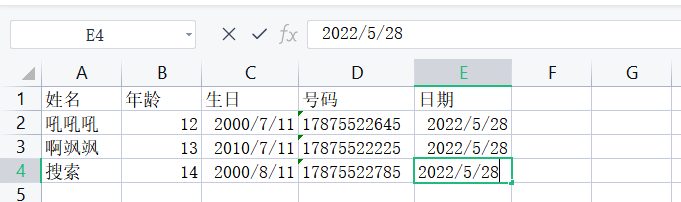

## 1.应用场景

将用户信息导出为excel表格

讲Excel表中的信息录入到网站数据库，大大减小网站数据的录入量！

开发中经常会涉及到excel的处理，如导出Excel到数据库中！

操作Excel目前比较流行的就是Apache POI和阿里巴巴的easyExcel

POI更灵活，easyExcel更方便

## 2.Apache POI

### 简介

Apache POI官网: https://poi.apache.org/

HSSF 对应 Excel 03 版本，最多支持65535行

XSSF对应 Excel 07 版本，最多支持1048576行

### 缺点：

使用比较麻烦

数据量大的时候会可能报OOM异常，因为它会先将所有数据读到内存，再写入excel。easyExcel是通过磁盘一条一条读的

### 项目准备

创建maven项目，作为父项目，去掉src目录

创建module模块，也是maven项目poi-study

### 导入依赖

```xml
<dependencies>
    <!--xLs(03)-->
    <!--<dependency>
            <groupId>org.apache.poi</groupId>
            <artifactId>poi</artifactId>
            <version>4.1.2</version>
        </dependency>-->
    <!--xLsx(07)-->
    <!--版本应该与poi一致，也可以不导入poi依赖，因为poi-ooxml中有poi-->
    <dependency>
        <groupId>org.apache.poi</groupId>
        <artifactId>poi-ooxml</artifactId>
        <version>4.1.2</version>
    </dependency>
    <!--日期格式化工具-->
    <dependency>
        <groupId>joda-time</groupId>
        <artifactId>joda-time</artifactId>
        <version>2.10.1</version>
    </dependency>
    <!--test-->
    <dependency>
        <groupId>junit</groupId>
        <artifactId>junit</artifactId>
        <version>4.12</version>
    </dependency>
</dependencies>
```

创建两个版本的Excel文件

打开可以看到，03版xls最多支持到65536行，而07版xlsx支持到1048576行

二者文件名后缀不同，对应操作的Java工具类也不同

明确几个概念，**工作簿**、**工作表**、**行**、**单元格**，分别对应了各自的对象

 

### 写入

#### 基本的单行写入数据

HSSF-03和XSSF-07

```java
String PATH = "C:\\Users\\29928\\Desktop\\";

@Test
public void Test1() throws IOException {
    //创建一个工作簿
    Workbook workbook = new HSSFWorkbook();
    //创建该工作簿的一个工作表
    Sheet sheet = workbook.createSheet("数据表03");

    //第一行
    //创建该工作表的一行，0为第一行
    Row row1 = sheet.createRow(0);
    //创建该行的一个单元格，0为第一列
    Cell cell11 = row1.createCell(0);
    //设置该单元格的数据
    cell11.setCellValue("编号");
    //创建该行的一个单元格，1为第二列
    Cell cell12 = row1.createCell(1);
    //设置该单元格的数据
    cell12.setCellValue("姓名");

    //第二行
    Row row2 = sheet.createRow(1);
    Cell cell21 = row2.createCell(0);
    Cell cell22 = row2.createCell(1);
    //import org.joda.time.DateTime;
    String s = new DateTime().toString("yyyy-MM-dd HH:mm:ss");
    cell21.setCellValue(s);

    FileOutputStream outputStream = new FileOutputStream(PATH+"数据表03.xls");
    workbook.write(outputStream);

    //关闭流和工作簿
    outputStream.close();
    workbook.close();

    System.out.println("EXCEL03 导入OK");
}
@Test
public void Test2() throws IOException {
    //创建一个工作簿
    Workbook workbook = new XSSFWorkbook();
    //创建该工作簿的一个工作表
    Sheet sheet = workbook.createSheet("数据表1");

    //第一行
    //创建该工作表的一行，0为第一行
    Row row1 = sheet.createRow(0);
    //创建该行的一个单元格，0为第一列
    Cell cell11 = row1.createCell(0);
    //设置该单元格的数据
    cell11.setCellValue("编号");
    //创建该行的一个单元格，1为第二列
    Cell cell12 = row1.createCell(1);
    //设置该单元格的数据
    cell12.setCellValue("姓名");

    //第二行
    Row row2 = sheet.createRow(1);
    Cell cell21 = row2.createCell(0);
    Cell cell22 = row2.createCell(1);
    String s = new DateTime().toString("yyyy-MM-dd HH:mm:ss");
    cell21.setCellValue(s);

    FileOutputStream outputStream = new FileOutputStream(PATH+"数据表07.xlsx");
    workbook.write(outputStream);

    //关闭流和工作簿
    outputStream.close();
    workbook.close();

    System.out.println("EXCEL07 导入OK");
}
```

#### 大文件写HSSF-03

缺点：最多只能处理65536行，否则会报异常java.lang.IllegalArgumentException:Invalid row number (65536) outside allowable range (0.. 65535)

优点：过程中写入缓存，不操作磁盘，最后一次性写入磁盘，速度快

```java
@Test
public void insetBigData() throws IOException {
    //创建工作簿
    Workbook workbook = new HSSFWorkbook();
    //创建工作表
    Sheet sheet = workbook.createSheet("大数据表");
    //开始时间
    long begin = System.currentTimeMillis();
    //插入65535条数据，在内存中操作
    for (int i=0;i<65535;i++){
        Row row = sheet.createRow(i);
        Cell id = row.createCell(0);
        id.setCellValue(i);
        Cell name = row.createCell(1);
        id.setCellValue("用户"+i);
    }
    //将数据写入磁盘中的excel文件
    FileOutputStream outputStream = new FileOutputStream(PATH + "大数据量03.xls");
    workbook.write(outputStream);
    outputStream.close();
    long end = System.currentTimeMillis();
    //查看耗时多少秒
    System.out.println((double) (end - begin) / 1000+"秒");
    System.out.println("over");
}
```

运行结果：

```
1.473秒
over
```

#### 大文件写XSSF-07

缺点：写数据时速度非常慢，非常耗内存，也会发生内存溢出，如100万条数据

优点：可以写较大的数据量，如20万条数据

只做一下修改，将new HSSFWorkbook();改成new XSSFWorkbook();，文件后缀名从xls改成xlsx

时间较长，但是可以写更多数据

运行结果：

```
4.056秒
over
```

#### 大文件写SXSSF-07升级版

优点：可以写非常大量的数据库，如100万条甚至更多条，写数据速度快，占用更少的内存

注意：

- 过程中会产生临时文件，需要在程序运行结束后清理临时文件
- 默认由100条记录被保存在内存中，如果超出这数量，则最前面的数据被写入临时文件
- 如果想自定义内存中数据的数量，可以使用new SXSSFWorkbook（数量）

修改代码： new XSSFWorkbook();改成new SXSSFWorkbook();，后缀名还是xlsx

```java
@Test
public void insetBigData07SXFFX() throws IOException {
    Workbook workbook = new SXSSFWorkbook();

    Sheet sheet = workbook.createSheet("大数据表");
    long begin = System.currentTimeMillis();
    for (int i=0;i<65535;i++){
        Row row = sheet.createRow(i);
        Cell id = row.createCell(0);
        id.setCellValue(i);
        Cell name = row.createCell(1);
        id.setCellValue("用户"+i);
    }
    FileOutputStream outputStream = new FileOutputStream(PATH + "大数据量03.xlsx");
    workbook.write(outputStream);
    //清除临时缓存，需要在workbook对象write完之后
    ((SXSSFWorkbook)workbook).dispose();
    workbook.close();
    outputStream.close();
    long end = System.currentTimeMillis();
    System.out.println((double) (end - begin) / 1000+"秒");
    System.out.println("over");
}
```

运行结果：

```
0.474秒
over
```

SXSSWorkbook 来自官方解释：实现：BigGridDemo策略的流式XSSFWorkbook版本。这允许写入非常大的文件而不会耗尽内存，因为任何时候只有可配置的行部分被保存在内存中。

合并区域，注释......仍然只储存在内存中，如果广泛使用，仍然可能会消耗大量内存

### 读取

#### 03类型

```java
@Test
public void read07() throws IOException {
    //读取excel文件
    FileInputStream inputStream = new FileInputStream(PATH + "数据表03.xls");
    //将读取的流创建为工作簿，使用 exceL能操作的这边他都可以操作！
    Workbook workbook = new HSSFWorkbook(inputStream);
    //获取工作簿的第一张表
    Sheet sheet = workbook.getSheetAt(0);
    //获取工作表的第一行
    Row row1 = sheet.getRow(0);
    //获取该行的第一个单元格
    Cell cell11 = row1.getCell(0);
    //打印该单元格中的字符串数据
    System.out.println(cell11.getStringCellValue());
    //关闭流和工作簿
    inputStream.close();
    workbook.close();
}
```

#### 07类型

```java
@Test
public void testRead07() throws Exception {
    //获取文件流
    FileInputStream fis = new FileInputStream(PATH + "07版本测试.xlsx");
    //1、创建一个工作簿。使用 exceL能操作的这边他都可以操作！
    Workbook workbook = new XSSFWorkbook(fis);
    //2、得到表
    Sheet sheet = workbook.getSheetAt(0);
    //3、得到行
    Row row = sheet.getRow(0);
    //4、得到列
    Cell cell = row.getCell(0);

    //读取值的时候，一定要注意类型！
    //getStringCellValue 字符串类型
    System.out.println(cell.getStringCellValue());
    fis.close();
}
```

注意获取值的类型即可

读取不同的数据类型，是工作上的重点，这段类型匹配代码工作时直接复制

#### 判断不同的数据类型

```java
@Test
public void readAll() throws IOException {
    FileInputStream inputStream = new FileInputStream(PATH + "测试07.xlsx");
    Workbook workbook = new XSSFWorkbook(inputStream);
    Sheet sheet = workbook.getSheetAt(0);
    Row row1 = sheet.getRow(0);
    int cells = row1.getPhysicalNumberOfCells();
    //获取第一行的数据，因为都是列名，所以一定是字符串类型
    for (int i = 0; i < cells; i++) {
        Cell cell = row1.getCell(i);
        System.out.print(cell.getStringCellValue()+" | ");
    }
    System.out.println();
    //获取总行数
    int rows = sheet.getPhysicalNumberOfRows();
    for (int i = 0; i < rows; i++) {
        Row row2 = sheet.getRow(i);
        for (int m = 0; m < cells; m++) {
            Cell cell = row2.getCell(m);
            CellType cellType = cell.getCellType();
            switch (cellType){
                case _NONE:
                    break;
                    //数字类型，可能是数字也可能是日期
                case NUMERIC:
                    //判断是不是日期类型（通过快捷键插入，ctrl+;）
                    if (DateUtil.isCellDateFormatted(cell)){
                        Date date = cell.getDateCellValue();
                        //import org.joda.time.DateTime;
                        String dateTime = new DateTime(date).toString();
                        System.out.print(dateTime);
                        break;
                    }
                    System.out.print(cell.getNumericCellValue());
                    break;
                    //字符串类型
                case STRING:
                    System.out.print(cell.getStringCellValue());
                    break;
                    //日期类型
                case FORMULA:
                    //判断是不是日期类型（通过公式插入）
                    if (DateUtil.isCellDateFormatted(cell)){
                        Date date = cell.getDateCellValue();
                        //import org.joda.time.DateTime;
                        String dateTime = new DateTime(date).toString();
                        System.out.print(dateTime);
                    }
                    break;
                    //空数据
                case BLANK:
                    break;
                    //Boolean类型
                case BOOLEAN:
                    System.out.print(cell.getBooleanCellValue());
                    break;
                    //数据类型错误
                case ERROR:
                    System.out.print("【数据类型错误】");
                    break;
            }
            System.out.print(" | ");
        }
        System.out.println();
    }
    inputStream.close();
    workbook.close();
}
```

excel数据：



运行结果

```
姓名 | 年龄 | 生日 | 号码 | 日期 | 
吼吼吼 | 12.0 | 2000-07-11T00:00:00.000+08:00 | 17875522645 | 2022-05-28T00:00:00.000+08:00 | 
啊飒飒 | 13.0 | 2010-07-11T00:00:00.000+08:00 | 17875522225 | 2022-05-28T00:00:00.000+08:00 | 
搜索 | 14.0 | 2000-08-11T00:00:00.000+08:00 | 17875522785 | 1899-12-31T21:27:43.000+08:05:43 | 
```

#### 计算公式

```java
@Test
public void testFormula() throws IOException {
    FileInputStream fis = new FileInputStream(PATH+"公式.xls");
    //创建一个工作簿。使用 excel能操作的这边他都可以操作
    Workbook workbook = new HSSFWorkbook(fis);
    Sheet sheet = workbook.getSheetAt(0);

    Row row = sheet.getRow(0);
    Cell cell = row.getCell(0);

    //拿到公式计算对象，用来计算一个单元格中的公式
    FormulaEvaluator formulaEvaluator = new HSSFFormulaEvaluator((HSSFWorkbook) workbook);

    //输出单元格的内容
    CellType cellType = cell.getCellType();
    //判断单元格类型是不是公式
    switch (cellType) {
        case FORMULA:
            //获取公式
            String formula = cell.getCellFormula();
            System.out.println(formula);

            //通过公式计算值
            //感觉有点多此一举了，直接使用getNumericCellValue()就可以了
            CellValue evaluate = formulaEvaluator.evaluate(cell);
            String cellValue = evaluate.formatAsString();
            System.out.println(cellValue);
            System.out.println(cell.getNumericCellValue());
            break;
    }
}
```

运行结果

```
SUM(B1,C1)
300.0
300.0
```


## 3.easyExcel

### 简介

easyExcel官网地址: https://github.com/alibaba/easyexcel

EasyExcel是阿里巴巴开源的一个excel处理框架，以使用简单，节约内存著称。

EasyExcel能大量减少占用内存的主要原因是在解析Excel时没有将文件数据一次性全部加载到内存中，而是从一个磁盘上一行行读取数据，逐个解析。

下图是EasyExcel和POI在解析Excel时的对比图(时间与空间的相互取舍)。


官方文档: https://www.yuque.com/easyexcel/doc/easyexcel

### 项目准备

### 添加依赖

```xml
<!--easyexcel-->
<dependency>
    <groupId>com.alibaba</groupId>
    <artifactId>easyexcel</artifactId>
    <version >2.2.0-beta2</version>
</dependency>
```

由于easyexcel依赖中包含POI相关依赖,有可能发生冲突,所以注释掉

```xml
<!--导入依赖-->
<dependencies>
    <!--fastjson-->
    <dependency>
        <groupId>com.alibaba</groupId>
        <artifactId>fastjson</artifactId>
        <version >1.2.62</version>
    </dependency>

    <!--easyexcel-->
    <dependency>
        <groupId>com.alibaba</groupId>
        <artifactId>easyexcel</artifactId>
        <version >2.2.0-beta2</version>
    </dependency>
    <!--lombok-->
    <dependency>
        <groupId>org.projectlombok</groupId>
        <artifactId>lombok</artifactId>
        <version >1.18.12</version>
    </dependency>

    <!-- <!–xLs(03)–>
<dependency>
<groupId>org.apache.poi</groupId>
<artifactId>poi</artifactId>
<version>3.9</version>
</dependency>
<!–xLsx(07)–>
<dependency>
<groupId>org.apache.poi</groupId>
<artifactId>poi-ooxml</artifactId>
<version>3.9</version>
</dependency>-->
    <!--日期格式化工具-->
    <dependency>
        <groupId>joda-time</groupId>
        <artifactId>joda-time</artifactId>
        <version>2.10.1</version>
    </dependency>
    <!--test-->
    <dependency>
        <groupId>junit</groupId>
        <artifactId>junit</artifactId>
        <version>4.12</version>
    </dependency>
</dependencies>
```

实体类

```java
@Data
public class DemoData {
    @ExcelProperty("字符串标题")
    private String string;
    @ExcelProperty("日期标题")
    private Date date;
    @ExcelProperty("数字标题")
    private Double doubleData;
    //忽略这个字段
    @ExcelIgnore
    private String ignore;
}
```

EasyExcel写入操作

```java
package com.kuang.easy;

import com.alibaba.excel.EasyExcel;
import org.junit.Test;
import java.util.ArrayList;
import java.util.Date;
import java.util.List;

public class EasyTest {
    String PATH = "ExcelCreate\\";

    //模拟写入数据
    private List<DemoData> data() {
        java.util.List<DemoData> list = new ArrayList<DemoData>();
        for (int i = 0; i < 10; i++) {
            DemoData data = new DemoData();
            data.setString("字符串" + i);
            data.setDate(new Date());
            data.setDoubleData(0.56);
            list.add(data);
        }
        return list;
    }
}
```

```java
//根据ist写 excel
@Test
public void simplewrite() {
    String fileName = PATH + "EasyTest.xlsx";
    //这里需要指定写用哪个 class去写，然后写到第一个 sheet，名字为模板然后文件流会自动关闭
    //write(fileName,格式类)
    //sheet（表名）
    //doWrite（数据）
    EasyExcel.write(fileName, DemoData.class).sheet("模板").doWrite(data());
}
```

EasyExcel读取操作
实体类

```java
@Data
public class DemoData {
    private String string;
    private Date date;
    private Double doubleData;
}
```

监听器

```java
import com.alibaba.excel.context.AnalysisContext;
import com.alibaba.excel.event.AnalysisEventListener;
import com.alibaba.fastjson.JSON;
import org.slf4j.Logger;
import org.slf4j.LoggerFactory;

import java.util.ArrayList;
import java.util.List;

// 有个很重要的点：DemoDataListener 不能被spring管理，要每次读取excel都要new,然后里面用到spring可以构造方法传进去
public class DemoDataListener extends AnalysisEventListener<DemoData> {
    private static final Logger LOGGER = LoggerFactory.getLogger(DemoDataListener.class);
    /**
* 每隔5条存储数据库，实际使用中可以3000条，然后清理list ，方便内存回收
*/
    private static final int BATCH_COUNT = 5;
    List<DemoData> list = new ArrayList<DemoData>();
    /**
* 假设这个是一个DAO，当然有业务逻辑这个也可以是一个service。当然如果不用存储这个对象没用。
*/
    private DemoDAO demoDAO;
    public DemoDataListener() {
        // 这里是demo，所以随便new一个。实际使用如果到了spring,请使用下面的有参构造函数
        demoDAO = new DemoDAO();
    }
    /**
* 如果使用了spring,请使用这个构造方法。每次创建Listener的时候需要把spring管理的类传进来
*
* @param demoDAO
*/
    public DemoDataListener(DemoDAO demoDAO) {
        this.demoDAO = demoDAO;
    }
    /**
* 这个每一条数据解析都会来调用
*
* @param data
* one row value. Is is same as {@link AnalysisContext#readRowHolder()}
* @param context
*/
    @Override
    public void invoke(DemoData data, AnalysisContext context) {
        LOGGER.info("解析到一条数据:{}", JSON.toJSONString(data));
        list.add(data);
        // 达到BATCH_COUNT了，需要去存储一次数据库，防止数据几万条数据在内存，容易OOM
        if (list.size() >= BATCH_COUNT) {
            saveData();
            // 存储完成清理 list
            list.clear();
        }
        list.forEach(System.out::println);
    }
    /**
* 所有数据解析完成了 都会来调用
*
* @param context
*/
    @Override
    public void doAfterAllAnalysed(AnalysisContext context) {
        // 这里也要保存数据，确保最后遗留的数据也存储到数据库
        saveData();
        LOGGER.info("所有数据解析完成！");
    }
    /**
* 加上存储数据库
*/
    private void saveData() {
        LOGGER.info("{}条数据，开始存储数据库！", list.size());
        demoDAO.save(list);
        LOGGER.info("存储数据库成功！");
    }
}
```

持久层

```java
/**
* 假设这个是你的DAO存储。当然还要这个类让spring管理，当然你不用需要存储，也不需要这个类。
**/
public class DemoDAO {
    public void save(List<DemoData> list) {
        // 如果是mybatis,尽量别直接调用多次insert,自己写一个mapper里面新增一个方法batchInsert,所有数据一次性插入
    }
}
```

读取代码

```java
/**
* 最简单的读
* <p>1. 创建excel对应的实体对象 参照{@link DemoData}
* <p>2. 由于默认一行行的读取excel，所以需要创建excel一行一行的回调监听器，参照{@link DemoDataListener}
* <p>3. 直接读即可
*/
@Test
public void simpleRead() {
    // 有个很重要的点 DemoDataListener 不能被spring管理，要每次读取excel都要new,然后里面用到spring可以构造方法传进去
    // 写法1：
    String fileName = PATH+"EasyTest.xlsx";
    // 这里 需要指定读用哪个class去读，然后读取第一个sheet 文件流会自动关闭
    EasyExcel.read(fileName, DemoData.class, new DemoDataListener()).sheet().doRead();

    /*// 有个很重要的点 DemoDataListener 不能被spring管理，要每次读取excel都要new,然后里面用到spring可以构造方法传进去
    // 写法1：
    String fileName = TestFileUtil.getPath() + "demo" + File.separator + "demo.xlsx";
    // 这里 需要指定读用哪个class去读，然后读取第一个sheet 文件流会自动关闭
    EasyExcel.read(fileName, DemoData.class, new DemoDataListener()).sheet().doRead();
    // 写法2：
    fileName = TestFileUtil.getPath() + "demo" + File.separator + "demo.xlsx";
    ExcelReader excelReader = null;
    try {
        excelReader = EasyExcel.read(fileName, DemoData.class, new DemoDataListener()).build();
        ReadSheet readSheet = EasyExcel.readSheet(0).build();
        excelReader.read(readSheet);
    } finally {
        if (excelReader != null) {
            // 这里千万别忘记关闭，读的时候会创建临时文件，到时磁盘会崩的
            excelReader.finish();
        }
    }*/
}
```

运行结果

```
SLF4J: Failed to load class "org.slf4j.impl.StaticLoggerBinder".
SLF4J: Defaulting to no-operation (NOP) logger implementation
SLF4J: See http://www.slf4j.org/codes.html#StaticLoggerBinder for further details.
DemoData(string=字符串0, date=Sat May 28 22:29:40 CST 2022, doubleData=0.56, ignore=null)
DemoData(string=字符串0, date=Sat May 28 22:29:40 CST 2022, doubleData=0.56, ignore=null)
DemoData(string=字符串1, date=Sat May 28 22:29:40 CST 2022, doubleData=0.56, ignore=null)
DemoData(string=字符串0, date=Sat May 28 22:29:40 CST 2022, doubleData=0.56, ignore=null)
DemoData(string=字符串1, date=Sat May 28 22:29:40 CST 2022, doubleData=0.56, ignore=null)
DemoData(string=字符串2, date=Sat May 28 22:29:40 CST 2022, doubleData=0.56, ignore=null)
DemoData(string=字符串0, date=Sat May 28 22:29:40 CST 2022, doubleData=0.56, ignore=null)
DemoData(string=字符串1, date=Sat May 28 22:29:40 CST 2022, doubleData=0.56, ignore=null)
DemoData(string=字符串2, date=Sat May 28 22:29:40 CST 2022, doubleData=0.56, ignore=null)
DemoData(string=字符串3, date=Sat May 28 22:29:40 CST 2022, doubleData=0.56, ignore=null)
DemoData(string=字符串5, date=Sat May 28 22:29:40 CST 2022, doubleData=0.56, ignore=null)
DemoData(string=字符串5, date=Sat May 28 22:29:40 CST 2022, doubleData=0.56, ignore=null)
DemoData(string=字符串6, date=Sat May 28 22:29:40 CST 2022, doubleData=0.56, ignore=null)
DemoData(string=字符串5, date=Sat May 28 22:29:40 CST 2022, doubleData=0.56, ignore=null)
DemoData(string=字符串6, date=Sat May 28 22:29:40 CST 2022, doubleData=0.56, ignore=null)
DemoData(string=字符串7, date=Sat May 28 22:29:40 CST 2022, doubleData=0.56, ignore=null)
DemoData(string=字符串5, date=Sat May 28 22:29:40 CST 2022, doubleData=0.56, ignore=null)
DemoData(string=字符串6, date=Sat May 28 22:29:40 CST 2022, doubleData=0.56, ignore=null)
DemoData(string=字符串7, date=Sat May 28 22:29:40 CST 2022, doubleData=0.56, ignore=null)
DemoData(string=字符串8, date=Sat May 28 22:29:40 CST 2022, doubleData=0.56, ignore=null)
```

固定套路

写入，固定类格式进行写入
读取，根据监听器设置的规则进行读取！